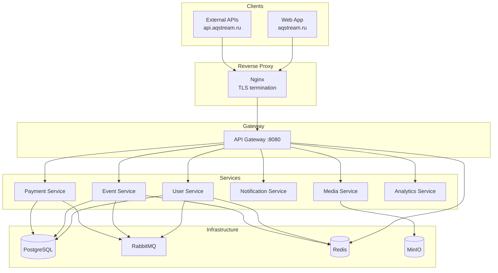

# AqStream

[](https://opensource.org/licenses/MIT)
[](https://openjdk.org/)
[](https://spring.io/projects/spring-boot)
[](https://nextjs.org/)
[](https://www.typescriptlang.org/)

**Open-source платформа для организации и управления мероприятиями.**

Любые события — онлайн и офлайн, рабочие и неформальные. AqStream помогает организаторам создавать события, управлять регистрациями, принимать платежи и анализировать результаты.

## Возможности

| Модуль | Описание |
|--------|----------|
| **События** | Полный жизненный цикл, гибкие типы билетов, листы ожидания |
| **Платежи** | Интеграция с платёжными провайдерами, возвраты, финансовая отчётность |
| **Уведомления** | Telegram-бот, автоматические напоминания |
| **Аналитика** | Дашборды, воронки регистраций, экспорт |
| **Multi-tenancy** | Изоляция данных организаций, роли и права |

## Архитектура



**Принципы:** микросервисы, event-driven (Outbox pattern), multi-tenant (Row Level Security), API-first.

## Быстрый старт

### Локальная разработка

```bash
git clone https://github.com/egorov-ma/aqstream.git && cd aqstream
cp .env.example .env
make infra-up     # Запустить инфраструктуру (PostgreSQL, Redis, RabbitMQ, MinIO)
```

| URL | Описание |
|-----|----------|
| http://localhost:3000 | Frontend |
| http://localhost:8080/swagger-ui.html | API Docs (Gateway) |
| http://localhost:15672 | RabbitMQ Management (guest/guest) |
| http://localhost:9001 | MinIO Console (minioadmin/minioadmin) |

### Production

| URL | Описание |
|-----|----------|
| https://aqstream.ru | Frontend |
| https://api.aqstream.ru | API Gateway |
| https://docs.aqstream.ru | Документация |
| https://egorov-ma.github.io/aqstream/allure/ | Allure Reports (тесты) |

## Технологии

| Backend | Frontend | Infrastructure |
|---------|----------|----------------|
| Java 25, Spring Boot 3.5 | Next.js 14, TypeScript 5 | Docker Compose |
| PostgreSQL 16, Redis 7 | Tailwind CSS, shadcn/ui | Nginx, MinIO |
| RabbitMQ, Liquibase | TanStack Query, Zustand | Prometheus, Grafana |

## Сервисы

| Сервис | Порт | Описание |
|--------|------|----------|
| Gateway | 8080 | API Gateway, JWT validation, rate limiting |
| User Service | 8081 | Пользователи, организации, роли |
| Event Service | 8082 | События, билеты, регистрации |
| Payment Service | 8083 | Платежи, возвраты |
| Notification Service | 8084 | Telegram-уведомления |
| Media Service | 8085 | Файлы, изображения |
| Analytics Service | 8086 | Метрики, отчёты |

## Полезные команды

```bash
make help           # Все доступные команды
make infra-up       # Запустить инфраструктуру
make infra-down     # Остановить инфраструктуру
make health         # Проверить доступность сервисов
make test           # Запустить тесты
make lint           # Проверка кода
```

## Документация

Полная документация: [`/docs`](docs/README.md)

| Раздел | Описание |
|--------|----------|
| [Architecture](docs/architecture/) | Микросервисы, топология, данные |
| [Tech Stack](docs/tech-stack/) | Backend, Frontend, API, тесты |
| [Operations](docs/operations/) | Окружения, деплой, CI/CD |
| [Server Setup](docs/operations/server-setup.md) | Подготовка сервера |

## Лицензия

[MIT](./LICENSE)

---

<p align="center">Made with ❤️ by AqStream</p>
