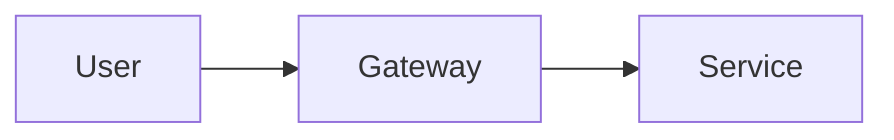

# Doc-as-Code Infrastructure

Внутренняя инфраструктура для генерации и валидации документации.

## Быстрый старт

### Локальный запуск

```bash
# Установить зависимости
pip install -r docs/_internal/doc-as-code/requirements.txt

# Запустить локальный сервер
make docs-serve
# или
cd docs/_internal && python3 -m mkdocs serve
```

Документация будет доступна на http://localhost:8000

### Сборка

```bash
make docs-build
```

Статические файлы будут в `site/`.

## Структура

```
docs/_internal/
├── README.md              # Этот файл
├── mkdocs.yml             # MkDocs конфигурация
├── generators/            # Скрипты генерации
│   ├── generate-openapi.sh
│   └── generate-redoc.sh
├── validators/            # Скрипты валидации
│   ├── validate-markdown.sh
│   ├── validate-openapi.sh
│   ├── validate-links.sh
│   ├── spectral.yaml
│   └── link-check-config.json
└── doc-as-code/
    └── requirements.txt   # Python зависимости
```

## Makefile команды

| Команда | Описание |
|---------|----------|
| `make docs-serve` | Запустить локальный сервер |
| `make docs-build` | Собрать документацию |
| `make docs-validate` | Валидировать документацию |
| `make docs-openapi` | Скачать OpenAPI specs из сервисов |
| `make docs-redoc` | Сгенерировать ReDoc HTML |

## Генераторы

### generate-openapi.sh

Скачивает OpenAPI спецификации из работающих сервисов:

```bash
./docs/_internal/generators/generate-openapi.sh
```

Требует запущенных сервисов. Спецификации сохраняются в `docs/tech-stack/backend/api/specs/`.

### generate-redoc.sh

Генерирует ReDoc HTML из OpenAPI спецификаций:

```bash
./docs/_internal/generators/generate-redoc.sh
```

HTML файлы сохраняются в `docs/tech-stack/backend/api/redoc/`.

## Валидаторы

### validate-markdown.sh

Проверяет markdown файлы с помощью markdownlint:

```bash
./docs/_internal/validators/validate-markdown.sh
```

Конфигурация в `.markdownlint.json`.

### validate-openapi.sh

Валидирует OpenAPI спецификации с помощью Spectral:

```bash
./docs/_internal/validators/validate-openapi.sh
```

Правила в `validators/spectral.yaml`.

### validate-links.sh

Проверяет битые ссылки в документации:

```bash
./docs/_internal/validators/validate-links.sh
```

## CI/CD

Документация автоматически деплоится при merge в main:

1. **validate** — проверка markdown и OpenAPI
2. **build** — сборка MkDocs
3. **deploy** — деплой на GitHub Pages (только из main)

Workflow: `.github/workflows/docs.yml`

## Добавление документации

1. Создать/изменить markdown файлы в `docs/`
2. Проверить локально: `make docs-serve`
3. Запустить валидацию: `make docs-validate`
4. Создать PR
5. После merge — автоматический деплой

## Правила написания

### Формат

- Markdown
- UTF-8
- LF line endings

### Язык

- Документация на русском
- Технические термины на английском
- Код на английском

### Ссылки

```markdown
# Относительные ссылки
[Architecture](../architecture/overview.md)

# Якоря
[JWT Tokens](#jwt-tokens)
```

### Mermaid диаграммы

````markdown

````

## Зависимости

### Python

```
mkdocs>=1.5.0
mkdocs-material>=9.5.0
pymdown-extensions>=10.0
```

### Node.js (для валидации)

```
markdownlint-cli2
@stoplight/spectral-cli
@redocly/cli
markdown-link-check
```
