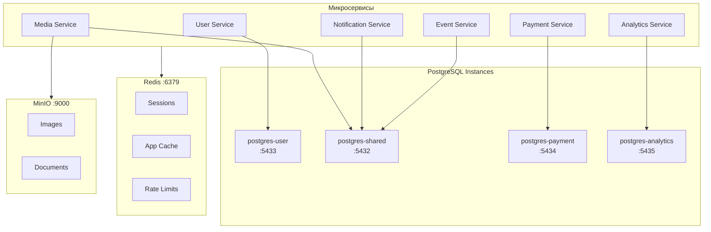
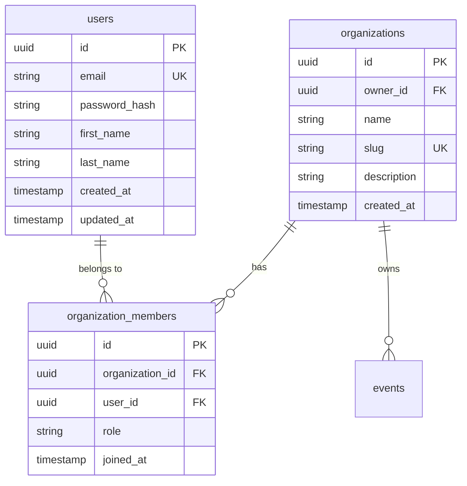
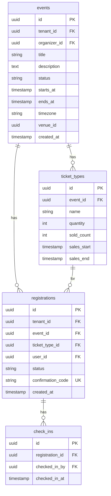
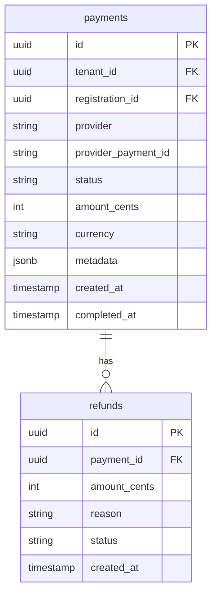
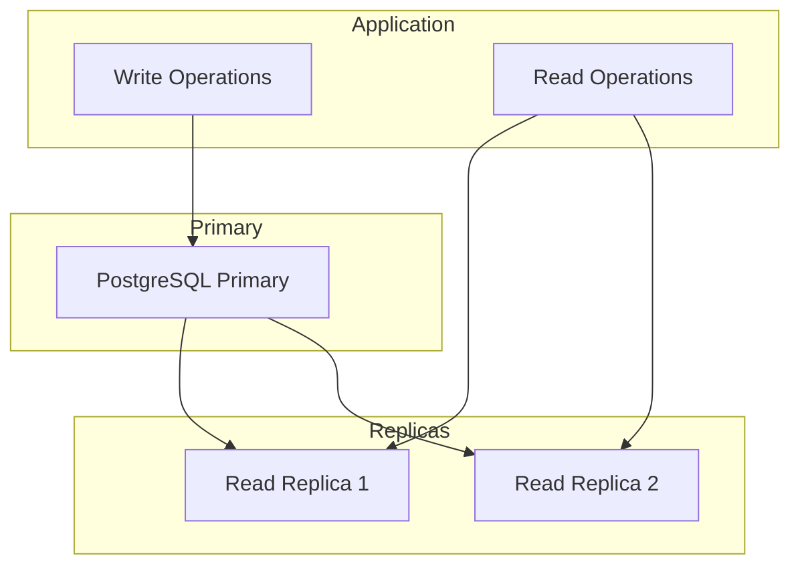

# Data Architecture

Архитектура данных платформы AqStream.

## Обзор



## Стратегия баз данных

### Database-per-Service с Mixed Deployment

Используем гибридный подход:

| Сервис | Instance | Причина |
|--------|----------|---------|
| User Service | Dedicated (postgres-user) | Критичность, изоляция auth данных |
| Payment Service | Dedicated (postgres-payment) | PCI DSS compliance, аудит |
| Analytics Service | Dedicated (postgres-analytics) | TimescaleDB, высокая нагрузка на запись |
| Event Service | Shared (postgres-shared) | Стандартная нагрузка |
| Notification Service | Shared (postgres-shared) | Стандартная нагрузка |
| Media Service | Shared (postgres-shared) | Только метаданные |

### Schema-per-Service

Каждый сервис имеет собственную схему:

```sql
-- postgres-shared
CREATE SCHEMA event_service;
CREATE SCHEMA notification_service;
CREATE SCHEMA media_service;

-- postgres-user
CREATE SCHEMA user_service;

-- postgres-payment
CREATE SCHEMA payment_service;

-- postgres-analytics
CREATE SCHEMA analytics_service;
```

## Multi-Tenancy

### Row Level Security

Изоляция данных организаций на уровне PostgreSQL:

```sql
-- Включение RLS
ALTER TABLE event_service.events ENABLE ROW LEVEL SECURITY;

-- Политика изоляции
CREATE POLICY tenant_isolation ON event_service.events
    FOR ALL
    USING (tenant_id = current_setting('app.tenant_id')::uuid);

-- Установка tenant context
SET app.tenant_id = '550e8400-e29b-41d4-a716-446655440000';
```

### Tenant Context в приложении

```java
// Установка tenant context перед запросами
@Component
public class TenantConnectionProvider implements ConnectionProvider {
    
    @Override
    public Connection getConnection() throws SQLException {
        Connection connection = dataSource.getConnection();
        try (Statement stmt = connection.createStatement()) {
            stmt.execute("SET app.tenant_id = '" + TenantContext.getTenantId() + "'");
        }
        return connection;
    }
}
```

### Таблицы без tenant_id

Некоторые таблицы глобальные:

| Таблица | Причина |
|---------|---------|
| users | Пользователь может быть в нескольких организациях |
| notification_templates | Системные шаблоны |
| analytics_events | Глобальные метрики |

## Схемы данных

### User Service



### Event Service



### Payment Service



## Индексы

### Стратегия индексирования

```sql
-- Обязательные индексы на tenant_id для RLS
CREATE INDEX idx_events_tenant_id ON event_service.events(tenant_id);
CREATE INDEX idx_registrations_tenant_id ON event_service.registrations(tenant_id);

-- Индексы для частых запросов
CREATE INDEX idx_events_status ON event_service.events(status) WHERE status = 'PUBLISHED';
CREATE INDEX idx_events_starts_at ON event_service.events(starts_at);
CREATE INDEX idx_registrations_event_id ON event_service.registrations(event_id);
CREATE INDEX idx_registrations_user_id ON event_service.registrations(user_id);

-- Составные индексы
CREATE INDEX idx_events_tenant_status ON event_service.events(tenant_id, status);
```

## Кэширование (Redis)

### Структура ключей

```
aqstream:{service}:{entity}:{id}
aqstream:{service}:{entity}:list:{params_hash}

# Примеры
aqstream:event:event:550e8400-e29b-41d4-a716-446655440000
aqstream:event:events:list:abc123
aqstream:user:session:jwt_token_hash
```

### Что кэшируем

| Данные | TTL | Invalidation |
|--------|-----|--------------|
| Event details | 5 мин | При обновлении события |
| User profile | 15 мин | При обновлении профиля |
| Public event list | 1 мин | При публикации/отмене |
| Sessions | 24 часа | При logout |
| Rate limit counters | 1 мин | Автоматически |

### Cache-Aside Pattern

```java
@Service
@RequiredArgsConstructor
public class EventService {
    
    private final EventRepository eventRepository;
    private final RedisTemplate<String, EventDto> redisTemplate;
    
    public EventDto findById(UUID id) {
        String key = "aqstream:event:event:" + id;
        
        // Проверяем кэш
        EventDto cached = redisTemplate.opsForValue().get(key);
        if (cached != null) {
            return cached;
        }
        
        // Запрос к БД
        EventDto event = eventRepository.findById(id)
            .map(eventMapper::toDto)
            .orElseThrow(() -> new EventNotFoundException(id));
        
        // Сохраняем в кэш
        redisTemplate.opsForValue().set(key, event, Duration.ofMinutes(5));
        
        return event;
    }
    
    @Transactional
    public EventDto update(UUID id, UpdateEventRequest request) {
        // ... update logic
        
        // Invalidate cache
        String key = "aqstream:event:event:" + id;
        redisTemplate.delete(key);
        
        return updated;
    }
}
```

## Миграции

### Liquibase

Каждый сервис управляет своими миграциями:

```
services/event-service/event-service-db/src/main/resources/
└── db/changelog/
    ├── db.changelog-master.xml
    └── changes/
        ├── 001-create-events-table.xml
        ├── 002-create-ticket-types-table.xml
        ├── 003-create-registrations-table.xml
        ├── 004-add-waitlist.xml
        └── 005-add-check-in.xml
```

### Правила миграций

1. **Backward compatible** — старый код должен работать с новой схемой
2. **Additive only** — не удалять колонки напрямую
3. **Всегда rollback** — каждый changeset должен иметь rollback
4. **Не изменять applied** — никогда не редактировать уже применённые changesets

Подробнее: [Migrations](../data/migrations.md)

## Репликация и отказоустойчивость

### Development

Single instance PostgreSQL (достаточно для разработки).

### Production (рекомендации)



## Бэкапы

### Стратегия

| Тип | Частота | Retention |
|-----|---------|-----------|
| Full backup | Ежедневно | 30 дней |
| WAL archiving | Continuous | 7 дней |
| Point-in-time recovery | — | До 7 дней назад |

Подробнее: [Backup & Restore](../operations/runbooks/backup-restore.md)

## Дальнейшее чтение

- [Domain Model](../data/domain-model.md) — детальная модель данных
- [Migrations](../data/migrations.md) — управление миграциями
- [Service Topology](./service-topology.md) — топология сервисов
