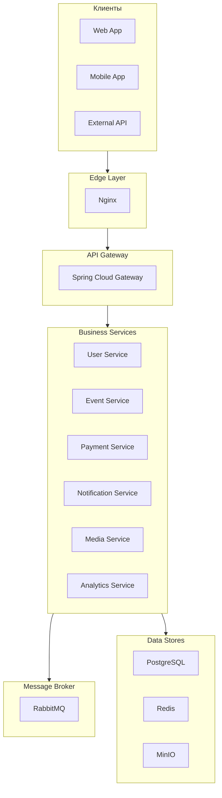
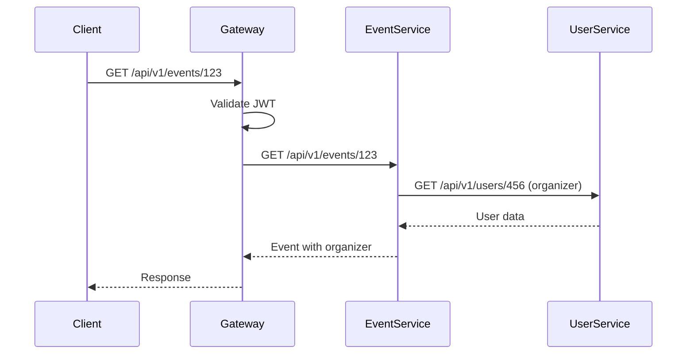
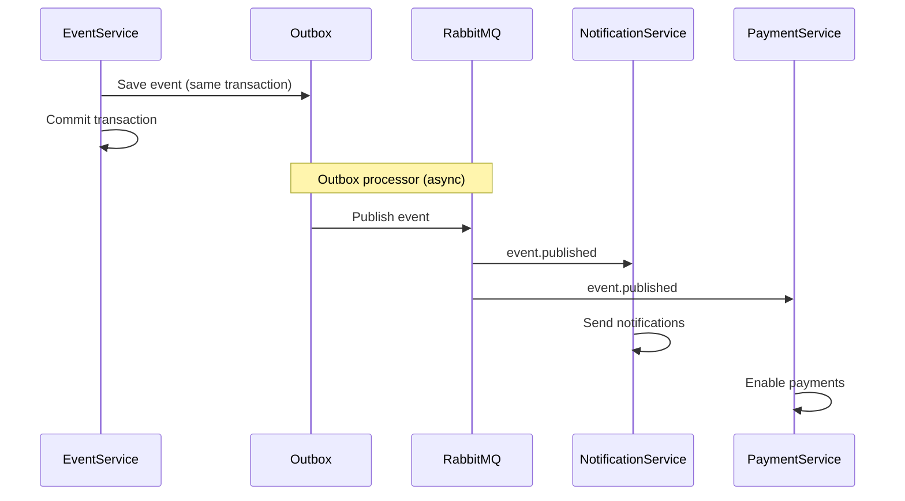
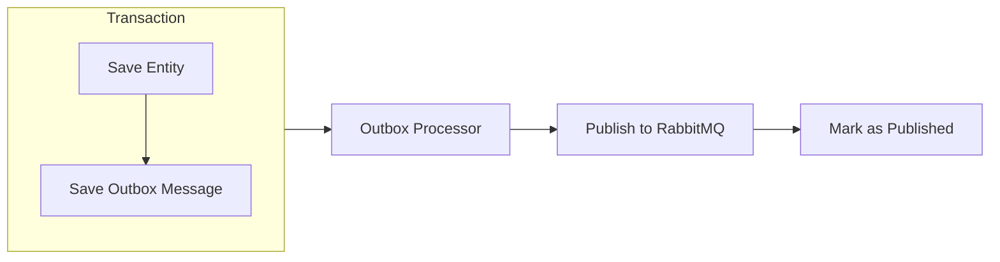

# Architecture Overview

Общий обзор архитектуры платформы AqStream.

## Принципы

### Микросервисная архитектура

AqStream построен как набор слабосвязанных сервисов, каждый из которых отвечает за свой домен:



### Ключевые принципы

**Автономность сервисов**

Каждый сервис:
- Имеет собственную базу данных (schema-per-service)
- Независимо деплоится
- Владеет своими данными
- Общается с другими только через API или события

**Event-Driven Architecture**

Асинхронная коммуникация через RabbitMQ:
- Outbox pattern для гарантии доставки
- Eventual consistency между сервисами
- Loose coupling

**Multi-Tenancy**

Изоляция данных организаций:
- `tenant_id` во всех бизнес-таблицах
- Row Level Security в PostgreSQL
- Tenant context в каждом запросе

**API-First**

- REST API для синхронных операций
- OpenAPI спецификации для всех endpoints
- Версионирование API (`/api/v1/`)

## Слои системы

### Edge Layer (Nginx)

- TLS termination
- Статические файлы
- Первичный routing
- DDoS protection

### API Gateway

- Аутентификация (JWT validation)
- Rate limiting
- Request routing
- Request/Response transformation
- Correlation ID generation

### Business Services

Шесть микросервисов, каждый со своей ответственностью:

| Сервис | Домен | Порт |
|--------|-------|------|
| User Service | Пользователи, организации, роли | 8081 |
| Event Service | События, билеты, регистрации | 8082 |
| Payment Service | Платежи, возвраты | 8083 |
| Notification Service | Email, Telegram | 8084 |
| Media Service | Файлы, изображения | 8085 |
| Analytics Service | Метрики, отчёты | 8086 |

### Data Layer

**PostgreSQL** — основное хранилище:
- Отдельные схемы для каждого сервиса
- Row Level Security для multi-tenancy
- Liquibase для миграций

**Redis** — кэш и сессии:
- Кэширование часто запрашиваемых данных
- Distributed sessions
- Rate limit counters

**MinIO** — файловое хранилище:
- S3-compatible API
- Изображения событий
- Документы

## Взаимодействие компонентов

### Синхронное (REST API)



### Асинхронное (RabbitMQ)



## Технологические решения

### Spring MVC (не WebFlux)

Все бизнес-сервисы используют классический Spring MVC:
- Простота отладки
- Предсказуемый stack trace
- Нативная работа с JPA/Hibernate
- Достаточная производительность

**Исключение:** API Gateway использует Spring Cloud Gateway (WebFlux).

### PostgreSQL с RLS

Row Level Security обеспечивает изоляцию данных на уровне БД:

```sql
-- Политика для таблицы events
CREATE POLICY tenant_isolation ON events
    USING (tenant_id = current_setting('app.tenant_id')::uuid);
```

### Outbox Pattern

Гарантия доставки событий:



## Дальнейшее чтение

- [Service Topology](./service-topology.md) — детальное описание сервисов
- [Data Architecture](./data-architecture.md) — архитектура данных
- [Backend Architecture](../tech-stack/backend/architecture.md) — архитектура backend
