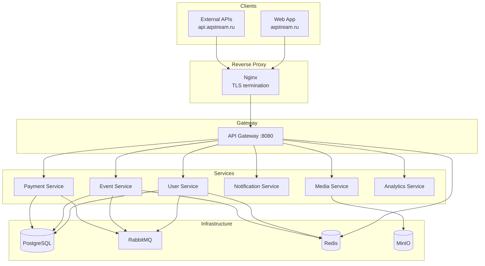
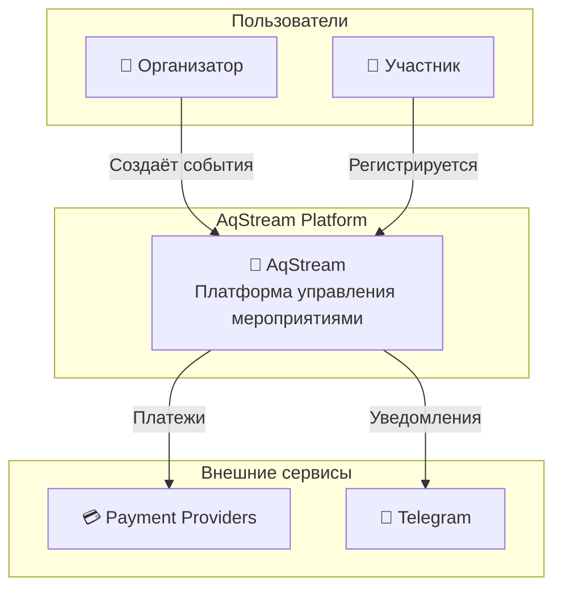
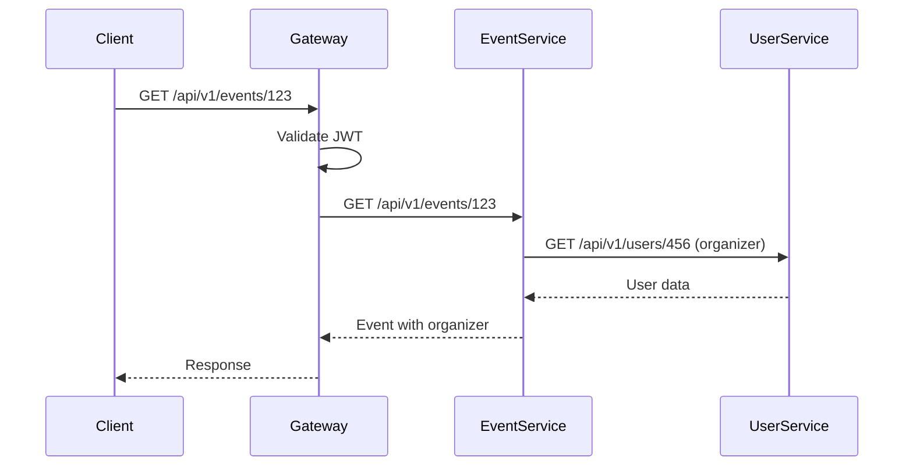
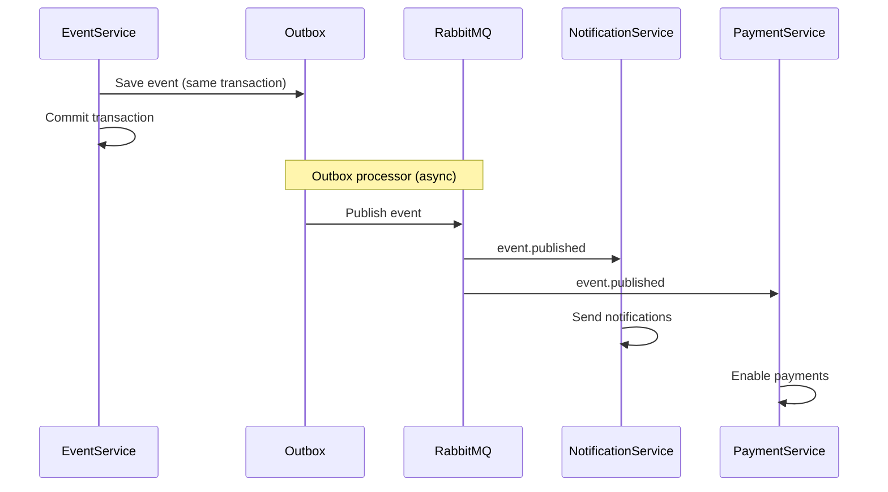
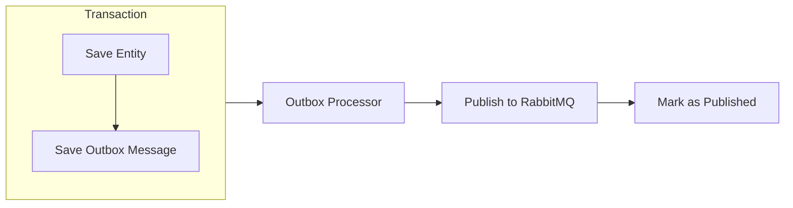

# Architecture Overview

Общий обзор архитектуры платформы AqStream.

## Принципы

### Микросервисная архитектура

AqStream построен как набор слабосвязанных сервисов, каждый из которых отвечает за свой домен:


```mermaid
graph TB
    subgraph Clients
        WEB[Web App<br/>aqstream.ru]
        API_CLIENT[External APIs<br/>api.aqstream.ru]
    end

    subgraph Edge["Reverse Proxy"]
        NGINX[Nginx<br/>TLS termination]
    end

    subgraph Gateway
        GW[API Gateway :8080]
    end

    subgraph Services
        US[User Service]
        ES[Event Service]
        PS[Payment Service]
        NS[Notification Service]
        MS[Media Service]
        AS[Analytics Service]
    end

    subgraph Infrastructure
        PG[(PostgreSQL)]
        RMQ[RabbitMQ]
        REDIS[(Redis)]
        MINIO[(MinIO)]
    end

    WEB --> NGINX
    API_CLIENT --> NGINX
    NGINX --> GW
    GW --> US & ES & PS & NS & MS & AS
    US & ES & PS --> PG
    US & ES & PS --> RMQ
    GW & US & ES --> REDIS
    MS --> MINIO
```

### C4 Context Diagram

Система в контексте внешних пользователей и сервисов:


```mermaid
flowchart TB
    subgraph Users["Пользователи"]
        Org["👤 Организатор"]
        Part["👤 Участник"]
    end

    subgraph System["AqStream Platform"]
        AQ["🎯 AqStream<br/>Платформа управления мероприятиями"]
    end

    subgraph External["Внешние сервисы"]
        PAY["💳 Payment Providers"]
        TG["📱 Telegram"]
    end

    Org -->|"Создаёт события"| AQ
    Part -->|"Регистрируется"| AQ
    AQ -->|"Платежи"| PAY
    AQ -->|"Уведомления"| TG
```

### Ключевые принципы

**Автономность сервисов**

Каждый сервис:
- Имеет собственную базу данных (schema-per-service)
- Независимо деплоится
- Владеет своими данными
- Общается с другими только через API или события

**Event-Driven Architecture**

Асинхронная коммуникация через RabbitMQ:
- Outbox pattern для гарантии доставки
- Eventual consistency между сервисами
- Loose coupling

**Multi-Tenancy**

Изоляция данных организаций:
- `tenant_id` во всех бизнес-таблицах
- Row Level Security в PostgreSQL
- Tenant context в каждом запросе

**API-First**

- REST API для синхронных операций
- OpenAPI спецификации для всех endpoints
- Версионирование API (`/api/v1/`)

**Security-First**

- JWT токены для аутентификации
- Row Level Security на уровне БД
- Валидация на всех уровнях
- Secrets через environment variables

**Idempotency**

- `X-Idempotency-Key` для критических операций
- Защита от дублирования платежей и регистраций
- Идемпотентные endpoints

**Soft Delete**

- Бизнес-данные не удаляются физически
- `deleted_at` timestamp для восстановления
- Аудит и compliance

## Слои системы

### Edge Layer (Nginx)

- TLS termination
- Статические файлы
- Первичный routing
- DDoS protection

### API Gateway

- Аутентификация (JWT validation)
- Rate limiting
- Request routing
- Request/Response transformation
- Correlation ID generation

### Business Services

Шесть микросервисов, каждый со своей ответственностью:

| Сервис | Домен | Порт |
|--------|-------|------|
| User Service | Пользователи, организации, группы, роли | 8081 |
| Event Service | События, билеты, регистрации, бронирование | 8082 |
| Payment Service | Платежи, предоплата, возвраты | 8083 |
| Notification Service | Telegram (уведомления, билеты) | 8084 |
| Media Service | Файлы, изображения | 8085 |
| Analytics Service | Метрики, отчёты | 8086 |

### Messaging Layer

**RabbitMQ** — асинхронная коммуникация:
- Outbox pattern для reliable publishing
- Topic-based routing
- Dead Letter Queue для failed messages
- Retry механизмы

### Data Layer

**PostgreSQL** — основное хранилище:
- Отдельные схемы для каждого сервиса
- Row Level Security для multi-tenancy
- Liquibase для миграций

**Redis** — кэш и сессии:
- Кэширование часто запрашиваемых данных
- Distributed sessions
- Rate limit counters

**MinIO** — файловое хранилище:
- S3-compatible API
- Изображения событий
- Документы

## Взаимодействие компонентов

### Синхронное (REST API)


```mermaid
sequenceDiagram
    participant Client
    participant Gateway
    participant EventService
    participant UserService
    
    Client->>Gateway: GET /api/v1/events/123
    Gateway->>Gateway: Validate JWT
    Gateway->>EventService: GET /api/v1/events/123
    EventService->>UserService: GET /api/v1/users/456 (organizer)
    UserService-->>EventService: User data
    EventService-->>Gateway: Event with organizer
    Gateway-->>Client: Response
```

### Асинхронное (RabbitMQ)


```mermaid
sequenceDiagram
    participant EventService
    participant Outbox
    participant RabbitMQ
    participant NotificationService
    participant PaymentService
    
    EventService->>Outbox: Save event (same transaction)
    EventService->>EventService: Commit transaction
    
    Note over Outbox,RabbitMQ: Outbox processor (async)
    Outbox->>RabbitMQ: Publish event
    
    RabbitMQ->>NotificationService: event.published
    RabbitMQ->>PaymentService: event.published
    
    NotificationService->>NotificationService: Send notifications
    PaymentService->>PaymentService: Enable payments
```

## Технологические решения

Здесь описаны ключевые архитектурные решения. Полный список технологий: [Tech Stack Overview](../tech-stack/overview.md).

### Spring MVC (не WebFlux)

Все бизнес-сервисы используют классический Spring MVC:
- Простота отладки
- Предсказуемый stack trace
- Нативная работа с JPA/Hibernate
- Достаточная производительность

**Исключение:** API Gateway использует Spring Cloud Gateway (WebFlux).

### JWT (HS256)

Для аутентификации используется JWT с симметричным алгоритмом HS256:
- API Gateway валидирует токен и прокидывает данные пользователя в headers (`X-User-Id`, `X-Tenant-Id`, `X-User-Roles`)
- Бизнес-сервисы за Gateway доверяют headers и не валидируют токен повторно
- Секретный ключ знают только User Service (генерация) и API Gateway (валидация)

Этот подход проще RS256 и достаточен, когда все сервисы находятся внутри доверенного периметра.

### PostgreSQL с RLS

Row Level Security обеспечивает изоляцию данных на уровне БД:

```sql
-- Политика для таблицы events
CREATE POLICY tenant_isolation ON events
    USING (tenant_id = current_setting('app.tenant_id')::uuid);
```

### Outbox Pattern

Гарантия доставки событий:


```mermaid
flowchart LR
    subgraph Transaction
        A["Save Entity"] --> B["Save Outbox Message"]
    end
    
    C["Outbox Processor"] --> D["Publish to RabbitMQ"]
    D --> E["Mark as Published"]
    
    Transaction --> C
```

## Дальнейшее чтение

- [Service Topology](./service-topology.md) — детальное описание сервисов
- [Data Architecture](./data-architecture.md) — архитектура данных
- [Backend Architecture](../tech-stack/backend/architecture.md) — архитектура backend
