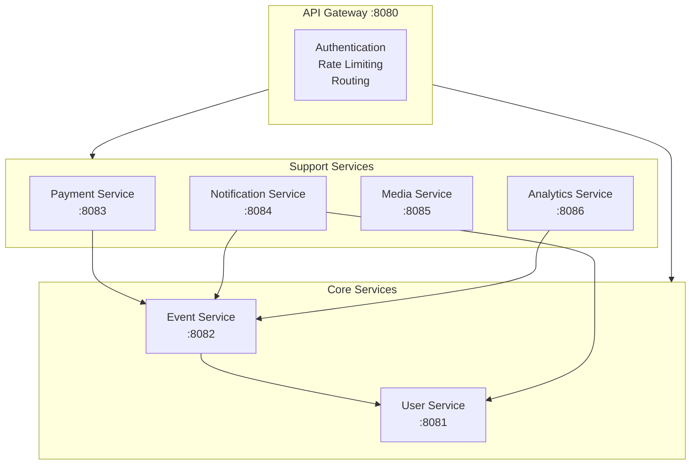
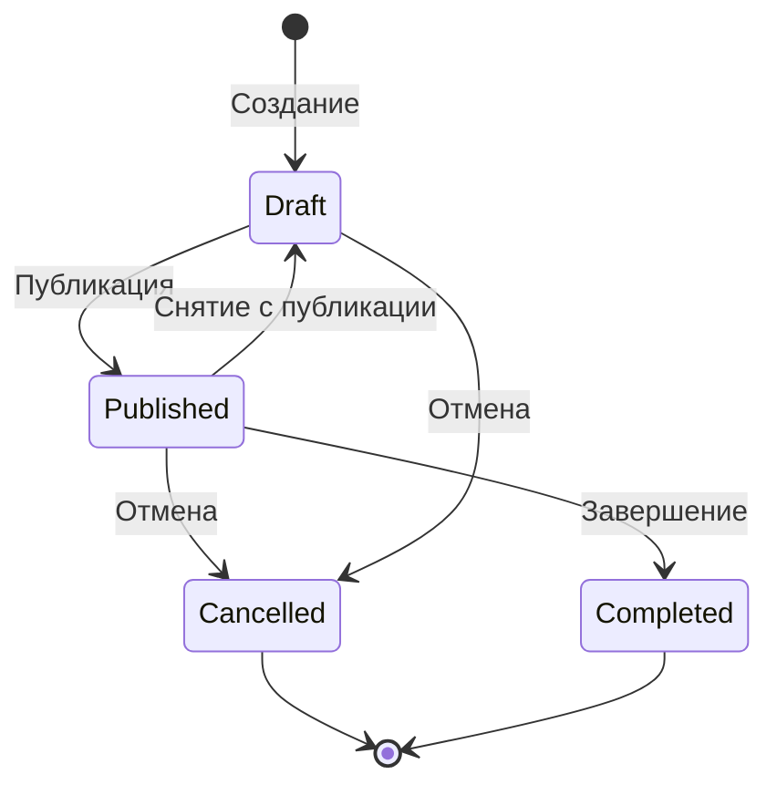
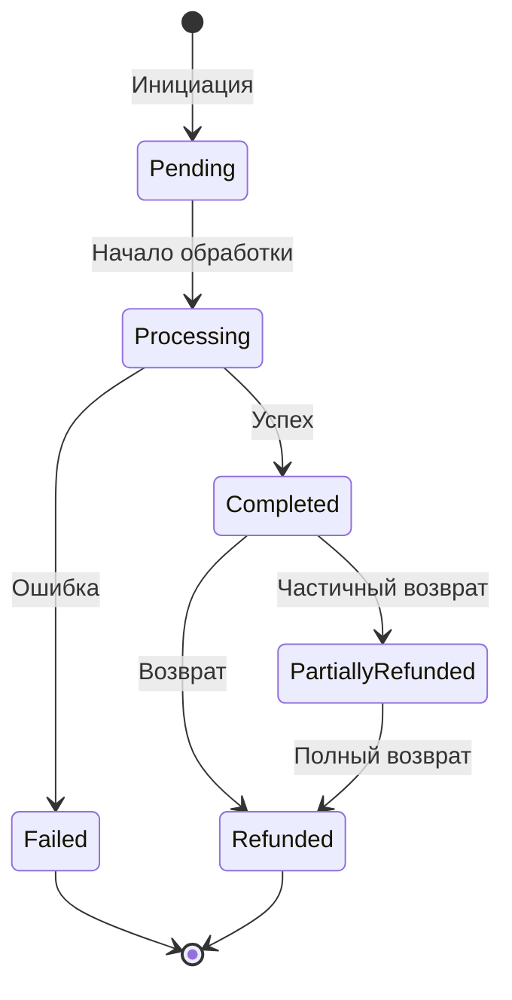

# Service Topology

Детальное описание микросервисов и их взаимодействия.

## Обзор сервисов

## API Gateway

**Порт:** 8080

**Технология:** Spring Cloud Gateway (WebFlux)

**Ответственность:**
- JWT validation и extraction
- Rate limiting (Redis-based)
- Request routing
- Correlation ID generation
- Response caching (опционально)

**Маршруты:**

| Path | Target | Description |
|------|--------|-------------|
| `/api/v1/users/**` | User Service | Пользователи |
| `/api/v1/organizations/**` | User Service | Организации |
| `/api/v1/events/**` | Event Service | События |
| `/api/v1/registrations/**` | Event Service | Регистрации |
| `/api/v1/payments/**` | Payment Service | Платежи |
| `/api/v1/media/**` | Media Service | Файлы |
| `/api/v1/analytics/**` | Analytics Service | Аналитика |

**Особенность:** Единственный сервис на WebFlux. Все остальные — Spring MVC.

## User Service

**Порт:** 8081

**База данных:** PostgreSQL (dedicated instance)

**Схема:** `user_service`

**Ответственность:**
- Регистрация и аутентификация пользователей
- Управление организациями
- Роли и права доступа
- JWT token generation

**Основные сущности:**
- User
- Organization  
- OrganizationMember
- Role

**API:**

| Method | Endpoint | Description |
|--------|----------|-------------|
| POST | `/api/v1/auth/register` | Регистрация |
| POST | `/api/v1/auth/login` | Вход |
| POST | `/api/v1/auth/refresh` | Обновление токена |
| GET | `/api/v1/users/me` | Текущий пользователь |
| GET | `/api/v1/organizations` | Список организаций |
| POST | `/api/v1/organizations` | Создание организации |
| GET | `/api/v1/organizations/{id}/members` | Члены организации |

**События (публикует):**
- `user.registered`
- `user.updated`
- `organization.created`
- `organization.member.added`

## Event Service

**Порт:** 8082

**База данных:** PostgreSQL (shared instance)

**Схема:** `event_service`

**Ответственность:**
- Управление событиями (CRUD, lifecycle)
- Типы билетов и лимиты
- Регистрации участников
- Check-in на событии
- Листы ожидания

**Основные сущности:**
- Event
- TicketType
- Registration
- CheckIn
- WaitlistEntry

**Жизненный цикл события:**

**API:**

| Method | Endpoint | Description |
|--------|----------|-------------|
| GET | `/api/v1/events` | Список событий |
| POST | `/api/v1/events` | Создание события |
| GET | `/api/v1/events/{id}` | Детали события |
| PUT | `/api/v1/events/{id}` | Обновление события |
| POST | `/api/v1/events/{id}/publish` | Публикация |
| POST | `/api/v1/events/{id}/cancel` | Отмена |
| GET | `/api/v1/events/{id}/registrations` | Регистрации |
| POST | `/api/v1/events/{id}/registrations` | Новая регистрация |
| POST | `/api/v1/registrations/{id}/check-in` | Check-in |

**События (публикует):**
- `event.created`
- `event.published`
- `event.cancelled`
- `event.completed`
- `registration.created`
- `registration.cancelled`
- `checkin.completed`

**События (потребляет):**
- `payment.completed` → Подтверждение регистрации
- `payment.refunded` → Отмена регистрации

## Payment Service

**Порт:** 8083

**База данных:** PostgreSQL (dedicated instance)

**Схема:** `payment_service`

**Ответственность:**
- Интеграция с платёжными провайдерами (Stripe, ЮKassa)
- Обработка платежей
- Возвраты (полные и частичные)
- Webhook handling

**Основные сущности:**
- Payment
- Refund
- PaymentMethod

**Статусы платежа:**

**API:**

| Method | Endpoint | Description |
|--------|----------|-------------|
| POST | `/api/v1/payments` | Создание платежа |
| GET | `/api/v1/payments/{id}` | Статус платежа |
| POST | `/api/v1/payments/{id}/refund` | Возврат |
| POST | `/api/v1/webhooks/stripe` | Stripe webhook |
| POST | `/api/v1/webhooks/yookassa` | ЮKassa webhook |

**События (публикует):**
- `payment.created`
- `payment.completed`
- `payment.failed`
- `payment.refunded`

**События (потребляет):**
- `registration.created` → Инициация платежа
- `event.cancelled` → Массовый возврат

## Notification Service

**Порт:** 8084

**База данных:** PostgreSQL (shared instance)

**Схема:** `notification_service`

**Ответственность:**
- Email уведомления (SMTP)
- Telegram уведомления (Bot API)
- Шаблоны сообщений
- Очередь отправки

**Основные сущности:**
- NotificationTemplate
- NotificationLog
- UserNotificationPreference

**Каналы:**
- Email (через SMTP)
- Telegram (через Bot API)

**API:**

| Method | Endpoint | Description |
|--------|----------|-------------|
| POST | `/api/v1/notifications/send` | Отправить уведомление |
| GET | `/api/v1/notifications/templates` | Список шаблонов |
| PUT | `/api/v1/notifications/preferences` | Настройки пользователя |

**События (потребляет):**
- `user.registered` → Welcome email
- `registration.created` → Confirmation email
- `event.cancelled` → Cancellation notice
- `event.reminder` → Reminder before event
- `payment.completed` → Receipt

## Media Service

**Порт:** 8085

**База данных:** PostgreSQL (shared instance)

**Схема:** `media_service`

**Хранилище:** MinIO (S3-compatible)

**Ответственность:**
- Upload файлов
- Обработка изображений (resize, crop)
- CDN URLs
- Cleanup неиспользуемых файлов

**Основные сущности:**
- Media
- MediaVariant

**Поддерживаемые типы:**

| Категория | MIME Types | Max Size |
|-----------|------------|----------|
| Изображения | image/jpeg, image/png, image/webp, image/gif | 5 MB |
| Документы | application/pdf | 10 MB |

**API:**

| Method | Endpoint | Description |
|--------|----------|-------------|
| POST | `/api/v1/media/upload` | Загрузка файла |
| GET | `/api/v1/media/{id}` | Метаданные файла |
| DELETE | `/api/v1/media/{id}` | Удаление файла |
| GET | `/api/v1/media/{id}/url` | Signed URL |

## Analytics Service

**Порт:** 8086

**База данных:** PostgreSQL с TimescaleDB (dedicated instance)

**Схема:** `analytics_service`

**Ответственность:**
- Сбор событий (event tracking)
- Агрегация метрик
- Дашборды для организаторов
- Экспорт отчётов

**Основные сущности:**
- AnalyticsEvent (time-series)
- AggregatedMetric
- Report

**Метрики:**
- Page views
- Registration funnel
- Revenue by event
- Attendance rate

**API:**

| Method | Endpoint | Description |
|--------|----------|-------------|
| POST | `/api/v1/analytics/track` | Трекинг события |
| GET | `/api/v1/analytics/events/{eventId}/dashboard` | Дашборд события |
| GET | `/api/v1/analytics/organizations/{orgId}/report` | Отчёт организации |
| POST | `/api/v1/analytics/export` | Экспорт данных |

**События (потребляет):**
- `event.*` → Агрегация по событиям
- `registration.*` → Воронка регистраций
- `payment.*` → Финансовая аналитика

## Матрица взаимодействия

### Синхронные вызовы (REST)

| From \ To | User | Event | Payment | Notification | Media | Analytics |
|-----------|------|-------|---------|--------------|-------|-----------|
| Gateway | ✓ | ✓ | ✓ | ✓ | ✓ | ✓ |
| Event | ✓ | — | — | — | ✓ | — |
| Payment | — | ✓ | — | — | — | — |
| Notification | ✓ | ✓ | — | — | — | — |

### Асинхронные события (RabbitMQ)

| Publisher | Events | Consumers |
|-----------|--------|-----------|
| User Service | user.*, organization.* | Notification, Analytics |
| Event Service | event.*, registration.*, checkin.* | Payment, Notification, Analytics |
| Payment Service | payment.* | Event, Notification, Analytics |

## Порты и endpoints

| Сервис | Port | Health | Swagger | Metrics |
|--------|------|--------|---------|---------|
| Gateway | 8080 | /actuator/health | /swagger-ui.html | /actuator/prometheus |
| User Service | 8081 | /actuator/health | /swagger-ui.html | /actuator/prometheus |
| Event Service | 8082 | /actuator/health | /swagger-ui.html | /actuator/prometheus |
| Payment Service | 8083 | /actuator/health | /swagger-ui.html | /actuator/prometheus |
| Notification Service | 8084 | /actuator/health | /swagger-ui.html | /actuator/prometheus |
| Media Service | 8085 | /actuator/health | /swagger-ui.html | /actuator/prometheus |
| Analytics Service | 8086 | /actuator/health | /swagger-ui.html | /actuator/prometheus |

## Дальнейшее чтение

- [Data Architecture](./data-architecture.md) — архитектура данных
- [API Guidelines](../tech-stack/backend/api-guidelines.md) — правила API
- Документация отдельных сервисов в `tech-stack/backend/services/`
