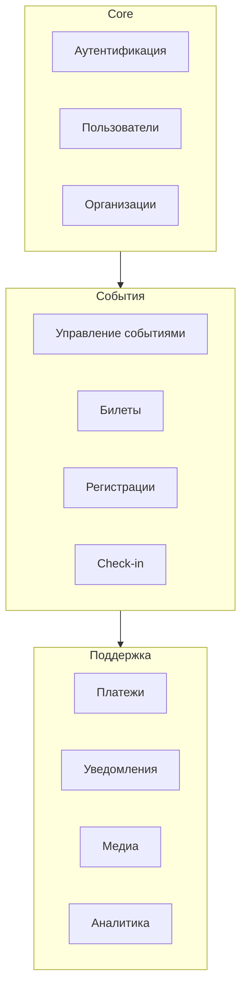
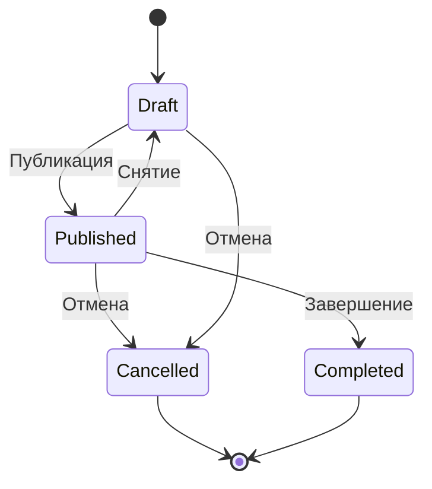

# Functional Requirements

Функциональные требования к платформе AqStream.

## Обзор модулей

## FR-1: Аутентификация и авторизация

### FR-1.1: Регистрация пользователя

| ID | Требование |
|----|-----------|
| FR-1.1.1 | Система должна позволять регистрацию по email и паролю |
| FR-1.1.2 | Email должен быть подтверждён для активации аккаунта |
| FR-1.1.3 | Пароль должен содержать минимум 8 символов, включая буквы и цифры |
| FR-1.1.4 | Система должна проверять уникальность email |

### FR-1.2: Вход в систему

| ID | Требование |
|----|-----------|
| FR-1.2.1 | Система должна аутентифицировать пользователя по email и паролю |
| FR-1.2.2 | При успешном входе выдаётся JWT access token и refresh token |
| FR-1.2.3 | Access token действителен 15 минут |
| FR-1.2.4 | Refresh token действителен 7 дней |
| FR-1.2.5 | Система должна блокировать аккаунт после 5 неудачных попыток входа |

### FR-1.3: Восстановление пароля

| ID | Требование |
|----|-----------|
| FR-1.3.1 | Пользователь может запросить сброс пароля по email |
| FR-1.3.2 | Ссылка для сброса действительна 1 час |
| FR-1.3.3 | После сброса все активные сессии завершаются |

## FR-2: Управление пользователями

### FR-2.1: Профиль пользователя

| ID | Требование |
|----|-----------|
| FR-2.1.1 | Пользователь может редактировать имя, фамилию, аватар |
| FR-2.1.2 | Пользователь может изменить email (требует подтверждения) |
| FR-2.1.3 | Пользователь может изменить пароль |
| FR-2.1.4 | Пользователь может удалить свой аккаунт |

### FR-2.2: Настройки уведомлений

| ID | Требование |
|----|-----------|
| FR-2.2.1 | Пользователь может включить/выключить email-уведомления |
| FR-2.2.2 | Пользователь может подключить Telegram для уведомлений |
| FR-2.2.3 | Настройки применяются ко всем организациям пользователя |

## FR-3: Организации

### FR-3.1: Создание организации

| ID | Требование |
|----|-----------|
| FR-3.1.1 | Пользователь может создать организацию |
| FR-3.1.2 | Название организации обязательно |
| FR-3.1.3 | URL (slug) организации должен быть уникальным |
| FR-3.1.4 | Создатель становится владельцем организации |

### FR-3.2: Управление членами

| ID | Требование |
|----|-----------|
| FR-3.2.1 | Владелец может приглашать членов по email |
| FR-3.2.2 | Доступные роли: Owner, Admin, Manager, Viewer |
| FR-3.2.3 | Owner может назначать роли другим членам |
| FR-3.2.4 | Admin может приглашать и удалять членов (кроме Owner) |
| FR-3.2.5 | Приглашение действительно 7 дней |

### FR-3.3: Роли и права

| Право | Owner | Admin | Manager | Viewer |
|-------|-------|-------|---------|--------|
| Управление организацией | ✓ | ✓ | — | — |
| Управление членами | ✓ | ✓ | — | — |
| Создание событий | ✓ | ✓ | ✓ | — |
| Редактирование событий | ✓ | ✓ | ✓ | — |
| Просмотр регистраций | ✓ | ✓ | ✓ | ✓ |
| Просмотр аналитики | ✓ | ✓ | ✓ | ✓ |
| Check-in | ✓ | ✓ | ✓ | — |

## FR-4: События

### FR-4.1: Создание события

| ID | Требование |
|----|-----------|
| FR-4.1.1 | Организатор может создать событие от имени организации |
| FR-4.1.2 | Обязательные поля: название, дата начала |
| FR-4.1.3 | Опциональные поля: описание, место, обложка, дата окончания |
| FR-4.1.4 | Описание поддерживает Markdown |
| FR-4.1.5 | Событие создаётся в статусе Draft |

### FR-4.2: Жизненный цикл события

| ID | Требование |
|----|-----------|
| FR-4.2.1 | Draft: событие не видно публично, можно редактировать |
| FR-4.2.2 | Published: событие доступно для регистрации |
| FR-4.2.3 | Cancelled: регистрация закрыта, участники уведомлены |
| FR-4.2.4 | Completed: событие завершено, только просмотр |

### FR-4.3: Редактирование события

| ID | Требование |
|----|-----------|
| FR-4.3.1 | В статусе Draft можно редактировать всё |
| FR-4.3.2 | В статусе Published нельзя изменять типы билетов с регистрациями |
| FR-4.3.3 | При изменении даты/места участники получают уведомление |

## FR-5: Билеты

### FR-5.1: Типы билетов

| ID | Требование |
|----|-----------|
| FR-5.1.1 | Событие может иметь несколько типов билетов |
| FR-5.1.2 | Каждый тип имеет: название, количество |
| FR-5.1.3 | Можно задать период продаж (начало, окончание) |
| FR-5.1.4 | Билет может быть бесплатным или платным |

### FR-5.2: Доступность билетов

| ID | Требование |
|----|-----------|
| FR-5.2.1 | Система отображает количество доступных билетов |
| FR-5.2.2 | При продаже последнего билета тип помечается как «Распродан» |
| FR-5.2.3 | Система предотвращает overselling (конкурентные покупки) |

## FR-6: Регистрации

### FR-6.1: Процесс регистрации

| ID | Требование |
|----|-----------|
| FR-6.1.1 | Пользователь выбирает тип билета |
| FR-6.1.2 | Заполняет регистрационную форму |
| FR-6.1.3 | Для платных билетов — переход к оплате |
| FR-6.1.4 | После успешной регистрации генерируется уникальный код |
| FR-6.1.5 | Билет отправляется на email с QR-кодом |

### FR-6.2: Статусы регистрации

| Статус | Описание |
|--------|----------|
| Pending | Ожидает оплаты |
| Confirmed | Подтверждена |
| Cancelled | Отменена |
| CheckedIn | Участник пришёл |

### FR-6.3: Отмена регистрации

| ID | Требование |
|----|-----------|
| FR-6.3.1 | Участник может отменить регистрацию |
| FR-6.3.2 | Организатор может отменить регистрацию участника |
| FR-6.3.3 | При отмене платной регистрации инициируется возврат |
| FR-6.3.4 | Место возвращается в пул доступных |

## FR-7: Лист ожидания

| ID | Требование |
|----|-----------|
| FR-7.1 | При отсутствии билетов можно встать в лист ожидания |
| FR-7.2 | При появлении места первый в очереди получает уведомление |
| FR-7.3 | На бронирование даётся 24 часа |
| FR-7.4 | Если не использовано — переходит к следующему |

## FR-8: Check-in

| ID | Требование |
|----|-----------|
| FR-8.1 | Организатор может сканировать QR-код билета |
| FR-8.2 | Система проверяет валидность билета |
| FR-8.3 | Система предотвращает повторный check-in |
| FR-8.4 | Возможен ручной поиск по имени/email |
| FR-8.5 | Статистика check-in доступна в реальном времени |

## FR-9: Платежи

### FR-9.1: Провайдеры

| ID | Требование |
|----|-----------|
| FR-9.1.1 | Поддержка Stripe |
| FR-9.1.2 | Поддержка ЮKassa |
| FR-9.1.3 | Организация выбирает провайдера в настройках |

### FR-9.2: Процесс оплаты

| ID | Требование |
|----|-----------|
| FR-9.2.1 | Создание платёжной сессии при регистрации |
| FR-9.2.2 | Редирект на страницу провайдера |
| FR-9.2.3 | Обработка webhook от провайдера |
| FR-9.2.4 | Подтверждение регистрации при успешной оплате |

### FR-9.3: Возвраты

| ID | Требование |
|----|-----------|
| FR-9.3.1 | Полный возврат при отмене регистрации |
| FR-9.3.2 | Полный возврат при отмене события |
| FR-9.3.3 | Частичный возврат по решению организатора |

## FR-10: Уведомления

### FR-10.1: Email

| Тип | Триггер |
|-----|---------|
| Подтверждение регистрации | Успешная регистрация |
| Напоминание | За 24 часа до события |
| Изменение события | Изменение даты/места |
| Отмена события | Отмена организатором |
| Билет из листа ожидания | Освобождение места |

### FR-10.2: Telegram

| ID | Требование |
|----|-----------|
| FR-10.2.1 | Пользователь может подключить Telegram-бот |
| FR-10.2.2 | Уведомления дублируются в Telegram |
| FR-10.2.3 | Возможность отключить Telegram-уведомления |

## FR-11: Медиа

| ID | Требование |
|----|-----------|
| FR-11.1 | Загрузка изображений для событий |
| FR-11.2 | Поддерживаемые форматы: JPEG, PNG, WebP, GIF |
| FR-11.3 | Максимальный размер: 5 MB |
| FR-11.4 | Автоматический resize для превью |

## FR-12: Аналитика

### FR-12.1: Дашборд события

| Метрика | Описание |
|---------|----------|
| Просмотры | Количество просмотров страницы события |
| Регистрации | Общее количество регистраций |
| Конверсия | Просмотры → Регистрации |
| Check-in rate | Регистрации → Пришедшие |
| По типам билетов | Распределение по типам |

### FR-12.2: Экспорт

| ID | Требование |
|----|-----------|
| FR-12.2.1 | Экспорт списка участников в CSV |
| FR-12.2.2 | Экспорт отчёта в PDF |

## Нефункциональные требования

### Производительность

| Метрика | Требование |
|---------|-----------|
| Response time (P95) | < 500ms |
| Throughput | 1000 req/sec |
| Concurrent users | 10,000 |

### Надёжность

| Метрика | Требование |
|---------|-----------|
| Uptime | 99.9% |
| Data durability | 99.999% |
| RPO | 1 час |
| RTO | 4 часа |

### Безопасность

- Все данные передаются по HTTPS
- Пароли хранятся с bcrypt
- JWT для аутентификации
- Row Level Security для multi-tenancy

## Дальнейшее чтение

- [User Journeys](./user-journeys.md) — сценарии использования
- [Roadmap](./roadmap.md) — план развития
- [Architecture Overview](../architecture/overview.md) — архитектура
