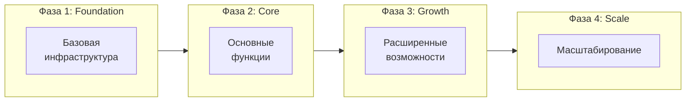

# Roadmap

План развития платформы AqStream.

## Фазы развития

## Связь с задачами

Каждая фаза декомпозируется на конкретные задачи в директории [to-dos](../to-dos/):

- `to-dos/phase-1/` — задачи Foundation
- `to-dos/phase-2/` — задачи Core
- `to-dos/phase-3/` — задачи Growth
- `to-dos/phase-4/` — задачи Scale

---

## Фаза 1: Foundation

**Цель:** Создать базовую инфраструктуру проекта

**Демо:** Локальный запуск всех сервисов одной командой, CI проходит на PR

### Инфраструктура

- [x] Настройка монорепозитория
- [x] Docker Compose для локальной разработки
- [x] CI/CD pipeline (GitHub Actions)
- [ ] Doc-as-code инфраструктура (MkDocs, генераторы, валидаторы)

### Backend Foundation

- [x] Структура Gradle multi-module проекта
- [x] Common modules (api, security, data, messaging, web, test)
- [ ] API Gateway
- [ ] PostgreSQL с multi-tenancy (RLS)
- [ ] RabbitMQ setup

### Frontend Foundation

- [ ] Next.js 14 проект
- [ ] shadcn/ui компоненты
- [ ] Базовая структура страниц
- [ ] API client setup

### Критерии завершения

- Локальная разработка одной командой (`make up`)
- CI проходит на каждый PR
- Документация актуальна

## Фаза 2: Core

**Цель:** Реализовать основные функции платформы

**Демо:** E2E сценарий — создать событие, зарегистрироваться, получить билет на email

### Аутентификация (User Service)

- [ ] Регистрация по email
- [ ] Вход по email/password
- [ ] JWT tokens (access + refresh)
- [ ] Email verification
- [ ] Password reset

### Организации (User Service)

- [ ] Создание организации
- [ ] Приглашение членов
- [ ] Роли: Owner, Admin, Manager, Viewer
- [ ] Переключение между организациями

### События (Event Service)

- [ ] CRUD событий
- [ ] Жизненный цикл: Draft → Published → Completed/Cancelled
- [ ] Типы билетов (бесплатные)
- [ ] Страница события (public)

### Регистрации (Event Service)

- [ ] Регистрация на событие
- [ ] Генерация confirmation code
- [ ] QR-код для билета
- [ ] Отмена регистрации

### Уведомления (Notification Service)

- [ ] Email templates
- [ ] Подтверждение регистрации
- [ ] Напоминание о событии

### Frontend

- [ ] Страницы auth (login, register, forgot password)
- [ ] Dashboard организатора
- [ ] Создание/редактирование события
- [ ] Страница события для участников
- [ ] Регистрация на событие
- [ ] Личный кабинет участника

### Критерии завершения

- E2E сценарий: создать событие → зарегистрироваться → получить билет
- Базовая аналитика (количество регистраций)
- Стабильная работа на тестовом окружении

## Фаза 3: Growth

**Цель:** Добавить функции для роста платформы

**Демо:** Полный платёжный цикл и check-in на реальном мероприятии

### Платежи (Payment Service)

- [ ] Интеграция Stripe
- [ ] Интеграция ЮKassa
- [ ] Платные билеты
- [ ] Возвраты
- [ ] Webhook handling

### Расширенные события

- [ ] Несколько типов билетов
- [ ] Периоды продаж
- [ ] Лимиты билетов
- [ ] Лист ожидания

### Check-in

- [ ] Сканирование QR-кодов
- [ ] Ручной поиск участников
- [ ] Статистика в реальном времени

### Уведомления

- [ ] Telegram-бот
- [ ] Настройки уведомлений
- [ ] Изменение события → уведомление участников
- [ ] Отмена события → массовое уведомление

### Медиа (Media Service)

- [ ] Загрузка изображений
- [ ] Resize для превью
- [ ] CDN интеграция

### Аналитика (Analytics Service)

- [ ] Дашборд события
- [ ] Воронка регистраций
- [ ] Экспорт данных

### Критерии завершения

- Полный платёжный цикл
- Check-in на реальном мероприятии
- Telegram-уведомления работают

## Фаза 4: Scale

**Цель:** Подготовить платформу к масштабированию

**Демо:** Нагрузочное тестирование пройдено, мониторинг настроен, Public API доступен

### Производительность

- [ ] Redis caching
- [ ] Database read replicas
- [ ] CDN для статики
- [ ] Load testing

### Observability

- [ ] Prometheus metrics
- [ ] Grafana dashboards
- [ ] Loki для логов
- [ ] Alerting

### API

- [ ] Public API документация
- [ ] Rate limiting
- [ ] API keys для интеграций
- [ ] Webhooks для клиентов

### Расширенные функции

- [ ] Промокоды
- [ ] Групповые регистрации
- [ ] Кастомные поля регистрации
- [ ] Брендирование страниц

### Критерии завершения

- Нагрузочное тестирование пройдено
- Мониторинг настроен
- Public API доступен

## Backlog (Future)

Функции для будущих фаз:

### Mobile

- [ ] Progressive Web App
- [ ] Native mobile app (React Native)
- [ ] Offline check-in

### Social

- [ ] Интеграция с календарями (Google, Apple)
- [ ] Social sharing
- [ ] Рекомендации событий

### Enterprise

- [ ] SSO (SAML, OIDC)
- [ ] Audit logs
- [ ] Custom domains
- [ ] White-label

### Monetization

- [ ] Subscription plans
- [ ] Usage-based billing
- [ ] Marketplace for integrations

## Текущий статус

| Фаза | Статус | Прогресс |
|------|--------|----------|
| Phase 1: Foundation | 🟡 В работе | Монорепозиторий и Docker Compose готовы |
| Phase 2: Core | ⚪ Не начата | — |
| Phase 3: Growth | ⚪ Не начата | — |
| Phase 4: Scale | ⚪ Не начата | — |

**Легенда:** 🟢 Завершена | 🟡 В работе | ⚪ Не начата

## Принципы приоритизации

1. **User value first** — функции, приносящие пользу пользователям
2. **Technical foundation** — инвестиции в архитектуру окупаются
3. **Iterative delivery** — маленькие релизы лучше больших
4. **Feedback-driven** — приоритеты корректируются по фидбеку

## Как контрибьютить

Хотите помочь с реализацией? 

1. Посмотрите [открытые issues](https://github.com/aqstream/aqstream/issues)
2. Выберите задачу из текущей фазы
3. Прочитайте [Contributing Guide](../experience/contributing.md)

## Дальнейшее чтение

- [Vision](./vision.md) — видение продукта
- [Functional Requirements](./functional-requirements.md) — требования
- [Architecture Overview](../architecture/overview.md) — архитектура
