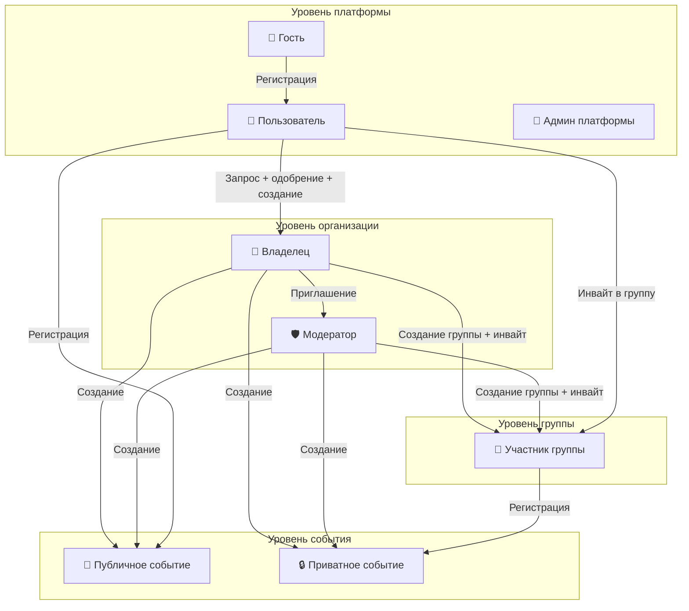
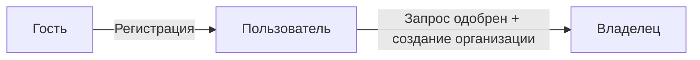
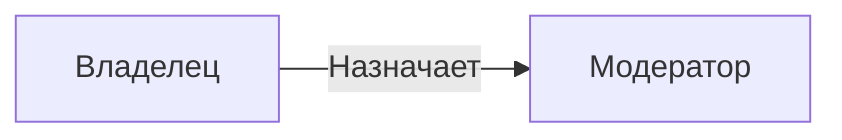
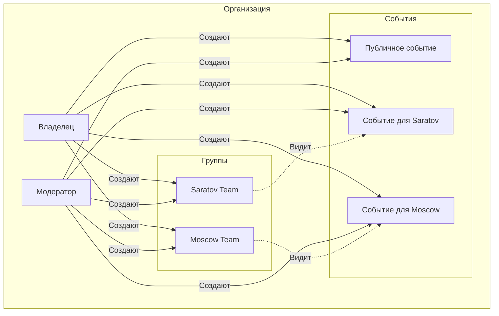
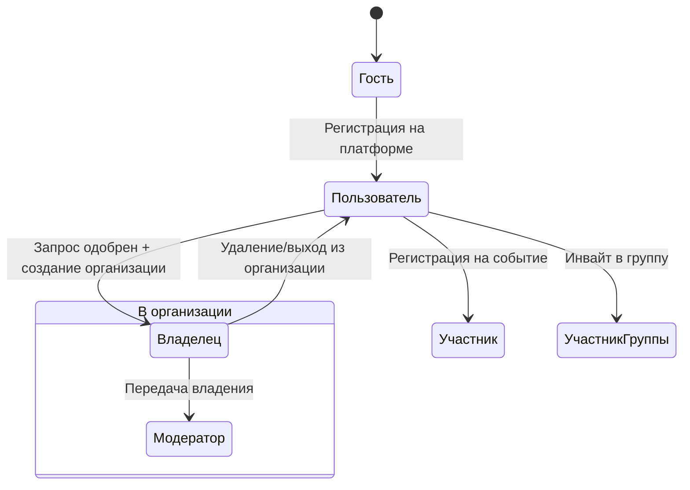
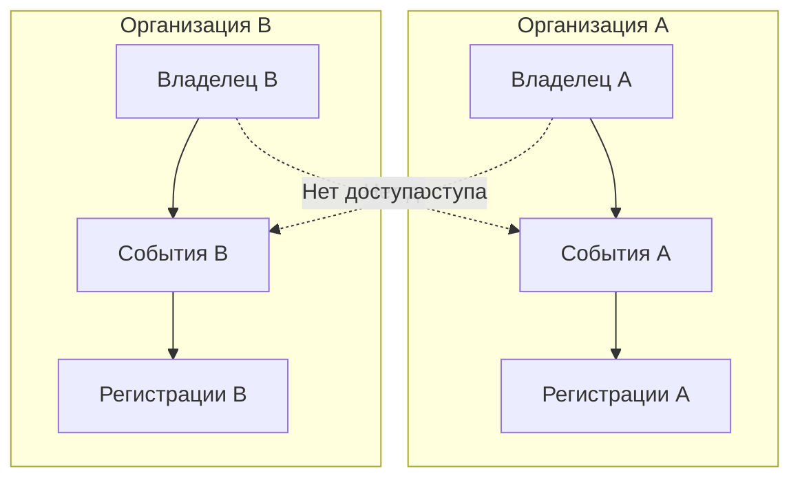

# Role Model

Ролевая модель платформы AqStream.

## Обзор

## Уровень платформы

Роли, определяющие базовый доступ к платформе.

### Матрица прав

| Возможность | Гость | Пользователь | Админ |
|-------------|-------|--------------|-------|
| Просмотр публичных событий | ✓ | ✓ | ✓ |
| Создание аккаунта | ✓ | — | — |
| Регистрация на события | — | ✓ | ✓ |
| Личный кабинет | — | ✓ | ✓ |
| История событий | — | ✓ | ✓ |
| Управление билетами | — | ✓ | ✓ |
| Запрос на создание организации | — | ✓ | ✓ |
| Настройки профиля | — | ✓ | ✓ |
| Настройки уведомлений | — | ✓ | ✓ |
| Одобрение запросов на организации | — | — | ✓ |
| Управление пользователями | — | — | ✓ |
| Управление организациями | — | — | ✓ |
| Модерация событий | — | — | ✓ |
| Системные настройки | — | — | ✓ |
| Просмотр логов | — | — | ✓ |
| Метрики платформы | — | — | ✓ |

**Как создать организацию:**
1. Пользователь отправляет запрос на создание организации
2. Админ платформы рассматривает запрос
3. При одобрении — пользователь создаёт организацию и становится её Владельцем

## Уровень организации

Роли внутри организации. Пользователь может иметь разные роли в разных организациях.

### Владелец (Owner)

Создатель организации с полным контролем.

- Один владелец на организацию
- Может передать владение другому пользователю
- Единственный, кто может удалить организацию

### Модератор

Управляет организацией и событиями.

- Приглашает и удаляет членов (кроме владельца)
- Создаёт и редактирует события
- Проводит check-in
- Доступ к аналитике

### Матрица прав

| Право | Владелец | Модератор |
|-------|----------|-----------|
| Удаление организации | ✓ | — |
| Передача владения | ✓ | — |
| Редактирование организации | ✓ | ✓ |
| Приглашение членов | ✓ | ✓ |
| Удаление членов | ✓ | ✓* |
| Назначение ролей | ✓ | — |
| Создание групп | ✓ | ✓ |
| Удаление групп | ✓ | — |
| Приглашение в группы | ✓ | ✓ |
| Создание событий | ✓ | ✓ |
| Редактирование событий | ✓ | ✓ |
| Отмена событий | ✓ | ✓ |
| Check-in | ✓ | ✓ |
| Просмотр регистраций | ✓ | ✓ |
| Просмотр аналитики | ✓ | ✓ |
| Экспорт данных | ✓ | ✓ |

*Модератор не может удалить владельца

## Группы

Группы позволяют ограничивать видимость событий внутри организации.

### Зачем нужны группы

- Приватные события для определённой аудитории
- Региональные команды внутри организации
- VIP-доступ к событиям
- Корпоративные мероприятия для сотрудников

### Участник группы

Пользователь, добавленный в группу по инвайту.

| Возможность | Доступ |
|-------------|--------|
| Просмотр событий группы | ✓ |
| Регистрация на события группы | ✓ |
| Выход из группы | ✓ |

**Особенности:**
- Один пользователь может состоять в нескольких группах
- Группы принадлежат организации
- Владелец и модераторы видят все события (включая групповые)

### Приглашение в группу

1. Владелец/модератор создаёт группу
2. Генерируется уникальный инвайт-код
3. Пользователь переходит по ссылке
4. Становится участником группы

### Видимость событий

| Тип события | Кто видит |
|-------------|-----------|
| Публичное | Все пользователи |
| Групповое | Участники группы + Владелец/Модератор |

## Уровень события

Контекстные роли в рамках конкретного события.

### Участник события

Пользователь, зарегистрированный на событие.

| Возможность | Доступ |
|-------------|--------|
| Просмотр своего билета | ✓ |
| Отмена регистрации | ✓ |
| Просмотр информации о событии | ✓ |
| Список участников* | По настройке события |

*Видимость списка участников настраивается организатором (открытая/закрытая)

## Жизненный цикл пользователя

## Назначение ролей

### Приглашение в организацию

1. Владелец или модератор отправляет приглашение через Telegram
2. Приглашённый получает уведомление с ссылкой
3. При принятии — становится модератором

### Изменение роли

- Только владелец может назначать/снимать роли
- При передаче владения — старый владелец становится модератором

## Изоляция данных

Каждая организация — отдельный tenant:
- Данные изолированы через Row Level Security
- Пользователь видит только данные своих организаций
- Админ платформы видит всё

## Дальнейшее чтение

- [User Journeys](./user-journeys.md) — сценарии использования
- [Functional Requirements](./functional-requirements.md) — функциональные требования
