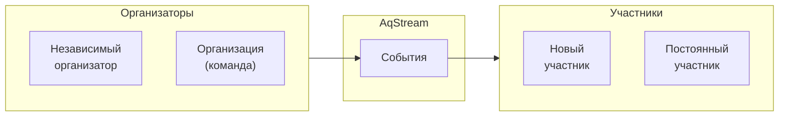
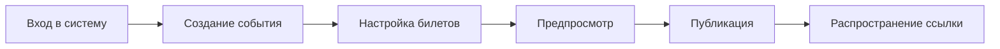
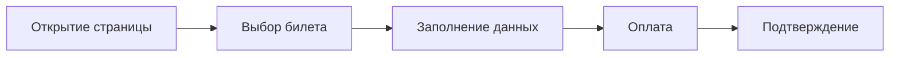
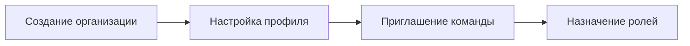
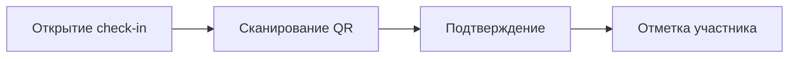
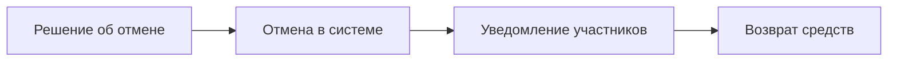
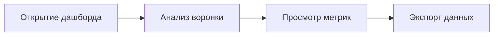
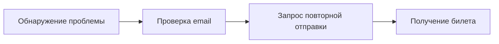

# User Journeys

Ключевые сценарии использования платформы AqStream.

## Обзор персон

## Journey 1: Создание и публикация события

**Персона:** Организатор (независимый или от организации)

**Цель:** Создать событие и начать принимать регистрации

### Шаги

### Детальный сценарий

**Предусловия:**
- Пользователь зарегистрирован
- Есть организация (для командной работы)

**Основной поток:**

1. Организатор входит в личный кабинет
2. Нажимает «Создать событие»
3. Заполняет основную информацию:
   - Название события
   - Описание (поддержка Markdown)
   - Дата и время начала/окончания
   - Место проведения (онлайн/офлайн)
   - Обложка события
4. Настраивает типы билетов:
   - «Стандарт» — основной билет
   - «VIP» — расширенный пакет (опционально)
   - Для каждого: количество, период продаж
5. Проверяет в предпросмотре
6. Публикует событие
7. Получает ссылку для распространения

**Результат:**
- Событие доступно для регистрации
- Организатор может отслеживать регистрации

### Метрики

- Time to publish (от входа до публикации)
- Completion rate (начали создание → опубликовали)
- Количество редактирований после публикации

## Journey 2: Регистрация на событие

**Персона:** Участник

**Цель:** Зарегистрироваться на интересное событие

### Шаги

### Детальный сценарий

**Предусловия:**
- Событие опубликовано
- Есть доступные билеты

**Основной поток:**

1. Участник открывает страницу события
2. Просматривает информацию:
   - Описание и программа
   - Дата, время, место
   - Доступные билеты
3. Выбирает тип билета
4. Заполняет регистрационную форму:
   - Имя, email
   - Дополнительные поля (если есть)
5. Переходит к оплате (если билет платный)
6. Получает подтверждение:
   - На странице
   - На email с билетом

**Результат:**
- Регистрация создана
- Участник получил билет
- Организатор видит новую регистрацию

### Альтернативные сценарии

**Билеты закончились:**
1. Участник видит сообщение «Билеты распроданы»
2. Предлагается встать в лист ожидания
3. При появлении места — автоматическое уведомление

**Бесплатное событие:**
1. Шаг оплаты пропускается
2. Подтверждение сразу после заполнения формы

### Метрики

- Conversion rate (посетители → регистрации)
- Drop-off по шагам
- Время регистрации

## Journey 3: Создание организации

**Персона:** Организатор, работающий в команде

**Цель:** Создать организацию для совместной работы над событиями

### Шаги

### Детальный сценарий

**Предусловия:**
- Пользователь зарегистрирован

**Основной поток:**

1. Пользователь переходит в «Организации»
2. Создаёт новую организацию:
   - Название
   - URL (slug)
   - Описание
   - Логотип
3. Приглашает членов команды по email
4. Назначает роли:
   - Admin — полный доступ
   - Manager — управление событиями
   - Viewer — только просмотр
5. Организация готова к работе

**Результат:**
- Создана организация
- Команда может совместно работать
- События привязаны к организации

### Метрики

- Количество организаций с >1 членом
- Retention организаций

## Journey 4: Check-in на событии

**Персона:** Организатор / волонтёр на входе

**Цель:** Отметить прибытие участников

### Шаги

### Детальный сценарий

**Предусловия:**
- Событие в статусе «В процессе» или близко к началу
- Есть регистрации

**Основной поток:**

1. Организатор открывает режим check-in
2. Сканирует QR-код с билета участника
3. Система проверяет:
   - Валидность билета
   - Не был ли уже check-in
4. Показывает информацию об участнике
5. Подтверждает check-in

**Альтернативный поток (ручной поиск):**

1. Организатор вводит имя или email
2. Находит участника в списке
3. Отмечает вручную

**Результат:**
- Участник отмечен как прибывший
- Статистика посещаемости обновлена

### Метрики

- Attendance rate (check-in / registrations)
- Среднее время check-in

## Journey 5: Отмена события

**Персона:** Организатор

**Цель:** Корректно отменить событие и уведомить участников

### Шаги

### Детальный сценарий

**Предусловия:**
- Событие опубликовано
- Есть регистрации

**Основной поток:**

1. Организатор открывает событие
2. Выбирает «Отменить событие»
3. Указывает причину отмены
4. Подтверждает действие
5. Система автоматически:
   - Меняет статус на «Отменено»
   - Отправляет уведомления всем участникам
   - Инициирует возвраты (для платных билетов)

**Результат:**
- Событие отменено
- Участники уведомлены
- Средства возвращены

### Метрики

- Процент отменённых событий
- Время от отмены до уведомления

## Journey 6: Просмотр аналитики

**Персона:** Организатор

**Цель:** Понять эффективность события

### Шаги

### Детальный сценарий

**Предусловия:**
- Событие завершено или в процессе

**Основной поток:**

1. Организатор открывает дашборд события
2. Видит ключевые метрики:
   - Просмотры страницы
   - Конверсия в регистрацию
   - Количество регистраций по дням
   - Attendance rate
3. Анализирует воронку:
   - Просмотры → Регистрации → Check-in
4. Экспортирует данные (CSV/Excel)

**Результат:**
- Понимание эффективности события
- Данные для улучшения следующих событий

### Метрики

- Использование дашборда организаторами
- Количество экспортов

## Journey 7: Участник не получил билет

**Персона:** Участник (проблемная ситуация)

**Цель:** Получить билет после успешной регистрации

### Шаги

### Детальный сценарий

**Предусловия:**
- Регистрация была успешной
- Билет не пришёл на email

**Основной поток:**

1. Участник проверяет папку «Спам»
2. Если не найден — входит в личный кабинет
3. Находит регистрацию в «Мои билеты»
4. Запрашивает повторную отправку
5. Получает билет на email

**Альтернатива (без аккаунта):**

1. Переходит на страницу события
2. Использует «Найти мою регистрацию»
3. Вводит email
4. Получает ссылку для просмотра билета

**Результат:**
- Участник получил билет
- Проблема решена без обращения в поддержку

## Матрица сценариев по персонам

| Journey | Организатор | Участник | Админ |
|---------|-------------|----------|-------|
| Создание события | ✓ | — | ✓ |
| Регистрация | — | ✓ | — |
| Создание организации | ✓ | — | — |
| Check-in | ✓ | — | ✓ |
| Отмена события | ✓ | — | ✓ |
| Аналитика | ✓ | — | ✓ |
| Восстановление билета | — | ✓ | — |

## Дальнейшее чтение

- [Functional Requirements](./functional-requirements.md) — функциональные требования
- [Roadmap](./roadmap.md) — план развития
