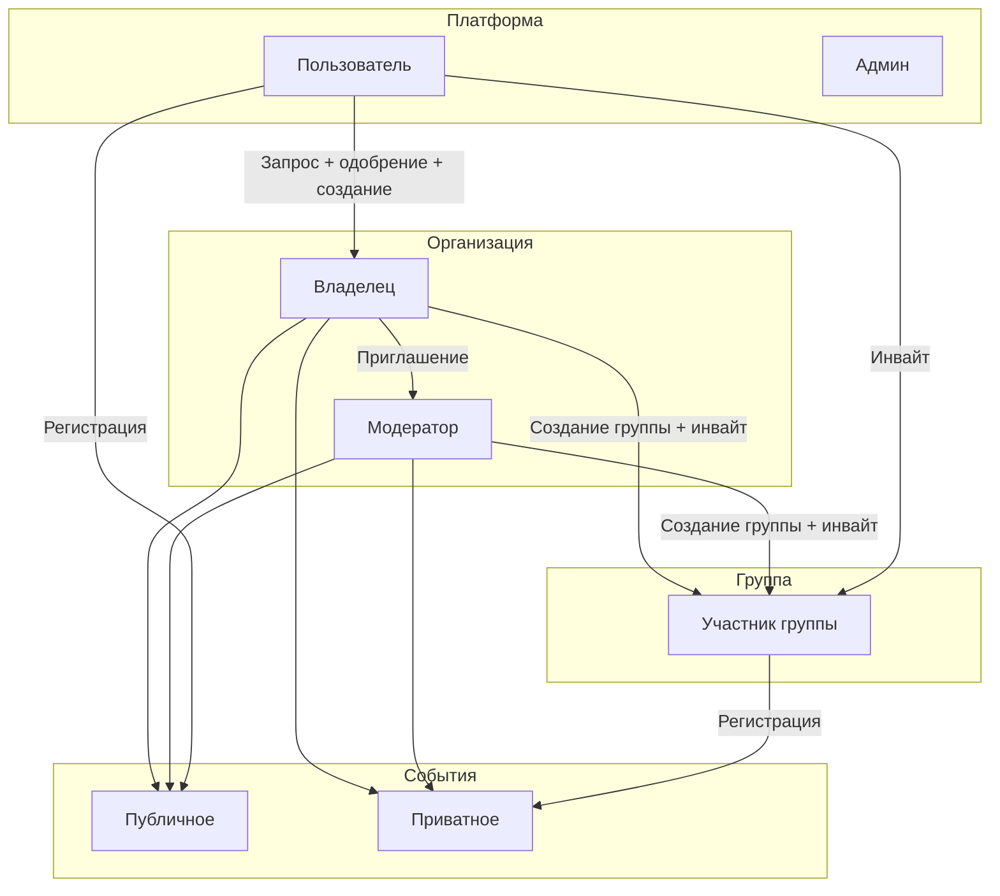
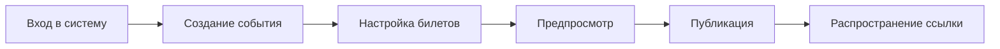
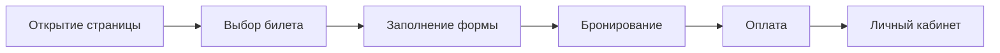
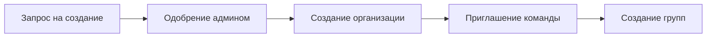
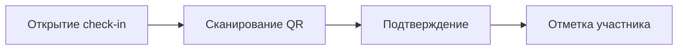
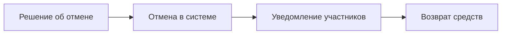
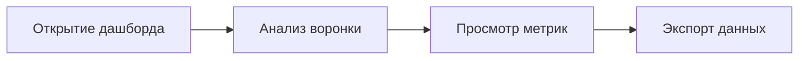
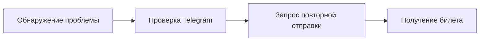
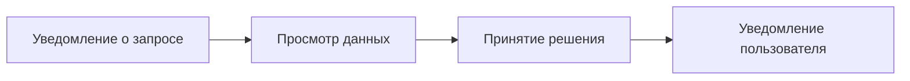

# User Journeys

Ключевые сценарии использования платформы AqStream.

## Обзор ролей

### Описание ролей

| Роль | Описание | Основные задачи |
|------|----------|-----------------|
| **Пользователь** | Зарегистрированный на платформе | Регистрация на события, запрос на создание организации |
| **Админ** | Администратор платформы | Одобрение запросов на организации, модерация |
| **Владелец** | Создатель организации | Полный контроль, удаление, передача владения |
| **Модератор** | Член организации | Создание событий, check-in, аналитика |
| **Участник группы** | Приглашённый в группу | Доступ к приватным событиям группы |

Полная ролевая модель: [Role Model](./role-model.md)

## Journey 1: Создание и публикация события

**Роль:** Владелец или Модератор организации

**Цель:** Создать событие и начать принимать регистрации

### Шаги

### Детальный сценарий

**Предусловия:**
- Пользователь зарегистрирован
- Есть организация (для командной работы)

**Основной поток:**

1. Организатор входит в личный кабинет
2. Нажимает «Создать событие»
3. Заполняет основную информацию:
   - Название события
   - Описание (поддержка Markdown)
   - Дата и время начала/окончания
   - Место проведения (онлайн/офлайн)
   - Обложка события
   - Видимость участников (закрытая/открытая)
4. Настраивает типы билетов:
   - Название типа задаёт организатор
   - Для каждого: цена (бесплатно или платно), количество, период продаж
   - Время брони (опционально)
   - Предоплата (опционально)
5. Настраивает поля регистрационной формы (кастомные поля)
6. Проверяет в предпросмотре
7. Публикует событие
8. Получает ссылку для распространения

**Результат:**
- Событие доступно для регистрации
- Организатор может отслеживать регистрации

**Видимость участников:**
- Закрытая (по умолчанию) — участник видит только свою регистрацию
- Открытая — участники видят список зарегистрированных с распределением по типам билетов (для турниров, командных событий)

### Метрики

- Time to publish (от входа до публикации)
- Completion rate (начали создание → опубликовали)
- Количество редактирований после публикации

## Journey 2: Регистрация на событие

**Роль:** Участник

**Цель:** Зарегистрироваться на интересное событие

### Шаги

### Детальный сценарий

**Предусловия:**
- Событие опубликовано
- Есть доступные билеты

**Основной поток:**

1. Участник открывает страницу события
2. Просматривает информацию:
   - Описание и программа
   - Дата, время, место
   - Доступные билеты
3. Выбирает тип билета
4. Заполняет регистрационную форму (поля заданы организатором)
5. Завершает регистрацию (бронирует билет)
6. В личном кабинете появляется карточка события

**Результат:**
- Регистрация создана (билет забронирован)
- В личном кабинете — карточка события со статусом оплаты
- Организатор видит новую регистрацию

### Сценарии оплаты

**Бесплатный билет:**
- Регистрация подтверждена сразу
- Билет отправляется в Telegram

**Платный билет без брони:**
- Оплата требуется сразу при регистрации
- После оплаты билет отправляется в Telegram

**Платный билет с предоплатой (без брони):**
- Предоплата требуется сразу при регистрации
- Остаток оплачивается позже в личном кабинете

**Платный билет с бронью:**
- Участник выбирает: оплатить сразу или позже
- Отображается срок брони
- В личном кабинете можно: оплатить полностью, внести предоплату, отменить

### Карточка события в личном кабинете

Участник видит:
- Информация о событии
- Тип билета
- Статус оплаты (если требуется)
- Доступные действия: оплатить, отменить

### Альтернативные сценарии

**Билеты закончились:**
1. Участник видит сообщение «Билеты распроданы»
2. Предлагается встать в лист ожидания
3. При появлении места — автоматическое уведомление

**Истекла бронь:**
1. Участник получает уведомление
2. Бронь аннулируется
3. Место возвращается в пул доступных

### Метрики

- Conversion rate (посетители → регистрации)
- Drop-off по шагам
- Время регистрации
- Процент оплат в срок брони

## Journey 3: Создание организации

**Роль:** Пользователь

**Цель:** Создать организацию для совместной работы над событиями

### Шаги

### Детальный сценарий

**Предусловия:**
- Пользователь зарегистрирован

**Основной поток:**

1. Пользователь отправляет запрос на создание организации
2. Админ платформы рассматривает и одобряет запрос
3. Пользователь создаёт организацию:
   - Название
   - URL (slug)
   - Описание
   - Логотип
4. Становится Владельцем организации
5. Приглашает членов команды через Telegram
6. Приглашённые становятся модераторами
7. Создаёт группы для приватных событий (опционально)

**Роли в организации:**
- Владелец (Owner) — создатель, полный контроль, удаление организации
- Модератор — управление событиями, check-in, аналитика

**Группы:**
- Для приватных событий внутри организации
- Участники приглашаются по уникальному инвайт-коду
- Событие может быть видно только участникам группы

**Результат:**
- Создана организация
- Пользователь стал Владельцем
- Команда может совместно работать

### Метрики

- Количество организаций с >1 членом
- Retention организаций

## Journey 4: Check-in на событии

**Роль:** Организатор / волонтёр на входе

**Цель:** Отметить прибытие участников

### Шаги

### Детальный сценарий

**Предусловия:**
- Событие в статусе «В процессе» или близко к началу
- Есть регистрации

**Основной поток:**

1. Организатор открывает режим check-in
2. Сканирует QR-код с билета участника
3. Система проверяет:
   - Валидность билета
   - Не был ли уже check-in
4. Показывает информацию об участнике
5. Подтверждает check-in

**Альтернативный поток (ручной поиск):**

1. Организатор вводит имя или email
2. Находит участника в списке
3. Отмечает вручную

**Результат:**
- Участник отмечен как прибывший
- Статистика посещаемости обновлена

### Метрики

- Attendance rate (check-in / registrations)
- Среднее время check-in

## Journey 5: Отмена события

**Роль:** Организатор

**Цель:** Корректно отменить событие и уведомить участников

### Шаги

### Детальный сценарий

**Предусловия:**
- Событие опубликовано
- Есть регистрации

**Основной поток:**

1. Организатор открывает событие
2. Выбирает «Отменить событие»
3. Указывает причину отмены
4. Подтверждает действие
5. Система автоматически:
   - Меняет статус на «Отменено»
   - Отправляет уведомления всем участникам
   - Инициирует возвраты (для платных билетов)

**Результат:**
- Событие отменено
- Участники уведомлены
- Средства возвращены

### Метрики

- Процент отменённых событий
- Время от отмены до уведомления

## Journey 6: Просмотр аналитики

**Роль:** Организатор

**Цель:** Понять эффективность события

### Шаги

### Детальный сценарий

**Предусловия:**
- Событие завершено или в процессе

**Основной поток:**

1. Организатор открывает дашборд события
2. Видит ключевые метрики:
   - Просмотры страницы
   - Конверсия в регистрацию
   - Количество регистраций по дням
   - Attendance rate
3. Анализирует воронку:
   - Просмотры → Регистрации → Check-in
4. Экспортирует данные (CSV/Excel)

**Результат:**
- Понимание эффективности события
- Данные для улучшения следующих событий

### Метрики

- Использование дашборда организаторами
- Количество экспортов

## Journey 7: Участник не получил билет

**Роль:** Участник (проблемная ситуация)

**Цель:** Получить билет после успешной регистрации

### Шаги

### Детальный сценарий

**Предусловия:**
- Регистрация была успешной
- Билет не пришёл в Telegram

**Основной поток:**

1. Участник проверяет чат с ботом в Telegram
2. Если не найден — входит в личный кабинет
3. Находит регистрацию в «Мои билеты»
4. Запрашивает повторную отправку
5. Получает билет в Telegram

**Альтернатива (без связанного Telegram):**

1. Переходит на страницу события
2. Использует «Найти мою регистрацию»
3. Вводит email
4. Получает ссылку для просмотра билета

**Результат:**
- Участник получил билет
- Проблема решена без обращения в поддержку

## Journey 8: Одобрение запроса на организацию

**Роль:** Администратор платформы

**Цель:** Проверить и одобрить/отклонить запрос на создание организации

### Шаги

### Детальный сценарий

**Предусловия:**
- Пользователь отправил запрос на создание организации

**Основной поток:**

1. Админ получает уведомление о новом запросе
2. Переходит в админ-панель → Запросы на организации
3. Просматривает данные запроса:
   - Имя пользователя
   - Название организации
   - Описание и цель
4. Принимает решение:
   - Одобрить — организация создаётся
   - Отклонить — указывает причину
5. Пользователь получает уведомление о решении

**Результат (при одобрении):**
- Организация создана
- Пользователь стал Владельцем
- Может приглашать модераторов

**Результат (при отклонении):**
- Пользователь получил уведомление с причиной
- Может подать повторный запрос

### Метрики

- Время обработки запроса (SLA)
- Процент одобренных запросов
- Количество повторных запросов

## Матрица сценариев по ролям

| Journey | Пользователь | Владелец | Модератор | Админ |
|---------|--------------|----------|-----------|-------|
| Создание события | — | ✓ | ✓ | — |
| Регистрация | ✓ | ✓ | ✓ | — |
| Создание организации | ✓* | — | — | — |
| Check-in | — | ✓ | ✓ | — |
| Отмена события | — | ✓ | ✓ | — |
| Аналитика | — | ✓ | ✓ | ✓ |
| Восстановление билета | ✓ | ✓ | ✓ | — |
| Одобрение организации | — | — | — | ✓ |

*После одобрения запроса админом

## Дальнейшее чтение

- [Role Model](./role-model.md) — ролевая модель
- [Functional Requirements](./functional-requirements.md) — функциональные требования
- [Roadmap](./roadmap.md) — план развития
