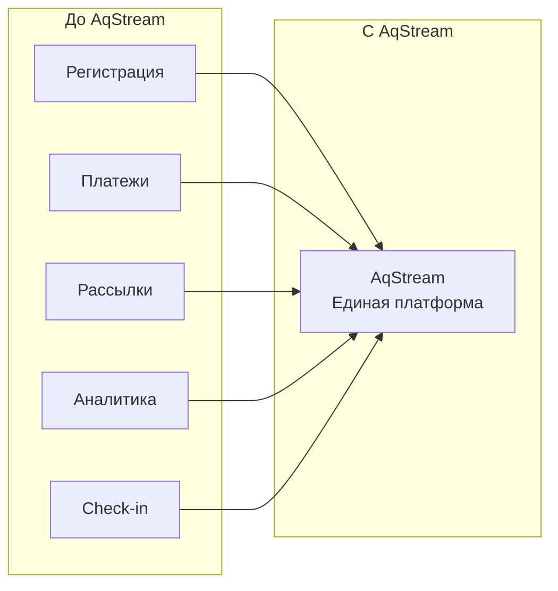

# Vision

Видение и стратегические цели платформы AqStream.

## Миссия

Сделать организацию мероприятий простой, доступной и эффективной для всех — от небольших митапов до крупных конференций.

## Проблема

Организаторы мероприятий сталкиваются с рядом сложностей:

1. **Фрагментация инструментов** — приходится использовать множество разных сервисов: для регистрации, платежей, рассылок, аналитики
2. **Сложность интеграции** — инструменты плохо работают вместе, данные разрознены
3. **Отсутствие гибкости** — готовые решения не адаптируются под специфику мероприятия
4. **Закрытость платформ** — vendor lock-in, невозможность кастомизации

## Решение

AqStream — единая open-source платформа, которая объединяет все инструменты организатора:

## Целевая аудитория

### Организаторы мероприятий

- **IT-сообщества** — митапы, хакатоны, конференции
- **Образовательные организации** — курсы, воркшопы, семинары
- **Компании** — корпоративные события, тренинги
- **Независимые организаторы** — концерты, фестивали, выставки

### Участники

- Люди, ищущие интересные мероприятия
- Профессионалы, развивающие навыки
- Сообщества по интересам

## Ценностное предложение

### Для организаторов

| Ценность | Как достигается |
|----------|----------------|
| **Единая платформа** | Все инструменты в одном месте |
| **Гибкость** | Open-source, возможность кастомизации |
| **Прозрачность** | Открытый код, понятные механизмы |
| **Контроль данных** | Self-hosted вариант, экспорт данных |
| **Аналитика** | Детальная статистика и отчёты |

### Для участников

| Ценность | Как достигается |
|----------|----------------|
| **Удобство** | Единый аккаунт для всех мероприятий |
| **Открытие** | Рекомендации релевантных событий |
| **История** | Архив посещённых мероприятий |
| **Уведомления** | Удобные каналы коммуникации |

## Конкурентные преимущества

### Open Source

- Прозрачность и доверие
- Возможность аудита кода
- Вклад сообщества
- Отсутствие vendor lock-in

### Гибкая архитектура

- Микросервисы — масштабируемость
- API-first — интеграции
- Multi-tenancy — корпоративные клиенты
- Self-hosted — полный контроль

### Локализация

- Поддержка русского языка из коробки
- Интеграция с локальными платёжными системами
- Учёт местных особенностей

## Ключевые функции

### MVP

- Создание и управление событиями
- Регистрация участников
- Типы билетов с лимитами
- Email-уведомления
- Базовая аналитика

### Roadmap

- Интеграция платёжных систем
- Telegram-бот
- Листы ожидания
- Check-in на мероприятии
- Расширенная аналитика
- API для интеграций
- Мобильное приложение

## Принципы продукта

### Простота

Интерфейс должен быть интуитивно понятен. Создание события — за минуты, не часы.

### Надёжность

Система должна работать стабильно. Потеря регистрации недопустима.

### Прозрачность

Пользователь должен понимать, что происходит с его данными и как работает система.

### Расширяемость

Платформа должна легко адаптироваться под различные сценарии использования.

## Метрики успеха

### Продуктовые метрики

- Количество активных организаций
- Количество созданных событий
- Количество регистраций
- Retention организаторов
- NPS участников

### Технические метрики

- Uptime
- Latency API
- Error rate
- Time to recovery

## Дальнейшее чтение

- [User Journeys](./user-journeys.md) — сценарии использования
- [Functional Requirements](./functional-requirements.md) — функциональные требования
- [Roadmap](./roadmap.md) — план развития
