# Domain Model

Модель предметной области платформы AqStream.

## Обзор доменов

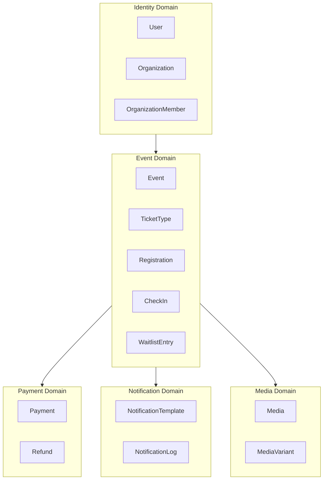

## Identity Domain

### User

Пользователь системы.

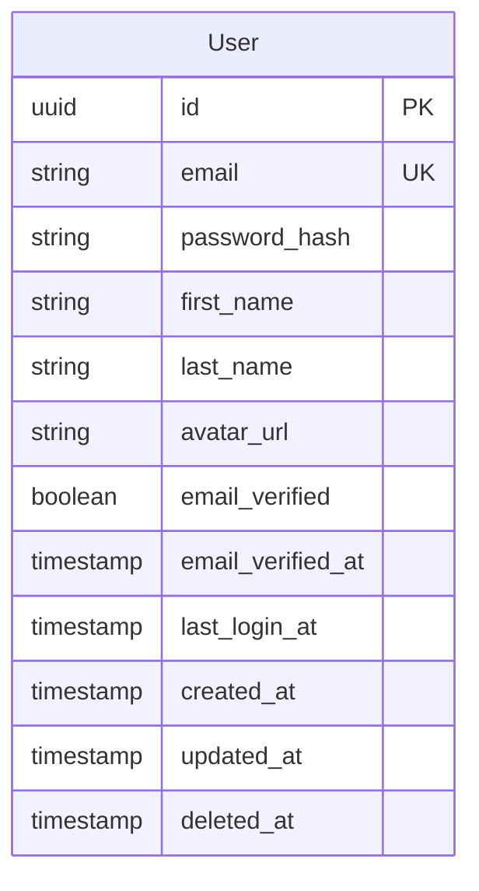

| Поле | Тип | Описание |
|------|-----|----------|
| id | UUID | Первичный ключ |
| email | String | Email (уникальный) |
| password_hash | String | Bcrypt hash пароля |
| first_name | String | Имя |
| last_name | String | Фамилия |
| avatar_url | String | URL аватара (nullable) |
| email_verified | Boolean | Подтверждён ли email |
| email_verified_at | Timestamp | Когда подтверждён |
| last_login_at | Timestamp | Последний вход |
| created_at | Timestamp | Дата создания |
| updated_at | Timestamp | Дата обновления |
| deleted_at | Timestamp | Soft delete |

**Бизнес-правила:**
- Email уникален среди активных пользователей
- Пользователь может быть членом нескольких организаций
- При soft delete email освобождается

### Organization

Организация (tenant).

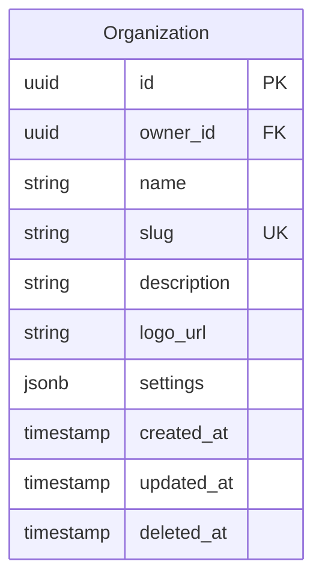

| Поле | Тип | Описание |
|------|-----|----------|
| id | UUID | Первичный ключ (используется как tenant_id) |
| owner_id | UUID | Владелец (FK → User) |
| name | String | Название |
| slug | String | URL-slug (уникальный) |
| description | String | Описание (nullable) |
| logo_url | String | URL логотипа (nullable) |
| settings | JSONB | Настройки организации |
| created_at | Timestamp | Дата создания |
| updated_at | Timestamp | Дата обновления |
| deleted_at | Timestamp | Soft delete |

**Бизнес-правила:**
- Slug уникален среди активных организаций
- Владелец не может быть удалён из организации
- При удалении организации все события архивируются

### OrganizationMember

Членство пользователя в организации.

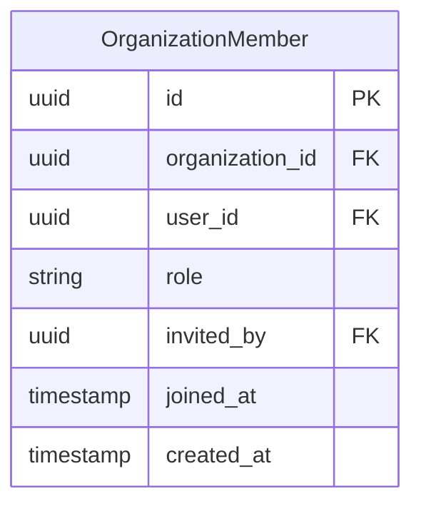

| Поле | Тип | Описание |
|------|-----|----------|
| id | UUID | Первичный ключ |
| organization_id | UUID | FK → Organization |
| user_id | UUID | FK → User |
| role | Enum | Роль: OWNER, ADMIN, MANAGER, VIEWER |
| invited_by | UUID | Кто пригласил (FK → User, nullable) |
| joined_at | Timestamp | Когда присоединился |
| created_at | Timestamp | Дата создания |

**Бизнес-правила:**
- Пара (organization_id, user_id) уникальна
- OWNER может быть только один
- OWNER не может изменить свою роль

## Event Domain

### Event

Мероприятие.

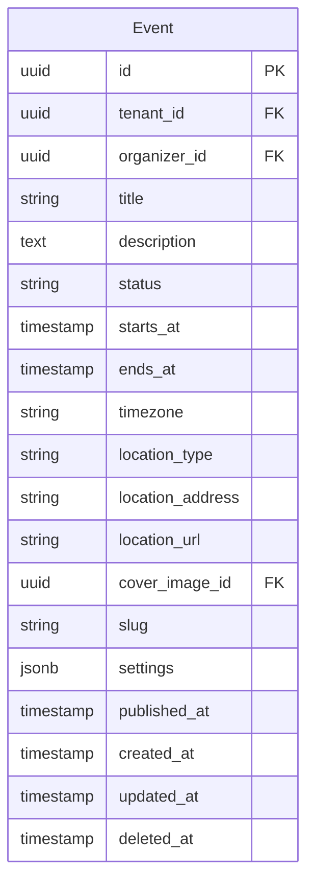

| Поле | Тип | Описание |
|------|-----|----------|
| id | UUID | Первичный ключ |
| tenant_id | UUID | FK → Organization |
| organizer_id | UUID | Создатель (FK → User) |
| title | String | Название |
| description | Text | Описание (Markdown) |
| status | Enum | DRAFT, PUBLISHED, CANCELLED, COMPLETED |
| starts_at | Timestamp | Начало (UTC) |
| ends_at | Timestamp | Окончание (UTC, nullable) |
| timezone | String | Таймзона (IANA) |
| location_type | Enum | ONLINE, OFFLINE, HYBRID |
| location_address | String | Адрес (для OFFLINE) |
| location_url | String | URL (для ONLINE) |
| cover_image_id | UUID | FK → Media (nullable) |
| slug | String | URL-slug |
| settings | JSONB | Настройки события |
| published_at | Timestamp | Когда опубликовано |
| created_at | Timestamp | Дата создания |
| updated_at | Timestamp | Дата обновления |
| deleted_at | Timestamp | Soft delete |

**Статусы:**

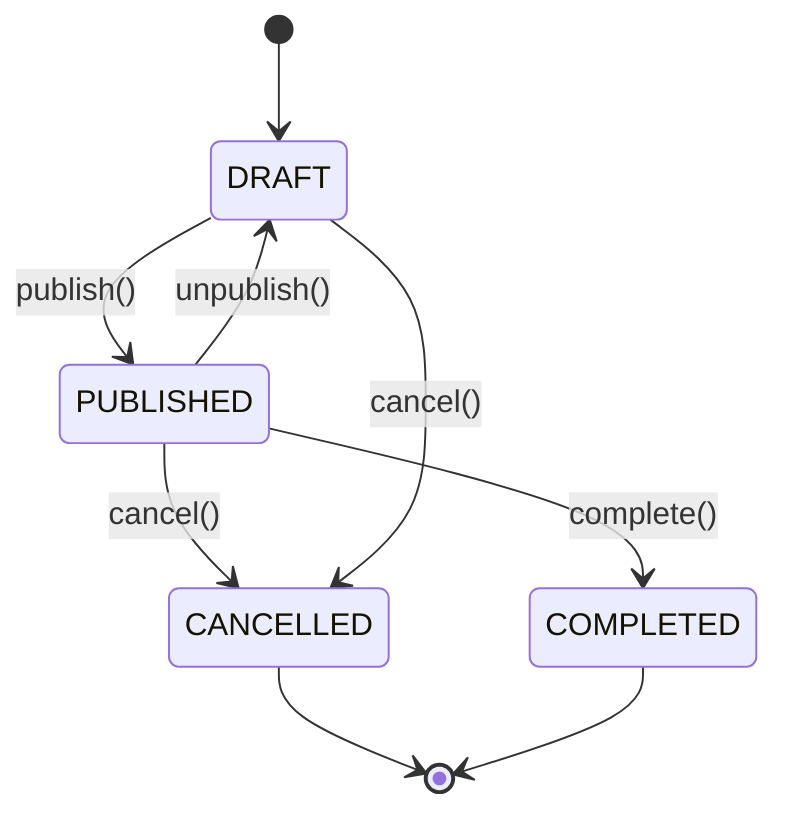

**Бизнес-правила:**
- Slug уникален в рамках tenant
- starts_at обязателен
- Нельзя публиковать событие в прошлом
- При отмене все регистрации отменяются

### TicketType

Тип билета.

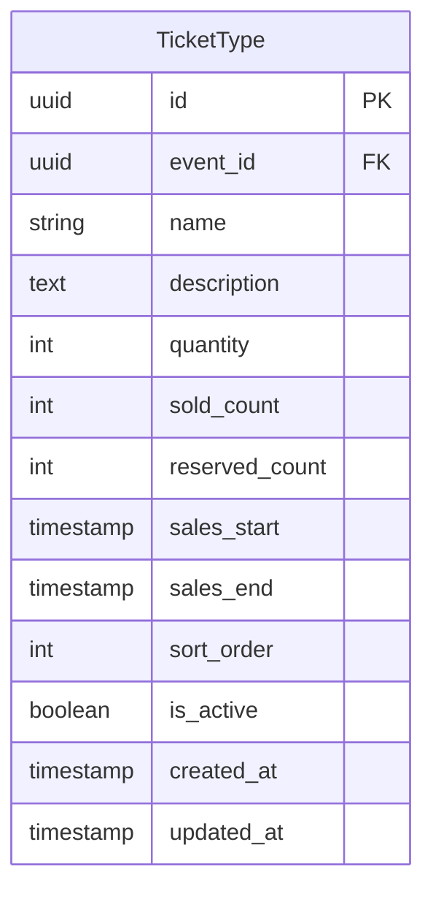

| Поле | Тип | Описание |
|------|-----|----------|
| id | UUID | Первичный ключ |
| event_id | UUID | FK → Event |
| name | String | Название |
| description | Text | Описание (nullable) |
| quantity | Integer | Общее количество (nullable = unlimited) |
| sold_count | Integer | Продано |
| reserved_count | Integer | Зарезервировано (pending payments) |
| sales_start | Timestamp | Начало продаж (nullable) |
| sales_end | Timestamp | Окончание продаж (nullable) |
| sort_order | Integer | Порядок отображения |
| is_active | Boolean | Активен ли |
| created_at | Timestamp | Дата создания |
| updated_at | Timestamp | Дата обновления |

**Бизнес-правила:**
- available = quantity - sold_count - reserved_count
- Нельзя удалить тип с регистрациями
- При отключении (is_active=false) не доступен для новых регистраций

### Registration

Регистрация участника.

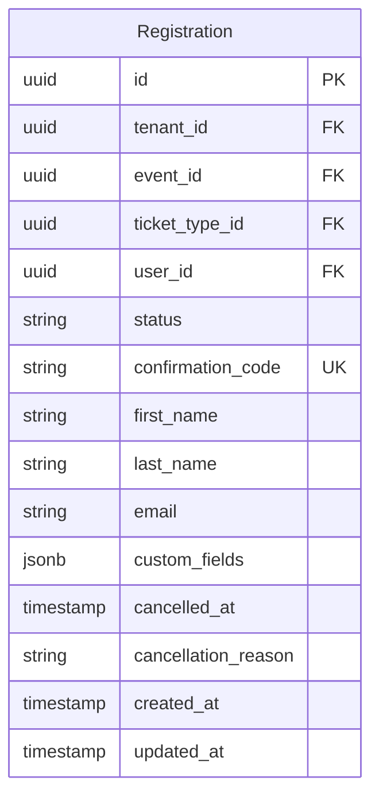

| Поле | Тип | Описание |
|------|-----|----------|
| id | UUID | Первичный ключ |
| tenant_id | UUID | FK → Organization |
| event_id | UUID | FK → Event |
| ticket_type_id | UUID | FK → TicketType |
| user_id | UUID | FK → User (nullable для анонимных) |
| status | Enum | PENDING, CONFIRMED, CANCELLED, CHECKED_IN |
| confirmation_code | String | Код подтверждения (уникальный) |
| first_name | String | Имя участника |
| last_name | String | Фамилия участника |
| email | String | Email участника |
| custom_fields | JSONB | Дополнительные поля |
| cancelled_at | Timestamp | Когда отменена |
| cancellation_reason | String | Причина отмены |
| created_at | Timestamp | Дата создания |
| updated_at | Timestamp | Дата обновления |

**Статусы:**

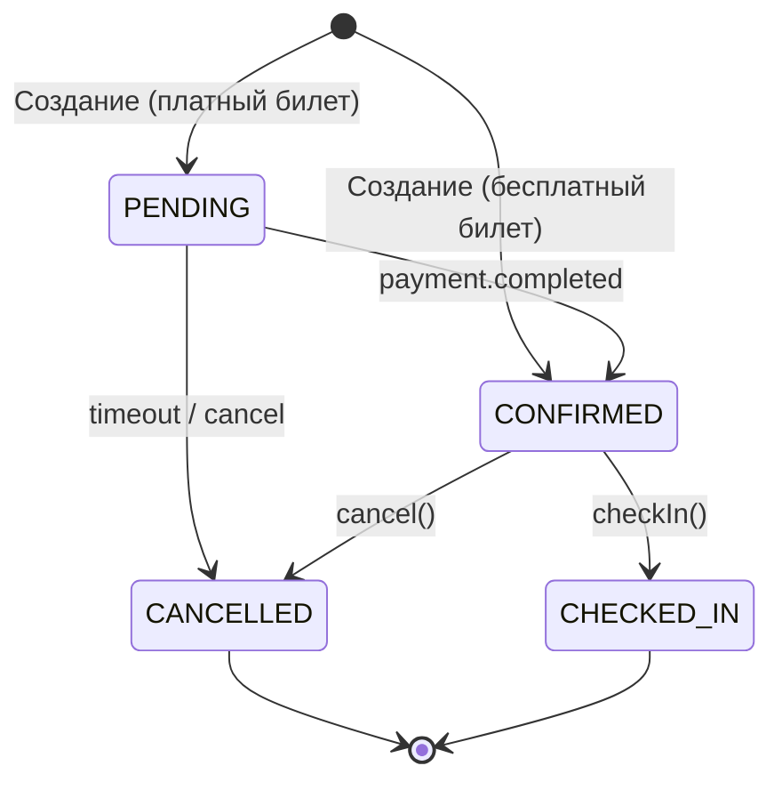

**Бизнес-правила:**
- confirmation_code генерируется автоматически (8 символов)
- При PENDING место зарезервировано на 15 минут
- Один пользователь — одна регистрация на событие

### CheckIn

Отметка прибытия.

```mermaid
erDiagram
    CheckIn {
        uuid id PK
        uuid registration_id FK UK
        uuid checked_in_by FK
        string check_in_method
        timestamp checked_in_at
    }
```

| Поле | Тип | Описание |
|------|-----|----------|
| id | UUID | Первичный ключ |
| registration_id | UUID | FK → Registration (уникальный) |
| checked_in_by | UUID | FK → User (кто отметил) |
| check_in_method | Enum | QR_SCAN, MANUAL |
| checked_in_at | Timestamp | Время отметки |

**Бизнес-правила:**
- Одна регистрация — один check-in
- Check-in только для CONFIRMED регистраций

### WaitlistEntry

Запись в лист ожидания.

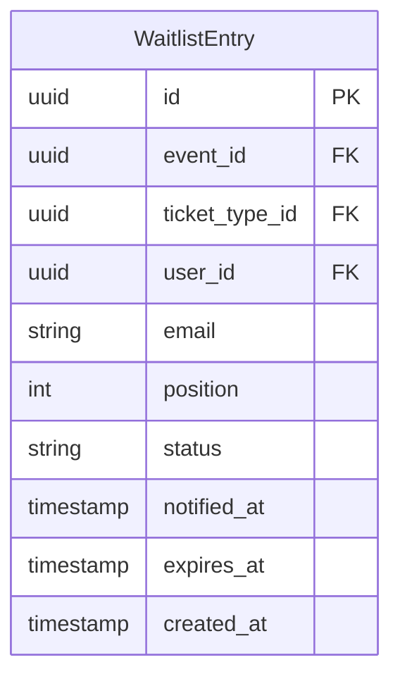

| Поле | Тип | Описание |
|------|-----|----------|
| id | UUID | Первичный ключ |
| event_id | UUID | FK → Event |
| ticket_type_id | UUID | FK → TicketType (nullable = любой тип) |
| user_id | UUID | FK → User (nullable) |
| email | String | Email |
| position | Integer | Позиция в очереди |
| status | Enum | WAITING, NOTIFIED, CONVERTED, EXPIRED |
| notified_at | Timestamp | Когда уведомлён |
| expires_at | Timestamp | Когда истекает предложение |
| created_at | Timestamp | Дата создания |

**Бизнес-правила:**
- При освобождении места первый WAITING получает уведомление
- 24 часа на регистрацию после уведомления
- При истечении переходит к следующему

## Payment Domain

### Payment

Платёж.

```mermaid
erDiagram
    Payment {
        uuid id PK
        uuid tenant_id FK
        uuid registration_id FK UK
        string provider
        string provider_payment_id
        string status
        int amount_cents
        string currency
        string idempotency_key UK
        jsonb provider_metadata
        timestamp completed_at
        timestamp created_at
        timestamp updated_at
    }
```

| Поле | Тип | Описание |
|------|-----|----------|
| id | UUID | Первичный ключ |
| tenant_id | UUID | FK → Organization |
| registration_id | UUID | FK → Registration |
| provider | Enum | STRIPE, YOOKASSA |
| provider_payment_id | String | ID в платёжной системе |
| status | Enum | PENDING, PROCESSING, COMPLETED, FAILED, REFUNDED |
| amount_cents | Integer | Сумма в копейках/центах |
| currency | String | Валюта (RUB, USD, EUR) |
| idempotency_key | UUID | Ключ идемпотентности |
| provider_metadata | JSONB | Данные от провайдера |
| completed_at | Timestamp | Когда завершён |
| created_at | Timestamp | Дата создания |
| updated_at | Timestamp | Дата обновления |

**Статусы:**

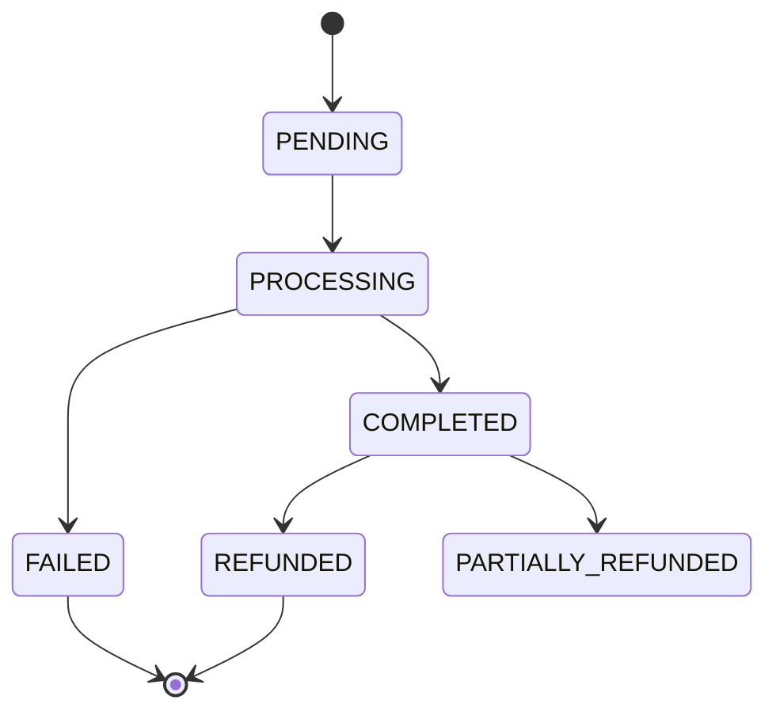

### Refund

Возврат.

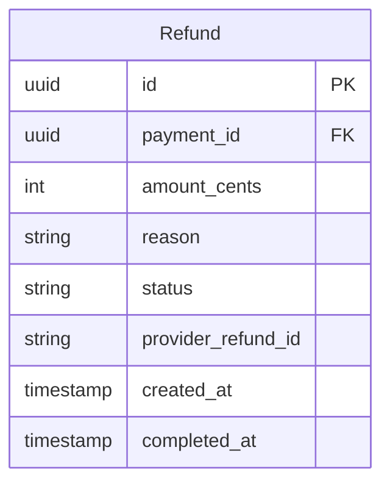

| Поле | Тип | Описание |
|------|-----|----------|
| id | UUID | Первичный ключ |
| payment_id | UUID | FK → Payment |
| amount_cents | Integer | Сумма возврата |
| reason | String | Причина |
| status | Enum | PENDING, COMPLETED, FAILED |
| provider_refund_id | String | ID в платёжной системе |
| created_at | Timestamp | Дата создания |
| completed_at | Timestamp | Когда завершён |

## Notification Domain

### NotificationTemplate

Шаблон уведомления.

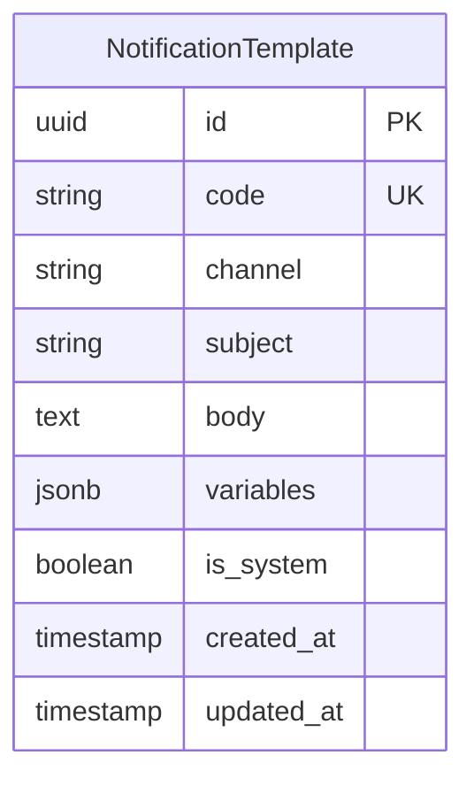

| Поле | Тип | Описание |
|------|-----|----------|
| id | UUID | Первичный ключ |
| code | String | Код шаблона (уникальный) |
| channel | Enum | EMAIL, TELEGRAM |
| subject | String | Тема (для email) |
| body | Text | Тело сообщения (Mustache template) |
| variables | JSONB | Описание переменных |
| is_system | Boolean | Системный шаблон |
| created_at | Timestamp | Дата создания |
| updated_at | Timestamp | Дата обновления |

**Стандартные шаблоны:**
- `registration.confirmed` — Подтверждение регистрации
- `registration.cancelled` — Отмена регистрации
- `event.reminder` — Напоминание о событии
- `event.changed` — Изменение события
- `event.cancelled` — Отмена события
- `waitlist.available` — Место из листа ожидания

### NotificationLog

Лог отправленных уведомлений.

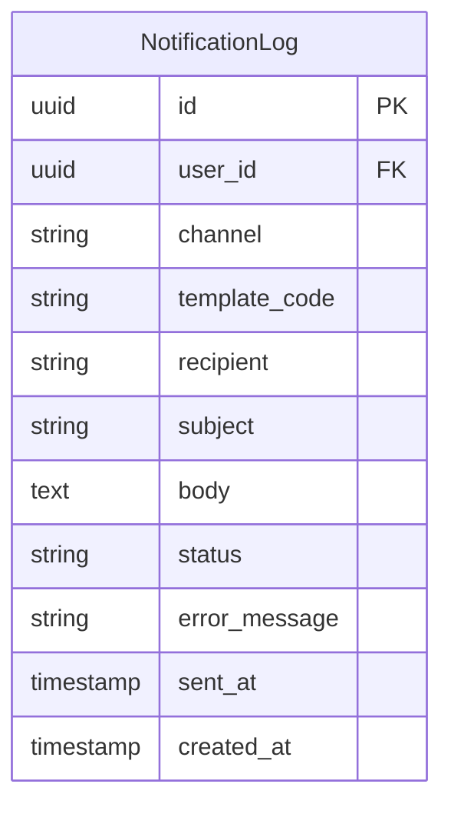

## Media Domain

### Media

Загруженный файл.

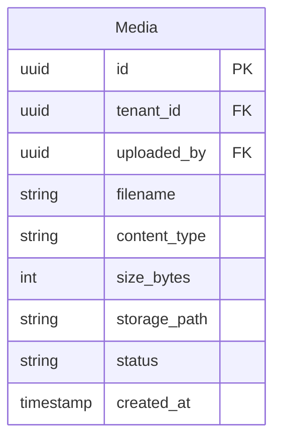

| Поле | Тип | Описание |
|------|-----|----------|
| id | UUID | Первичный ключ |
| tenant_id | UUID | FK → Organization |
| uploaded_by | UUID | FK → User |
| filename | String | Оригинальное имя файла |
| content_type | String | MIME type |
| size_bytes | Integer | Размер в байтах |
| storage_path | String | Путь в хранилище |
| status | Enum | UPLOADING, READY, DELETED |
| created_at | Timestamp | Дата создания |

### MediaVariant

Вариант изображения (resize).

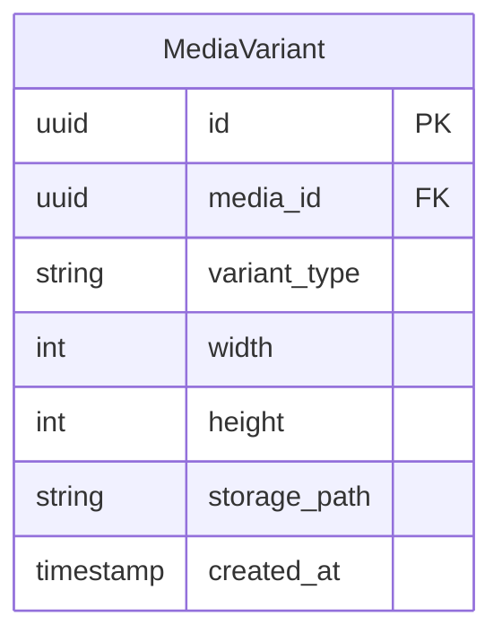

| Поле | Тип | Описание |
|------|-----|----------|
| id | UUID | Первичный ключ |
| media_id | UUID | FK → Media |
| variant_type | Enum | THUMBNAIL, SMALL, MEDIUM, LARGE |
| width | Integer | Ширина |
| height | Integer | Высота |
| storage_path | String | Путь в хранилище |
| created_at | Timestamp | Дата создания |

## Связи между доменами

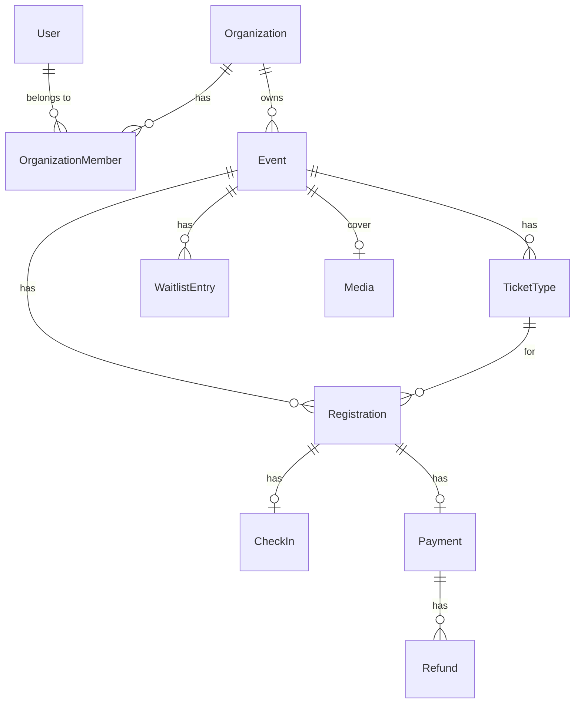

## Дальнейшее чтение

- [Data Architecture](../architecture/data-architecture.md) — архитектура данных
- [Migrations](./migrations.md) — управление миграциями
