# Domain Model

Модель предметной области платформы AqStream.

## Обзор доменов

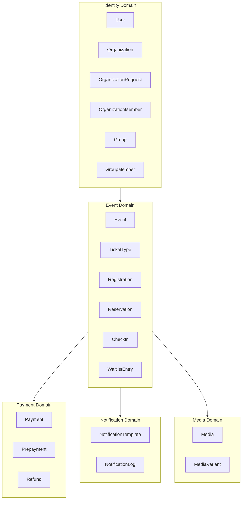

## Identity Domain

### User

Пользователь системы.

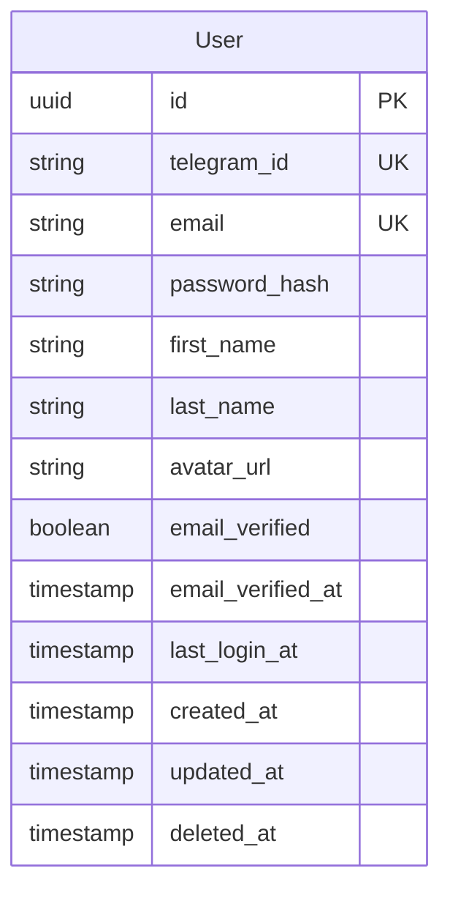

| Поле | Тип | Описание |
|------|-----|----------|
| id | UUID | Первичный ключ |
| telegram_id | String | Telegram ID (уникальный, nullable) |
| email | String | Email (уникальный, nullable) |
| password_hash | String | Bcrypt hash пароля (nullable для Telegram-only) |
| first_name | String | Имя |
| last_name | String | Фамилия |
| avatar_url | String | URL аватара (nullable) |
| email_verified | Boolean | Подтверждён ли email |
| email_verified_at | Timestamp | Когда подтверждён |
| last_login_at | Timestamp | Последний вход |
| created_at | Timestamp | Дата создания |
| updated_at | Timestamp | Дата обновления |
| deleted_at | Timestamp | Soft delete |

**Бизнес-правила:**
- Telegram ID или Email обязателен (хотя бы один)
- Telegram ID и Email уникальны среди активных пользователей
- Пользователь может быть членом нескольких организаций
- При soft delete telegram_id/email освобождаются

### Organization

Организация (tenant).

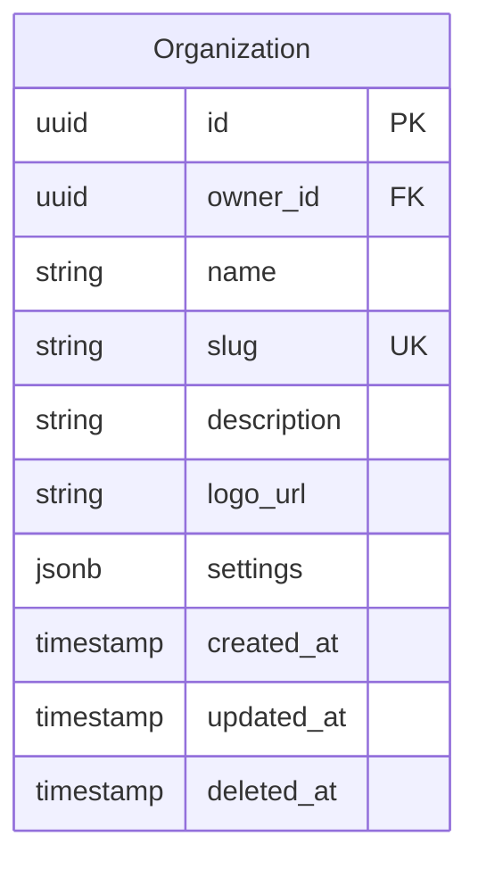

| Поле | Тип | Описание |
|------|-----|----------|
| id | UUID | Первичный ключ (используется как tenant_id) |
| owner_id | UUID | Владелец (FK → User) |
| name | String | Название |
| slug | String | URL-slug (уникальный) |
| description | String | Описание (nullable) |
| logo_url | String | URL логотипа (nullable) |
| settings | JSONB | Настройки организации |
| created_at | Timestamp | Дата создания |
| updated_at | Timestamp | Дата обновления |
| deleted_at | Timestamp | Soft delete |

**Бизнес-правила:**
- Slug уникален среди активных организаций
- Владелец не может быть удалён из организации
- При удалении организации все события архивируются

### OrganizationMember

Членство пользователя в организации.

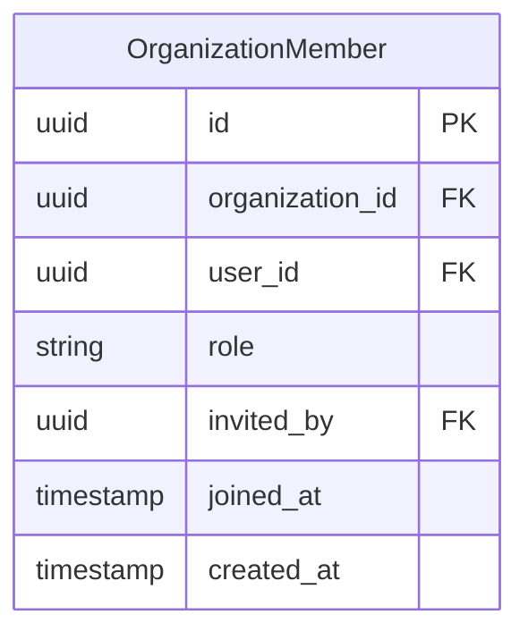

| Поле | Тип | Описание |
|------|-----|----------|
| id | UUID | Первичный ключ |
| organization_id | UUID | FK → Organization |
| user_id | UUID | FK → User |
| role | Enum | Роль: OWNER, MODERATOR |
| invited_by | UUID | Кто пригласил (FK → User, nullable) |
| joined_at | Timestamp | Когда присоединился |
| created_at | Timestamp | Дата создания |

**Роли:**
- **OWNER (Владелец)** — создатель организации, полный контроль, удаление
- **MODERATOR (Модератор)** — управление событиями, check-in, аналитика

**Бизнес-правила:**
- Пара (organization_id, user_id) уникальна
- OWNER может быть только один
- OWNER не может изменить свою роль
- Только OWNER может назначать/снимать роли

### OrganizationRequest

Запрос на создание организации (требует одобрения админа).

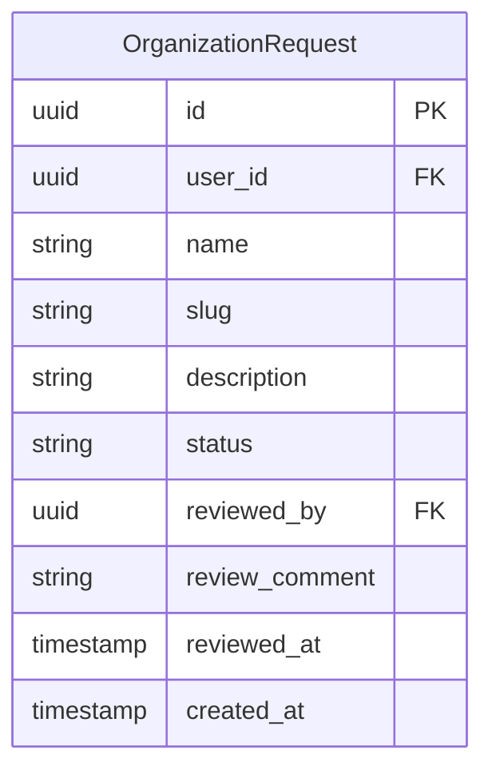

| Поле | Тип | Описание |
|------|-----|----------|
| id | UUID | Первичный ключ |
| user_id | UUID | FK → User (заявитель) |
| name | String | Желаемое название |
| slug | String | Желаемый URL-slug |
| description | String | Описание организации |
| status | Enum | PENDING, APPROVED, REJECTED |
| reviewed_by | UUID | FK → User (админ, nullable) |
| review_comment | String | Комментарий админа (nullable) |
| reviewed_at | Timestamp | Когда рассмотрено |
| created_at | Timestamp | Дата создания |

**Бизнес-правила:**
- После APPROVED пользователь может создать организацию
- Slug проверяется на уникальность при подаче запроса
- Нет tenant_id — глобальная таблица

### Group

Группа для приватных событий внутри организации.

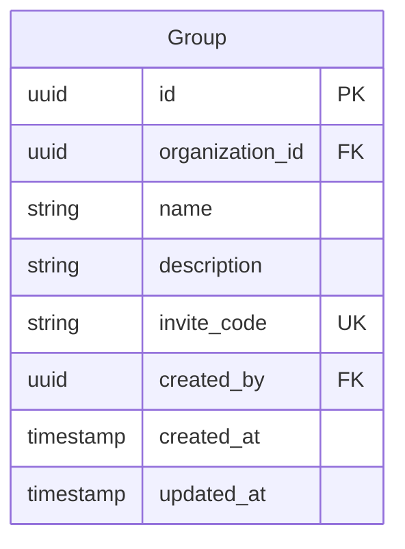

| Поле | Тип | Описание |
|------|-----|----------|
| id | UUID | Первичный ключ |
| organization_id | UUID | FK → Organization |
| name | String | Название группы |
| description | String | Описание (nullable) |
| invite_code | String | Уникальный инвайт-код |
| created_by | UUID | FK → User |
| created_at | Timestamp | Дата создания |
| updated_at | Timestamp | Дата обновления |

**Бизнес-правила:**
- Группы принадлежат организации
- invite_code генерируется автоматически (8 символов)
- Владелец и модераторы видят все группы

### GroupMember

Членство пользователя в группе.

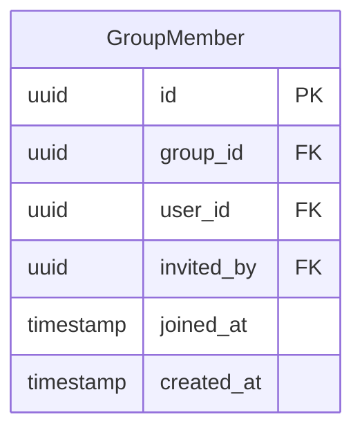

| Поле | Тип | Описание |
|------|-----|----------|
| id | UUID | Первичный ключ |
| group_id | UUID | FK → Group |
| user_id | UUID | FK → User |
| invited_by | UUID | FK → User (nullable) |
| joined_at | Timestamp | Когда присоединился |
| created_at | Timestamp | Дата создания |

**Бизнес-правила:**
- Пара (group_id, user_id) уникальна
- Пользователь может состоять в нескольких группах
- Участник группы видит приватные события этой группы

## Event Domain

### Event

Мероприятие.

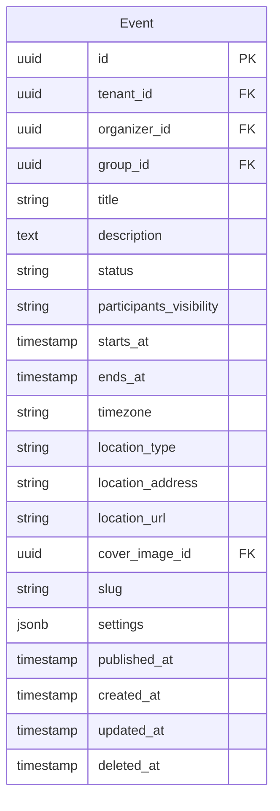

| Поле | Тип | Описание |
|------|-----|----------|
| id | UUID | Первичный ключ |
| tenant_id | UUID | FK → Organization |
| organizer_id | UUID | Создатель (FK → User) |
| group_id | UUID | FK → Group (nullable, для приватных событий) |
| title | String | Название |
| description | Text | Описание (Markdown) |
| status | Enum | DRAFT, PUBLISHED, CANCELLED, COMPLETED |
| participants_visibility | Enum | CLOSED, OPEN (по умолчанию CLOSED) |
| starts_at | Timestamp | Начало (UTC) |
| ends_at | Timestamp | Окончание (UTC, nullable) |
| timezone | String | Таймзона (IANA) |
| location_type | Enum | ONLINE, OFFLINE, HYBRID |
| location_address | String | Адрес (для OFFLINE) |
| location_url | String | URL (для ONLINE) |
| cover_image_id | UUID | FK → Media (nullable) |
| slug | String | URL-slug |
| settings | JSONB | Настройки события |
| published_at | Timestamp | Когда опубликовано |
| created_at | Timestamp | Дата создания |
| updated_at | Timestamp | Дата обновления |
| deleted_at | Timestamp | Soft delete |

**Видимость участников:**
- **CLOSED** — участник видит только свою регистрацию (по умолчанию)
- **OPEN** — участники видят список зарегистрированных с распределением по типам билетов (для турниров)

**Статусы:**

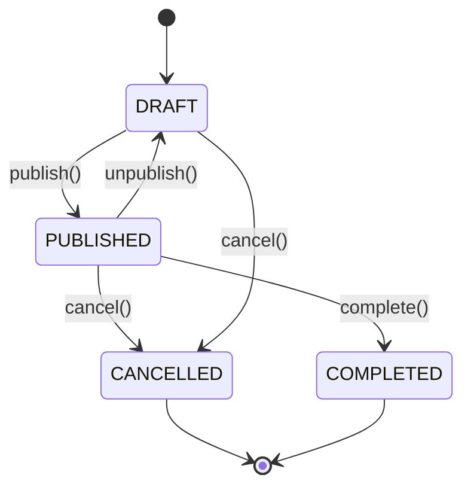

**Бизнес-правила:**
- Slug уникален в рамках tenant
- starts_at обязателен
- Нельзя публиковать событие в прошлом
- При отмене все регистрации отменяются
- Если group_id указан — событие приватное (видно только участникам группы)

### TicketType

Тип билета.

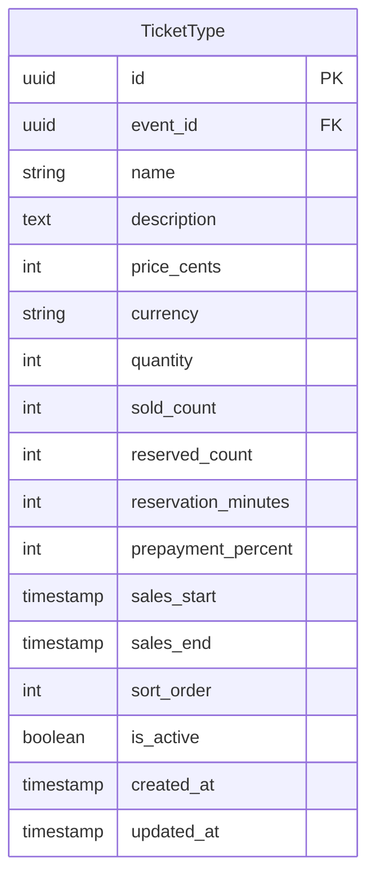

| Поле | Тип | Описание |
|------|-----|----------|
| id | UUID | Первичный ключ |
| event_id | UUID | FK → Event |
| name | String | Название |
| description | Text | Описание (nullable) |
| price_cents | Integer | Цена в копейках (0 = бесплатный) |
| currency | String | Валюта (RUB, USD, EUR) |
| quantity | Integer | Общее количество (nullable = unlimited) |
| sold_count | Integer | Продано |
| reserved_count | Integer | Зарезервировано (pending payments) |
| reservation_minutes | Integer | Время брони в минутах (nullable = без брони) |
| prepayment_percent | Integer | Процент предоплаты (nullable = полная оплата) |
| sales_start | Timestamp | Начало продаж (nullable) |
| sales_end | Timestamp | Окончание продаж (nullable) |
| sort_order | Integer | Порядок отображения |
| is_active | Boolean | Активен ли |
| created_at | Timestamp | Дата создания |
| updated_at | Timestamp | Дата обновления |

**Бизнес-правила:**
- available = quantity - sold_count - reserved_count
- Нельзя удалить тип с регистрациями
- При отключении (is_active=false) не доступен для новых регистраций
- Если reservation_minutes > 0 — участник может забронировать и оплатить позже
- Если prepayment_percent > 0 — можно внести частичную оплату

### Registration

Регистрация участника.

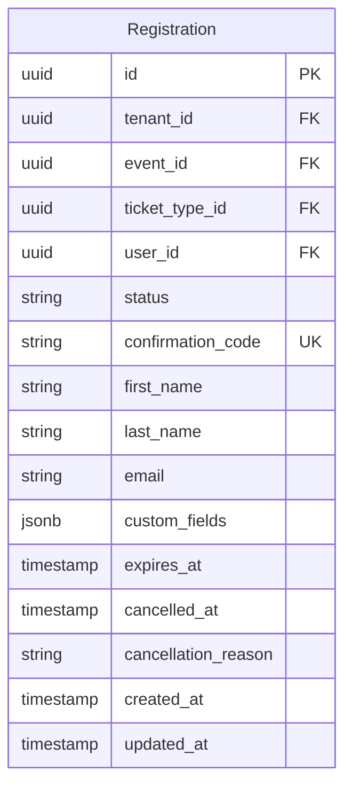

| Поле | Тип | Описание |
|------|-----|----------|
| id | UUID | Первичный ключ |
| tenant_id | UUID | FK → Organization |
| event_id | UUID | FK → Event |
| ticket_type_id | UUID | FK → TicketType |
| user_id | UUID | FK → User (nullable для анонимных) |
| status | Enum | RESERVED, PENDING, CONFIRMED, CANCELLED, CHECKED_IN, EXPIRED |
| confirmation_code | String | Код подтверждения (уникальный) |
| first_name | String | Имя участника |
| last_name | String | Фамилия участника |
| email | String | Email участника |
| custom_fields | JSONB | Дополнительные поля |
| expires_at | Timestamp | Когда истекает бронь (nullable) |
| cancelled_at | Timestamp | Когда отменена |
| cancellation_reason | String | Причина отмены |
| created_at | Timestamp | Дата создания |
| updated_at | Timestamp | Дата обновления |

**Статусы:**

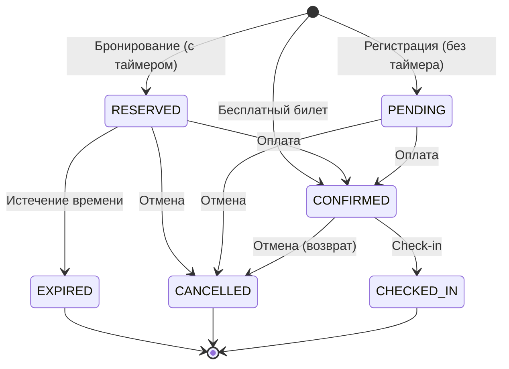

| Статус | Описание |
|--------|----------|
| RESERVED | Забронировано, ожидает оплаты (с ограничением по времени) |
| PENDING | Ожидает оплаты (без ограничения) |
| CONFIRMED | Подтверждена (оплачена или бесплатный билет) |
| CANCELLED | Отменена |
| CHECKED_IN | Участник пришёл |
| EXPIRED | Бронь истекла |

**Бизнес-правила:**
- confirmation_code генерируется автоматически (8 символов)
- RESERVED используется когда у билета задан reservation_minutes
- При EXPIRED место возвращается в пул доступных
- Один пользователь — одна регистрация на событие

### CheckIn

Отметка прибытия.

```mermaid
erDiagram
    CheckIn {
        uuid id PK
        uuid registration_id FK UK
        uuid checked_in_by FK
        string check_in_method
        timestamp checked_in_at
    }
```

| Поле | Тип | Описание |
|------|-----|----------|
| id | UUID | Первичный ключ |
| registration_id | UUID | FK → Registration (уникальный) |
| checked_in_by | UUID | FK → User (кто отметил) |
| check_in_method | Enum | QR_SCAN, MANUAL |
| checked_in_at | Timestamp | Время отметки |

**Бизнес-правила:**
- Одна регистрация — один check-in
- Check-in только для CONFIRMED регистраций

### WaitlistEntry

Запись в лист ожидания.

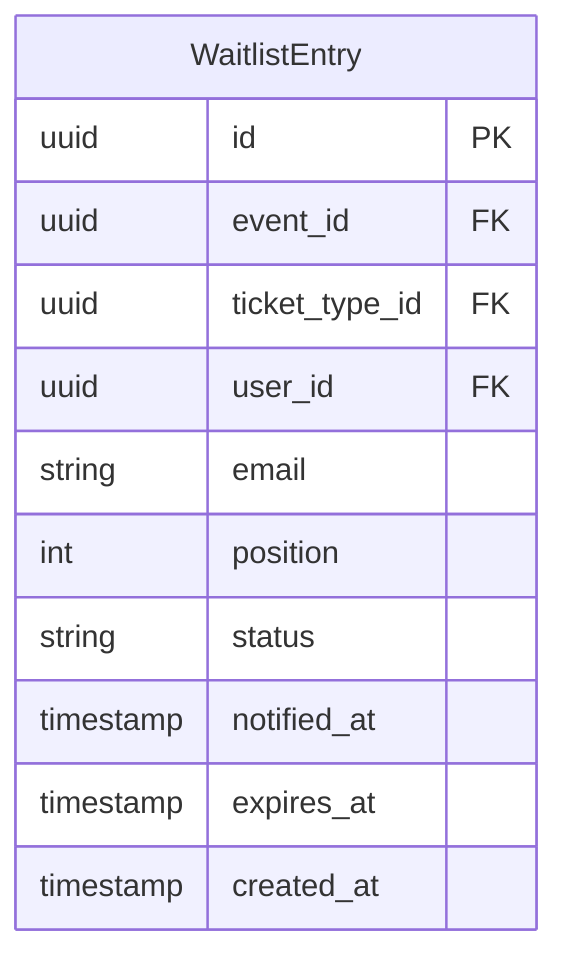

| Поле | Тип | Описание |
|------|-----|----------|
| id | UUID | Первичный ключ |
| event_id | UUID | FK → Event |
| ticket_type_id | UUID | FK → TicketType (nullable = любой тип) |
| user_id | UUID | FK → User (nullable) |
| email | String | Email |
| position | Integer | Позиция в очереди |
| status | Enum | WAITING, NOTIFIED, CONVERTED, EXPIRED |
| notified_at | Timestamp | Когда уведомлён |
| expires_at | Timestamp | Когда истекает предложение |
| created_at | Timestamp | Дата создания |

**Бизнес-правила:**
- При освобождении места первый WAITING получает уведомление
- 24 часа на регистрацию после уведомления
- При истечении переходит к следующему

## Payment Domain

### Payment

Платёж.

```mermaid
erDiagram
    Payment {
        uuid id PK
        uuid tenant_id FK
        uuid registration_id FK UK
        string provider
        string provider_payment_id
        string status
        int amount_cents
        string currency
        string idempotency_key UK
        jsonb provider_metadata
        timestamp completed_at
        timestamp created_at
        timestamp updated_at
    }
```

| Поле | Тип | Описание |
|------|-----|----------|
| id | UUID | Первичный ключ |
| tenant_id | UUID | FK → Organization |
| registration_id | UUID | FK → Registration |
| provider | String | Идентификатор провайдера |
| provider_payment_id | String | ID в платёжной системе |
| status | Enum | PENDING, PROCESSING, COMPLETED, FAILED, REFUNDED, PARTIALLY_REFUNDED |
| amount_cents | Integer | Сумма в копейках/центах |
| currency | String | Валюта (RUB, USD, EUR) |
| idempotency_key | UUID | Ключ идемпотентности |
| provider_metadata | JSONB | Данные от провайдера |
| completed_at | Timestamp | Когда завершён |
| created_at | Timestamp | Дата создания |
| updated_at | Timestamp | Дата обновления |

**Статусы:**

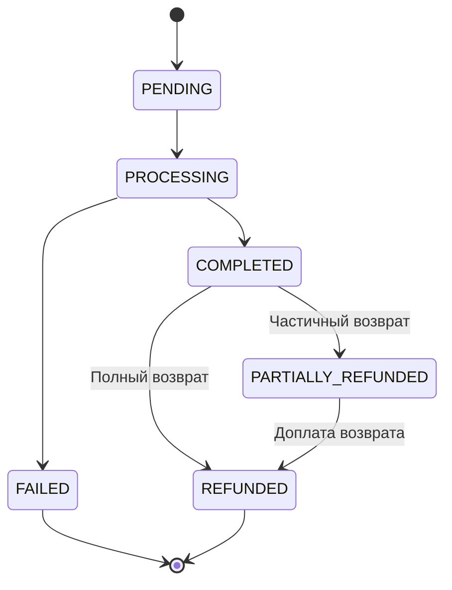

### Prepayment

Предоплата (частичная оплата при регистрации).

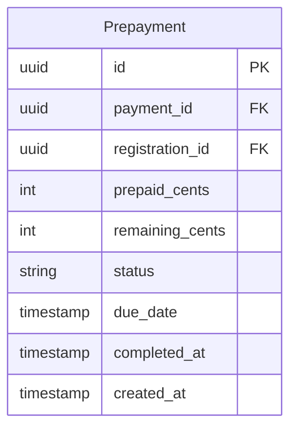

| Поле | Тип | Описание |
|------|-----|----------|
| id | UUID | Первичный ключ |
| payment_id | UUID | FK → Payment (первая оплата) |
| registration_id | UUID | FK → Registration |
| prepaid_cents | Integer | Внесённая предоплата |
| remaining_cents | Integer | Остаток к оплате |
| status | Enum | PARTIAL, COMPLETED |
| due_date | Timestamp | Срок доплаты (до начала события) |
| completed_at | Timestamp | Когда полностью оплачено |
| created_at | Timestamp | Дата создания |

**Бизнес-правила:**
- Создаётся когда билет имеет prepayment_percent > 0
- Остаток можно оплатить в личном кабинете
- Если не оплачено до due_date — регистрация может быть отменена

### Refund

Возврат.

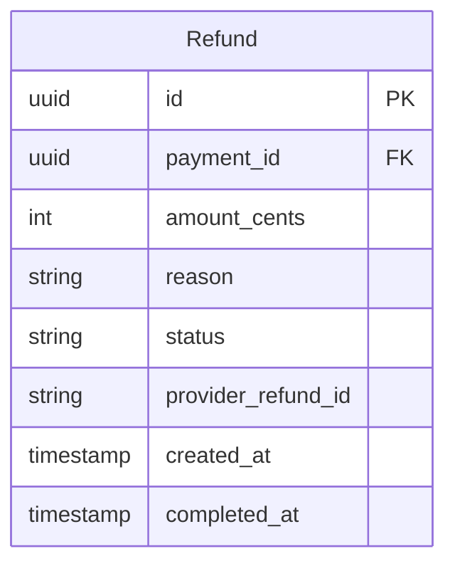

| Поле | Тип | Описание |
|------|-----|----------|
| id | UUID | Первичный ключ |
| payment_id | UUID | FK → Payment |
| amount_cents | Integer | Сумма возврата |
| reason | String | Причина |
| status | Enum | PENDING, COMPLETED, FAILED |
| provider_refund_id | String | ID в платёжной системе |
| created_at | Timestamp | Дата создания |
| completed_at | Timestamp | Когда завершён |

## Notification Domain

### NotificationTemplate

Шаблон уведомления.

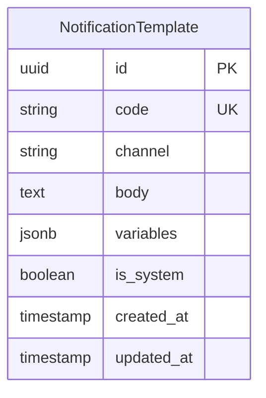

| Поле | Тип | Описание |
|------|-----|----------|
| id | UUID | Первичный ключ |
| code | String | Код шаблона (уникальный) |
| channel | Enum | TELEGRAM (единственный канал) |
| body | Text | Тело сообщения (Mustache template, Markdown) |
| variables | JSONB | Описание переменных |
| is_system | Boolean | Системный шаблон |
| created_at | Timestamp | Дата создания |
| updated_at | Timestamp | Дата обновления |

**Стандартные шаблоны:**
- `user.welcome` — Welcome сообщение после регистрации
- `registration.confirmed` — Билет с QR-кодом
- `registration.cancelled` — Отмена регистрации
- `reservation.expired` — Истечение брони
- `event.reminder` — Напоминание о событии (за 24ч)
- `event.changed` — Изменение даты/места
- `event.cancelled` — Отмена события
- `waitlist.available` — Место из листа ожидания
- `payment.receipt` — Чек об оплате

### NotificationLog

Лог отправленных уведомлений.

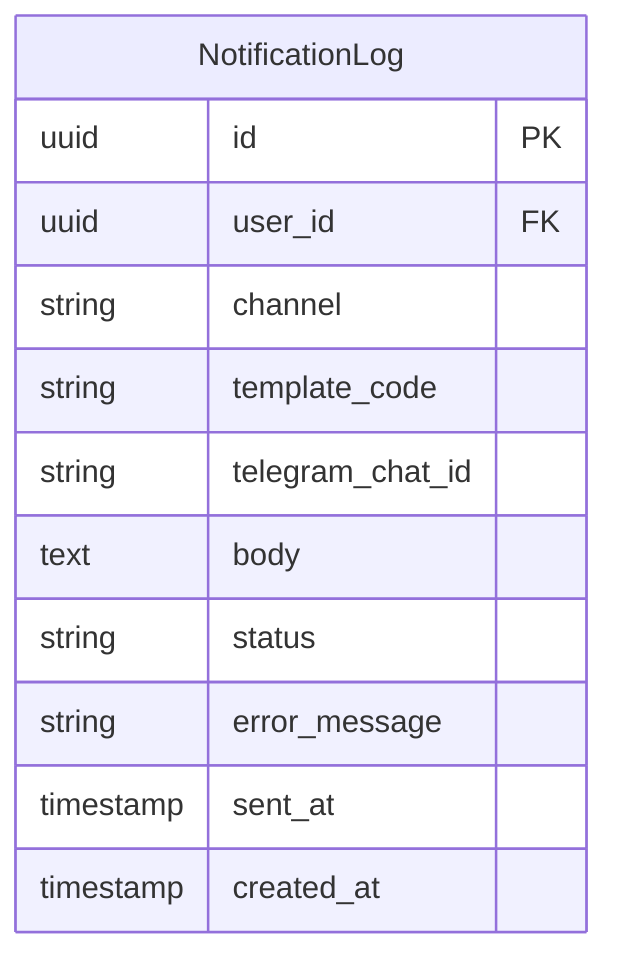

| Поле | Тип | Описание |
|------|-----|----------|
| id | UUID | Первичный ключ |
| user_id | UUID | FK → User |
| channel | Enum | TELEGRAM |
| template_code | String | Код использованного шаблона |
| telegram_chat_id | String | Telegram chat ID получателя |
| body | Text | Отправленное сообщение |
| status | Enum | PENDING, SENT, FAILED |
| error_message | String | Ошибка (если FAILED) |
| sent_at | Timestamp | Когда отправлено |
| created_at | Timestamp | Дата создания |

## Media Domain

### Media

Загруженный файл.

```mermaid
erDiagram
    Media {
        uuid id PK
        uuid tenant_id FK
        uuid uploaded_by FK
        string filename
        string content_type
        int size_bytes
        string storage_path
        string status
        timestamp created_at
    }
```

| Поле | Тип | Описание |
|------|-----|----------|
| id | UUID | Первичный ключ |
| tenant_id | UUID | FK → Organization |
| uploaded_by | UUID | FK → User |
| filename | String | Оригинальное имя файла |
| content_type | String | MIME type |
| size_bytes | Integer | Размер в байтах |
| storage_path | String | Путь в хранилище |
| status | Enum | UPLOADING, READY, DELETED |
| created_at | Timestamp | Дата создания |

### MediaVariant

Вариант изображения (resize).

```mermaid
erDiagram
    MediaVariant {
        uuid id PK
        uuid media_id FK
        string variant_type
        int width
        int height
        string storage_path
        timestamp created_at
    }
```

| Поле | Тип | Описание |
|------|-----|----------|
| id | UUID | Первичный ключ |
| media_id | UUID | FK → Media |
| variant_type | Enum | THUMBNAIL, SMALL, MEDIUM, LARGE |
| width | Integer | Ширина |
| height | Integer | Высота |
| storage_path | String | Путь в хранилище |
| created_at | Timestamp | Дата создания |

## Связи между доменами

```mermaid
erDiagram
    User ||--o{ OrganizationMember : "belongs to"
    User ||--o{ OrganizationRequest : "requests"
    Organization ||--o{ OrganizationMember : "has"
    Organization ||--o{ Group : "has"
    Organization ||--o{ Event : "owns"
    Group ||--o{ GroupMember : "has"
    User ||--o{ GroupMember : "belongs to"
    Event ||--o| Group : "private for"
    Event ||--o{ TicketType : "has"
    Event ||--o{ Registration : "has"
    TicketType ||--o{ Registration : "for"
    Registration ||--o| CheckIn : "has"
    Registration ||--o| Payment : "has"
    Registration ||--o| Prepayment : "has"
    Payment ||--o{ Refund : "has"
    Event ||--o{ WaitlistEntry : "has"
    Event ||--o| Media : "cover"
```

## Дальнейшее чтение

- [Data Architecture](../architecture/data-architecture.md) — архитектура данных
- [Migrations](./migrations.md) — управление миграциями
