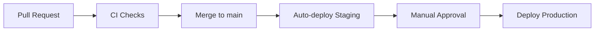

# CI/CD Pipeline

GitHub Actions для AqStream.

## Обзор



## Workflows

| Файл | Триггер | Действие |
|------|---------|----------|
| `.github/workflows/ci.yml` | PR to main | Lint, Test, Build |
| `.github/workflows/deploy-staging.yml` | Push to main | Build images, Deploy staging |
| `.github/workflows/deploy-production.yml` | Manual | Deploy production |

## PR Checks

```yaml
# .github/workflows/ci.yml
jobs:
  backend-lint:      # ./gradlew checkstyleMain checkstyleTest
  backend-test:      # ./gradlew test (with postgres, rabbitmq services)
  frontend-lint:     # pnpm lint && pnpm typecheck
  frontend-test:     # pnpm test && pnpm build
  e2e-test:          # docker compose + pnpm test:e2e
```

## Quality Gates

| Check | Required |
|-------|----------|
| Backend Lint | Yes |
| Backend Tests | Yes |
| Frontend Lint | Yes |
| Frontend Tests | Yes |
| E2E Tests | Yes |
| Coverage > 80% | Warning only |

## Deploy to Staging

На push в main:
1. Build Docker images
2. Push to GitHub Container Registry (`ghcr.io/aqstream/*`)
3. SSH deploy to staging
4. Health check
5. Slack notification

## Deploy to Production

Manual workflow_dispatch:
1. Verify image exists
2. Deploy with rolling update
3. Health check
4. Slack notification

## Secrets

| Secret | Description |
|--------|-------------|
| `STAGING_SSH_KEY` | SSH для staging |
| `PRODUCTION_SSH_KEY` | SSH для production |
| `SLACK_WEBHOOK` | Уведомления |
| `CODECOV_TOKEN` | Coverage |

## Caching

- Gradle: `~/.gradle/caches`, key по `*.gradle*`
- Node: pnpm с `cache-dependency-path`
- Docker: GitHub Actions cache
