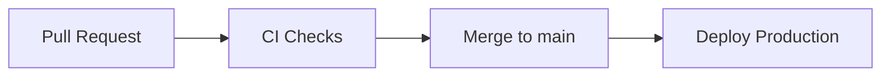

# CI/CD Pipeline

GitHub Actions для AqStream.

## Обзор



## Workflows

| Файл | Триггер | Действие |
|------|---------|----------|
| `.github/workflows/ci.yml` | PR to main, Push to main | Lint, Test, Build |
| `.github/workflows/deploy-production.yml` | Push to main | Build images, Deploy production |
| `.github/workflows/docs.yml` | Push to main (docs/**) | Build MkDocs, Deploy to docs.aqstream.ru |

## CI Workflow

### Backend Jobs

```yaml
backend-lint:
  # Checkstyle проверки
  ./gradlew checkstyleMain checkstyleTest

backend-test:
  # Unit и интеграционные тесты
  # Services: PostgreSQL 16, Redis 7
  ./gradlew test

backend-build:
  # Сборка JAR файлов
  # Запускается после успешных lint и test
  ./gradlew build -x test
```

### Frontend Jobs

```yaml
frontend-lint:
  # ESLint и TypeScript проверки
  pnpm lint
  pnpm typecheck

frontend-test:
  # Unit тесты (Vitest)
  pnpm test

frontend-build:
  # Production сборка
  # Запускается после успешных lint и test
  pnpm build
```

### Concurrency

```yaml
concurrency:
  group: ${{ github.workflow }}-${{ github.ref }}
  cancel-in-progress: true
```

Отменяет предыдущие запуски при новых коммитах в том же PR.

## Quality Gates

| Check | Required | Description |
|-------|----------|-------------|
| Backend Lint (Checkstyle) | Yes | Code style |
| Backend Tests | Yes | JUnit 5 |
| Frontend Lint (ESLint) | Yes | Code style |
| Frontend TypeCheck | Yes | TypeScript |
| Frontend Tests | Yes | Vitest |

## Deploy to Production

Автоматический деплой при push в `main`:

1. **Build JARs** — `./gradlew bootJar`
2. **Build Docker images** — для каждого сервиса
3. **Push to GHCR** — `ghcr.io/aqstream/<service>:<sha>`
4. **Deploy** — SSH к production серверу
5. **Health Check** — проверка `/actuator/health`

### Image Tags

```
ghcr.io/aqstream/aqstream/gateway:abc1234
ghcr.io/aqstream/aqstream/gateway:latest
ghcr.io/aqstream/aqstream/user-service:abc1234
ghcr.io/aqstream/aqstream/event-service:abc1234
```

## Deploy Documentation

Автоматический деплой документации при изменениях в `docs/`:

1. **Trigger** — push to main с изменениями в `docs/**`
2. **Build** — `make docs-build` (MkDocs + Material theme)
3. **Deploy** — SCP на production сервер в `/var/www/docs.aqstream.ru`

```yaml
on:
  push:
    branches: [main]
    paths: ['docs/**']

jobs:
  deploy:
    steps:
      - uses: actions/checkout@v4
      - uses: actions/setup-python@v5
      - run: pip install -r docs/_internal/doc-as-code/requirements.txt
      - run: make docs-build
      - uses: appleboy/scp-action@master
        with:
          source: "site/*"
          target: "/var/www/docs.aqstream.ru"
```

См. полный пример в [Server Setup](./server-setup.md).

## GitHub Secrets

| Secret | Description | Required For |
|--------|-------------|--------------|
| `GITHUB_TOKEN` | Автоматически предоставляется | GHCR push |
| `PRODUCTION_SSH_KEY` | SSH ключ для production | deploy-production |
| `PRODUCTION_HOST` | Адрес production сервера | deploy-production |
| `SSH_KEY` | SSH ключ для деплоя docs | docs |
| `SSH_HOST` | Адрес сервера docs | docs |
| `SSH_USER` | Пользователь SSH | docs |
| `CODECOV_TOKEN` | Токен Codecov | Coverage reports |

## Branch Protection Rules

Для ветки `main`:

- [x] Require pull request reviews (1 approval)
- [x] Require status checks to pass
  - `backend-lint`
  - `backend-test`
  - `backend-build`
  - `frontend-lint`
  - `frontend-test`
  - `frontend-build`
- [x] Require branches to be up to date
- [x] Include administrators

## Caching

### Gradle

```yaml
- uses: gradle/actions/setup-gradle@v4
  # Автоматически кэширует:
  # - ~/.gradle/caches
  # - ~/.gradle/wrapper
```

### pnpm

```yaml
- uses: actions/setup-node@v4
  with:
    cache: 'pnpm'
    cache-dependency-path: frontend/pnpm-lock.yaml
```

## Troubleshooting

### CI падает на checkstyle

```bash
# Локально проверить
./gradlew checkstyleMain checkstyleTest

# Посмотреть отчёт
open build/reports/checkstyle/main.html
```

### Тесты падают в CI но проходят локально

1. Проверить environment variables в workflow
2. Убедиться что PostgreSQL/Redis доступны (services)
3. Проверить таймауты health checks

### Docker build падает

1. Убедиться что Dockerfile существует в сервисе
2. Проверить что JAR собрался (`./gradlew bootJar`)
3. Проверить права на GHCR

## Дальнейшее чтение

- [Deploy](./deploy.md) — процесс деплоя
- [Environments](./environments.md) — окружения
- [Runbook](./runbook.md) — операционные процедуры
