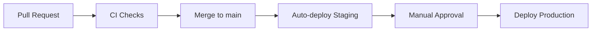

# CI/CD Pipeline

GitHub Actions для AqStream.

## Обзор



## Workflows

| Файл | Триггер | Действие |
|------|---------|----------|
| `.github/workflows/ci.yml` | PR to main, Push to main | Lint, Test, Build |
| `.github/workflows/deploy-staging.yml` | Push to main | Build images, Deploy staging |
| `.github/workflows/deploy-production.yml` | Manual (workflow_dispatch) | Deploy production |

## CI Workflow

### Backend Jobs

```yaml
backend-lint:
  # Checkstyle проверки
  ./gradlew checkstyleMain checkstyleTest

backend-test:
  # Unit и интеграционные тесты
  # Services: PostgreSQL 16, Redis 7
  ./gradlew test

backend-build:
  # Сборка JAR файлов
  # Запускается после успешных lint и test
  ./gradlew build -x test
```

### Frontend Jobs

```yaml
frontend-lint:
  # ESLint и TypeScript проверки
  pnpm lint
  pnpm typecheck

frontend-test:
  # Unit тесты (Vitest)
  pnpm test

frontend-build:
  # Production сборка
  # Запускается после успешных lint и test
  pnpm build
```

### Concurrency

```yaml
concurrency:
  group: ${{ github.workflow }}-${{ github.ref }}
  cancel-in-progress: true
```

Отменяет предыдущие запуски при новых коммитах в том же PR.

## Quality Gates

| Check | Required | Description |
|-------|----------|-------------|
| Backend Lint (Checkstyle) | Yes | Code style |
| Backend Tests | Yes | JUnit 5 |
| Frontend Lint (ESLint) | Yes | Code style |
| Frontend TypeCheck | Yes | TypeScript |
| Frontend Tests | Yes | Vitest |

## Deploy to Staging

Автоматический деплой при push в `main`:

1. **Build JARs** — `./gradlew bootJar`
2. **Build Docker images** — для каждого сервиса
3. **Push to GHCR** — `ghcr.io/aqstream/<service>:<sha>`
4. **Deploy** — SSH к staging серверу
5. **Health Check** — проверка `/actuator/health`
6. **Notification** — Slack (когда настроен)

### Image Tags

```
ghcr.io/aqstream/aqstream/gateway:abc1234
ghcr.io/aqstream/aqstream/gateway:latest
ghcr.io/aqstream/aqstream/user-service:abc1234
ghcr.io/aqstream/aqstream/event-service:abc1234
```

## Deploy to Production

Manual workflow с обязательным подтверждением:

1. **Input:** версия (SHA или tag) + подтверждение "deploy"
2. **Validation** — проверка формата версии
3. **Verify images** — проверка наличия образов в registry
4. **Deploy** — SSH к production серверу
5. **Health Check** — 30 попыток с интервалом 10 секунд
6. **Notification** — Slack/Email

### Запуск вручную

```
gh workflow run deploy-production.yml \
  -f version=abc1234 \
  -f confirm=deploy
```

## GitHub Secrets

| Secret | Description | Required For |
|--------|-------------|--------------|
| `GITHUB_TOKEN` | Автоматически предоставляется | GHCR push |
| `STAGING_SSH_KEY` | SSH ключ для staging | deploy-staging |
| `STAGING_HOST` | Адрес staging сервера | deploy-staging |
| `PRODUCTION_SSH_KEY` | SSH ключ для production | deploy-production |
| `PRODUCTION_HOST` | Адрес production сервера | deploy-production |
| `SLACK_WEBHOOK` | Webhook для уведомлений | Notifications |
| `CODECOV_TOKEN` | Токен Codecov | Coverage reports |

## Branch Protection Rules

Для ветки `main`:

- [x] Require pull request reviews (1 approval)
- [x] Require status checks to pass
  - `backend-lint`
  - `backend-test`
  - `backend-build`
  - `frontend-lint`
  - `frontend-test`
  - `frontend-build`
- [x] Require branches to be up to date
- [x] Include administrators

## Caching

### Gradle

```yaml
- uses: gradle/actions/setup-gradle@v4
  # Автоматически кэширует:
  # - ~/.gradle/caches
  # - ~/.gradle/wrapper
```

### pnpm

```yaml
- uses: actions/setup-node@v4
  with:
    cache: 'pnpm'
    cache-dependency-path: frontend/pnpm-lock.yaml
```

## CODEOWNERS

Файл `.github/CODEOWNERS` определяет автоматических reviewers:

| Path | Team |
|------|------|
| `/services/` | @aqstream/backend-team |
| `/common/` | @aqstream/backend-team |
| `/frontend/` | @aqstream/frontend-team |
| `/.github/` | @aqstream/devops-team |
| `/docker/` | @aqstream/devops-team |
| `/docs/` | @aqstream/core-team |

## Troubleshooting

### CI падает на checkstyle

```bash
# Локально проверить
./gradlew checkstyleMain checkstyleTest

# Посмотреть отчёт
open build/reports/checkstyle/main.html
```

### Тесты падают в CI но проходят локально

1. Проверить environment variables в workflow
2. Убедиться что PostgreSQL/Redis доступны (services)
3. Проверить таймауты health checks

### Docker build падает

1. Убедиться что Dockerfile существует в сервисе
2. Проверить что JAR собрался (`./gradlew bootJar`)
3. Проверить права на GHCR

## Дальнейшее чтение

- [Deploy](./deploy.md) — процесс деплоя
- [Environments](./environments.md) — окружения
- [Runbooks](./runbooks/) — операционные процедуры
