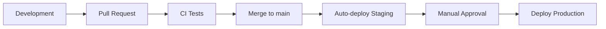

# Deploy

Процесс деплоя AqStream.

## Обзор



## Docker Images

### Сборка

```dockerfile
# services/event-service/Dockerfile
FROM eclipse-temurin:25-jre-alpine

WORKDIR /app

COPY build/libs/event-service.jar app.jar

EXPOSE 8082

ENTRYPOINT ["java", "-jar", "app.jar"]
```

### Multi-stage build

```dockerfile
# Build stage
FROM eclipse-temurin:25-jdk-alpine AS build
WORKDIR /app
COPY . .
RUN ./gradlew :services:event-service:bootJar -x test

# Runtime stage
FROM eclipse-temurin:25-jre-alpine
WORKDIR /app
COPY --from=build /app/services/event-service/build/libs/*.jar app.jar
EXPOSE 8082
ENTRYPOINT ["java", "-jar", "app.jar"]
```

### Tagging

```bash
# Format: ghcr.io/aqstream/{service}:{version}
ghcr.io/aqstream/event-service:1.0.0
ghcr.io/aqstream/event-service:1.0.0-sha-abc1234
ghcr.io/aqstream/event-service:latest
```

## CI/CD Pipeline

### Build & Test

```yaml
# .github/workflows/ci.yml
name: CI

on:
  pull_request:
    branches: [main]
  push:
    branches: [main]

jobs:
  backend-test:
    runs-on: ubuntu-latest
    services:
      postgres:
        image: postgres:16
        env:
          POSTGRES_PASSWORD: test
        ports:
          - 5432:5432
    steps:
      - uses: actions/checkout@v4
      - uses: actions/setup-java@v4
        with:
          java-version: '25'
          distribution: 'temurin'
      - name: Run tests
        run: ./gradlew test

  frontend-test:
    runs-on: ubuntu-latest
    steps:
      - uses: actions/checkout@v4
      - uses: pnpm/action-setup@v2
        with:
          version: 8
      - uses: actions/setup-node@v4
        with:
          node-version: '20'
          cache: 'pnpm'
          cache-dependency-path: frontend/pnpm-lock.yaml
      - run: cd frontend && pnpm install
      - run: cd frontend && pnpm test
      - run: cd frontend && pnpm build
```

### Deploy to Staging

```yaml
# .github/workflows/deploy-staging.yml
name: Deploy Staging

on:
  push:
    branches: [main]

jobs:
  deploy:
    runs-on: ubuntu-latest
    steps:
      - uses: actions/checkout@v4
      
      - name: Build and push images
        run: |
          echo ${{ secrets.GITHUB_TOKEN }} | docker login ghcr.io -u ${{ github.actor }} --password-stdin
          docker compose -f docker-compose.prod.yml build
          docker compose -f docker-compose.prod.yml push
      
      - name: Deploy to staging
        run: |
          # SSH and deploy
          ssh deploy@staging.aqstream.com "cd /app && docker compose pull && docker compose up -d"
```

### Deploy to Production

```yaml
# .github/workflows/deploy-production.yml
name: Deploy Production

on:
  workflow_dispatch:
    inputs:
      version:
        description: 'Version to deploy'
        required: true

jobs:
  deploy:
    runs-on: ubuntu-latest
    environment: production  # Requires approval
    steps:
      - name: Deploy to production
        run: |
          ssh deploy@aqstream.com "cd /app && ./deploy.sh ${{ inputs.version }}"
```

## Deployment Strategy

### Rolling Update

```yaml
# docker-compose.prod.yml
services:
  event-service:
    image: ghcr.io/aqstream/event-service:${VERSION}
    deploy:
      replicas: 2
      update_config:
        parallelism: 1
        delay: 10s
        failure_action: rollback
      rollback_config:
        parallelism: 1
        delay: 10s
```

### Health Checks

```yaml
services:
  event-service:
    healthcheck:
      test: ["CMD", "curl", "-f", "http://localhost:8082/actuator/health"]
      interval: 30s
      timeout: 10s
      retries: 3
      start_period: 60s
```

## Database Migrations

### Автоматические

Миграции применяются автоматически при старте сервиса:

```yaml
spring:
  liquibase:
    enabled: true
```

### Ручные (для сложных миграций)

```bash
# На staging
./gradlew :services:event-service:liquibaseUpdate -Penv=staging

# На production (после тестирования на staging)
./gradlew :services:event-service:liquibaseUpdate -Penv=production
```

## Rollback

### Быстрый rollback

```bash
# Откатить к предыдущей версии
docker compose pull event-service:previous-version
docker compose up -d event-service
```

### Database rollback

```bash
# Откатить последнюю миграцию
./gradlew :services:event-service:liquibaseRollbackCount -PliquibaseCommandValue=1
```

## Secrets Management

### GitHub Secrets

```
GITHUB_TOKEN          # GitHub Container Registry
DATABASE_URL          # PostgreSQL connection string
REDIS_URL             # Redis connection string
JWT_SECRET            # JWT signing key
STRIPE_API_KEY        # Stripe API key
SMTP_PASSWORD         # SMTP password
```

### Environment injection

```yaml
services:
  event-service:
    environment:
      - DATABASE_URL=${DATABASE_URL}
      - JWT_SECRET=${JWT_SECRET}
```

## Мониторинг деплоя

### Slack notification

```yaml
- name: Notify Slack
  uses: slackapi/slack-github-action@v1
  with:
    payload: |
      {
        "text": "Deployed ${{ github.sha }} to staging"
      }
  env:
    SLACK_WEBHOOK_URL: ${{ secrets.SLACK_WEBHOOK }}
```

### Health check после деплоя

```yaml
- name: Verify deployment
  run: |
    for i in {1..30}; do
      if curl -s http://staging.aqstream.com/actuator/health | grep -q "UP"; then
        echo "Deployment successful"
        exit 0
      fi
      sleep 10
    done
    echo "Deployment failed"
    exit 1
```

## Дальнейшее чтение

- [CI/CD](./ci-cd.md) — детали пайплайнов
- [Observability](./observability.md) — мониторинг
- [Runbooks](./runbooks/) — операционные процедуры
