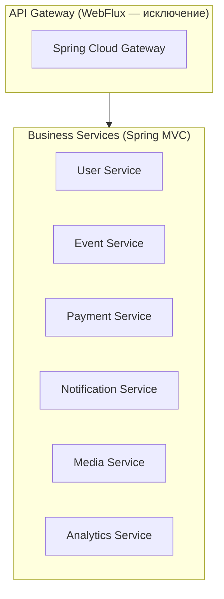
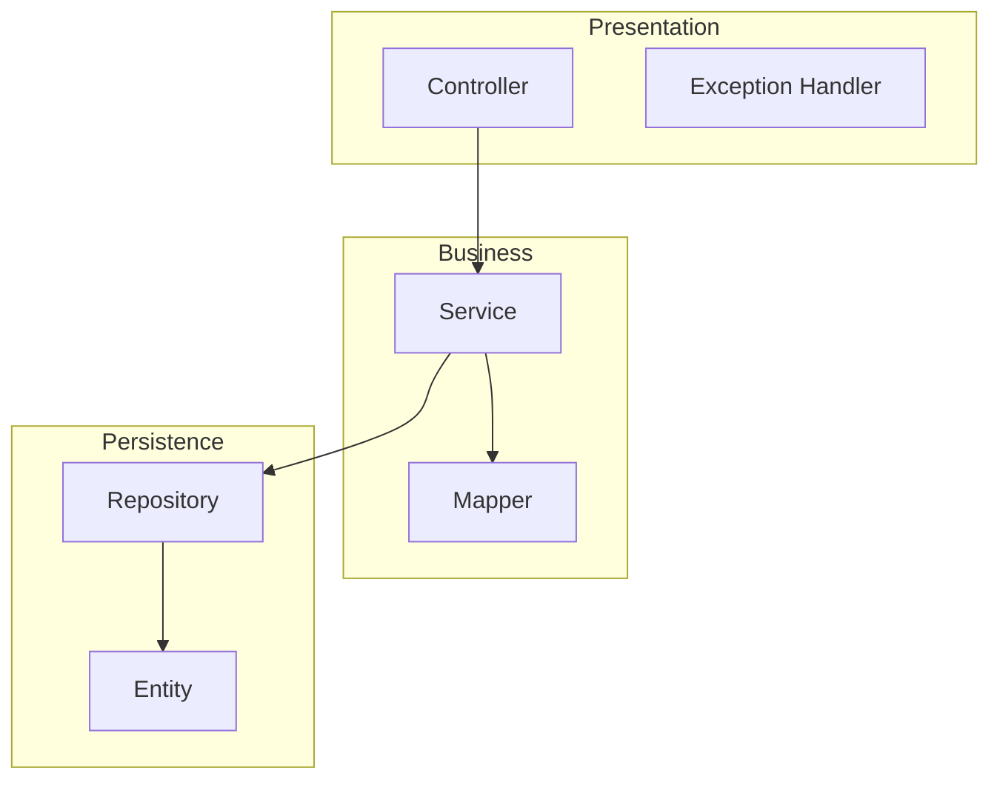

# Backend Architecture

Архитектура и стандарты backend-разработки в AqStream.

## Архитектурное решение: Spring MVC

**Все бизнес-сервисы используют классический Spring MVC (servlet-based, blocking I/O).**



### Почему Spring MVC

| Критерий | Spring MVC | WebFlux |
|----------|------------|---------|
| Отладка | Простой stack trace | Сложный async stack |
| JPA/Hibernate | Нативная поддержка | Требует R2DBC |
| Код | Простой, понятный | Reactive chains |
| Производительность | Достаточна для нас | Нужна при 100K+ req/s |

```java
// ✅ ПРАВИЛЬНО — Spring MVC
@RestController
@RequestMapping("/api/v1/events")
@RequiredArgsConstructor
public class EventController {
    
    private final EventService eventService;
    
    @GetMapping("/{id}")
    public ResponseEntity<EventDto> getById(@PathVariable UUID id) {
        return ResponseEntity.ok(eventService.findById(id));
    }
}

// ❌ НЕПРАВИЛЬНО — WebFlux (не использовать в бизнес-сервисах)
@GetMapping("/{id}")
public Mono<EventDto> getById(@PathVariable UUID id) {
    return eventService.findById(id);  // НЕТ!
}
```

## Структура сервиса

Каждый сервис состоит из 4 модулей:

```
event-service/
├── event-service-api/       # DTO, Events, Exceptions
├── event-service-service/   # Business logic, Controllers
├── event-service-db/        # Entities, Repositories, Migrations
└── event-service-client/    # Feign client (опционально)
```

### Модуль API

Публичные контракты сервиса:

```
event-service-api/src/main/java/com/aqstream/event/api/
├── dto/
│   ├── EventDto.java
│   ├── CreateEventRequest.java
│   └── UpdateEventRequest.java
├── event/
│   ├── EventCreatedEvent.java
│   └── EventPublishedEvent.java
└── exception/
    └── EventNotFoundException.java
```

### Модуль Service

Бизнес-логика и контроллеры:

```
event-service-service/src/main/java/com/aqstream/event/
├── EventServiceApplication.java
├── controller/
│   └── EventController.java
├── service/
│   └── EventService.java
├── mapper/
│   └── EventMapper.java
└── config/
    ├── SecurityConfig.java
    └── RabbitConfig.java
```

### Модуль DB

Persistence layer:

```
event-service-db/src/main/java/com/aqstream/event/db/
├── entity/
│   └── EventEntity.java
└── repository/
    └── EventRepository.java

event-service-db/src/main/resources/db/changelog/
├── db.changelog-master.xml
└── changes/
    └── 001-create-events-table.xml
```

## Слои приложения



### Controller

```java
@RestController
@RequestMapping("/api/v1/events")
@RequiredArgsConstructor
@Tag(name = "Events", description = "Event management API")
public class EventController {

    private final EventService eventService;

    @Operation(summary = "Получить событие по ID")
    @GetMapping("/{id}")
    public ResponseEntity<EventDto> getById(@PathVariable UUID id) {
        return ResponseEntity.ok(eventService.findById(id));
    }

    @Operation(summary = "Создать событие")
    @PostMapping
    public ResponseEntity<EventDto> create(
        @Valid @RequestBody CreateEventRequest request
    ) {
        EventDto created = eventService.create(request);
        return ResponseEntity.status(HttpStatus.CREATED).body(created);
    }
}
```

### Service

```java
@Service
@RequiredArgsConstructor
@Transactional(readOnly = true)
public class EventService {

    private final EventRepository eventRepository;
    private final EventMapper eventMapper;
    private final EventPublisher eventPublisher;

    public EventDto findById(UUID id) {
        return eventRepository.findById(id)
            .map(eventMapper::toDto)
            .orElseThrow(() -> new EventNotFoundException(id));
    }

    @Transactional
    public EventDto create(CreateEventRequest request) {
        EventEntity entity = eventMapper.toEntity(request);
        entity.setStatus(EventStatus.DRAFT);
        entity.setTenantId(TenantContext.getTenantId());
        
        EventEntity saved = eventRepository.save(entity);
        
        eventPublisher.publish(new EventCreatedEvent(saved.getId()));
        
        return eventMapper.toDto(saved);
    }
}
```

### Repository

```java
public interface EventRepository extends JpaRepository<EventEntity, UUID> {
    
    List<EventEntity> findByTenantIdAndStatus(UUID tenantId, EventStatus status);
    
    Optional<EventEntity> findByTenantIdAndSlug(UUID tenantId, String slug);
    
    @Query("""
        SELECT e FROM EventEntity e 
        WHERE e.tenantId = :tenantId 
        AND e.status = 'PUBLISHED'
        AND e.startsAt > :now
        ORDER BY e.startsAt
        """)
    Page<EventEntity> findUpcomingPublished(
        @Param("tenantId") UUID tenantId,
        @Param("now") Instant now,
        Pageable pageable
    );
}
```

### Entity

```java
@Entity
@Table(name = "events", schema = "event_service")
@Getter
@Setter
@NoArgsConstructor
public class EventEntity extends TenantAwareEntity {

    @Column(nullable = false)
    private String title;

    @Column(columnDefinition = "text")
    private String description;

    @Enumerated(EnumType.STRING)
    @Column(nullable = false)
    private EventStatus status;

    @Column(name = "starts_at", nullable = false)
    private Instant startsAt;

    @Column(name = "ends_at")
    private Instant endsAt;

    @Column(nullable = false)
    private String slug;

    @OneToMany(mappedBy = "event", cascade = CascadeType.ALL)
    private List<TicketTypeEntity> ticketTypes = new ArrayList<>();
}
```

## Code Style

### Общие правила

- Google Java Style с модификациями
- 4 spaces indentation
- Max line length: 120 символов
- Constructor injection (не field injection)

### Naming

| Элемент | Convention | Пример |
|---------|-----------|--------|
| Classes | PascalCase | `EventService`, `CreateEventRequest` |
| Methods | camelCase | `findById`, `createEvent` |
| Constants | UPPER_SNAKE | `MAX_TICKET_TYPES` |
| DB tables | snake_case | `events`, `ticket_types` |
| REST endpoints | kebab-case | `/api/v1/ticket-types` |

### DTO Records

```java
public record CreateEventRequest(
    @NotBlank 
    @Size(max = 255)
    String title,
    
    String description,
    
    @NotNull 
    @Future
    Instant startsAt,
    
    Instant endsAt,
    
    @NotBlank
    String timezone
) {}
```

### Exceptions

```java
// Domain-specific exceptions
public class EventNotFoundException extends AqStreamException {
    public EventNotFoundException(UUID id) {
        super("event_not_found", "Событие не найдено: " + id, HttpStatus.NOT_FOUND);
    }
}

// Использование
throw new EventNotFoundException(eventId);
throw new RegistrationClosedException(eventId);
throw new InsufficientPermissionsException("Недостаточно прав");
```

## Транзакции и события

### Outbox Pattern

```java
@Service
@RequiredArgsConstructor
public class EventService {

    private final EventRepository eventRepository;
    private final OutboxRepository outboxRepository;

    @Transactional
    public EventDto create(CreateEventRequest request) {
        // Сохраняем entity
        EventEntity saved = eventRepository.save(entity);
        
        // Сохраняем событие в outbox (в той же транзакции)
        outboxRepository.save(new OutboxMessage(
            "event.created",
            new EventCreatedEvent(saved.getId(), saved.getTenantId())
        ));
        
        return eventMapper.toDto(saved);
    }
}
```

## Логирование

```java
// Structured logging на русском
log.info("Событие создано: eventId={}, tenantId={}", event.getId(), tenantId);
log.error("Ошибка создания события: {}", e.getMessage(), e);

// НЕ логировать PII
log.info("Пользователь вошёл: email={}", email); // ❌
log.info("Пользователь вошёл: userId={}", userId); // ✅
```

## Тестирование

```java
@SpringBootTest
@Testcontainers
class EventServiceIntegrationTest {

    @Container
    static PostgreSQLContainer<?> postgres = new PostgreSQLContainer<>("postgres:15");

    @Autowired
    private EventService eventService;

    @Test
    void create_ValidRequest_ReturnsCreatedEvent() {
        CreateEventRequest request = new CreateEventRequest(
            "Test Event",
            "Description",
            Instant.now().plus(7, ChronoUnit.DAYS),
            null,
            "Europe/Moscow"
        );

        EventDto result = eventService.create(request);

        assertThat(result.id()).isNotNull();
        assertThat(result.title()).isEqualTo("Test Event");
        assertThat(result.status()).isEqualTo(EventStatus.DRAFT);
    }
}
```

## Дальнейшее чтение

- [API Guidelines](./api-guidelines.md) — правила API
- [Common Library](./common-library.md) — общие модули
- [Service Template](./service-template.md) — шаблон сервиса
