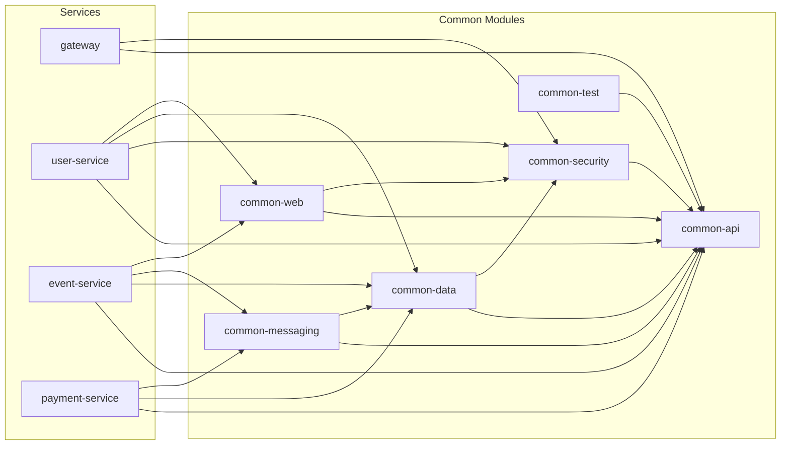

# Common Library

Общие модули для всех микросервисов AqStream.

## Диаграмма зависимостей



## Структура модулей

```text
common/
├── common-api/           # DTO, Events, Exceptions
├── common-security/      # JWT, Auth, TenantContext
├── common-data/          # BaseEntity, Repositories
├── common-messaging/     # Outbox, EventPublisher
├── common-web/           # ExceptionHandler, Filters
└── common-test/          # TestContainers, Fixtures
```

## common-api

Публичные контракты.

| Класс | Назначение |
|-------|------------|
| `PageResponse<T>` | Обёртка для пагинации |
| `ErrorResponse` | Структура ошибки (code, message, details) |
| `DomainEvent` | Базовый класс событий |
| `AqStreamException` | Базовое исключение |
| `EntityNotFoundException` | 404 для сущностей |
| `ValidationException` | 400 для валидации |
| `ConflictException` | 409 для конфликтов |

## common-security

Аутентификация и multi-tenancy.

| Класс | Назначение |
|-------|------------|
| `TenantContext` | ThreadLocal для tenant_id |
| `UserPrincipal` | Данные пользователя из JWT |
| `JwtTokenProvider` | Генерация/парсинг JWT |
| `SecurityContext` | Получение текущего пользователя |
| `JwtAuthenticationException` | Исключение аутентификации |

**TenantContext API:**

```java
TenantContext.setTenantId(uuid);  // Установить tenant
TenantContext.getTenantId();       // Получить (или IllegalStateException)
TenantContext.clear();             // Очистить (в finally)
```

## common-data

Базовые entity и конфигурация данных.

| Класс | Назначение |
|-------|------------|
| `BaseEntity` | id, createdAt, updatedAt |
| `TenantAwareEntity` | + tenantId (extends BaseEntity) |
| `SoftDeletableEntity` | + deletedAt (extends TenantAwareEntity) |
| `TenantEntityListener` | Автозаполнение tenantId из TenantContext |
| `AuditingConfig` | Конфигурация аудита JPA |
| `TenantAwareDataSourceConfig` | Конфигурация multi-tenant DataSource |
| `TenantAwareDataSourceDecorator` | Декоратор для RLS |

## common-messaging

Outbox pattern для reliable event publishing.

| Класс | Назначение |
|-------|------------|
| `OutboxMessage` | Entity для outbox таблицы |
| `EventPublisher` | Сохраняет событие в outbox |
| `OutboxProcessor` | Scheduled job — публикует в RabbitMQ |
| `OutboxRepository` | Repository для outbox сообщений |
| `OutboxSchedulingConfig` | Конфигурация планировщика |
| `RabbitMQConfig` | Конфигурация RabbitMQ |
| `EventPublishingException` | Исключение публикации |

**Использование:**

```java
@Transactional
public Event create(CreateEventRequest request) {
    Event event = eventRepository.save(entity);
    eventPublisher.publish(new EventCreatedEvent(event.getId()));
    return event;
}
```

## common-web

Web-слой.

| Класс | Назначение |
|-------|------------|
| `CorrelationIdFilter` | X-Correlation-ID в MDC |
| `TenantContextFilter` | TenantContext из JWT |
| `RequestLoggingFilter` | Логирование запросов |
| `GlobalExceptionHandler` | Преобразует exceptions → ErrorResponse |

## common-test

| Класс | Назначение |
|-------|------------|
| `@IntegrationTest` | Composite annotation для интеграционных тестов |
| `PostgresTestContainer` | Singleton контейнер PostgreSQL |
| `SharedServicesTestContainer` | Singleton контейнер для shared_services_db |
| `RabbitMQTestContainer` | Singleton контейнер RabbitMQ |
| `SecurityTestUtils` | Хелперы для JWT в тестах (jwt(), jwtAdmin()) |
| `TestFixtures` | Хелперы для тестовых данных |

## Подключение

```kotlin
dependencies {
    implementation(project(":common:common-security"))
    implementation(project(":common:common-messaging"))
    implementation(project(":common:common-web"))
    testImplementation(project(":common:common-test"))
}
```

## Правила

**В common:**
- Базовые entity, security, общие DTO
- Инфраструктурный код (outbox, filters)

**НЕ в common:**
- Бизнес-логика
- Domain-specific DTO
- Конфигурации конкретных сервисов
