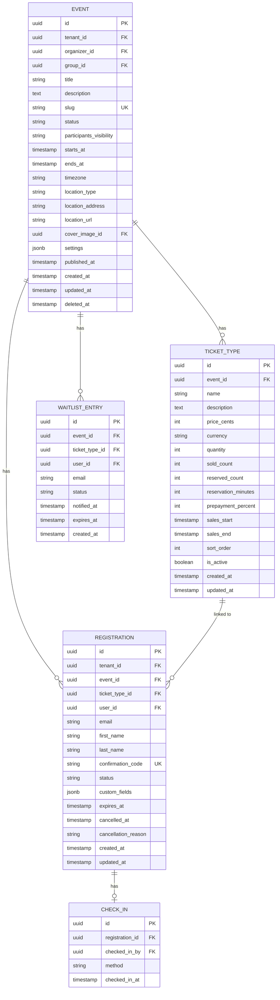
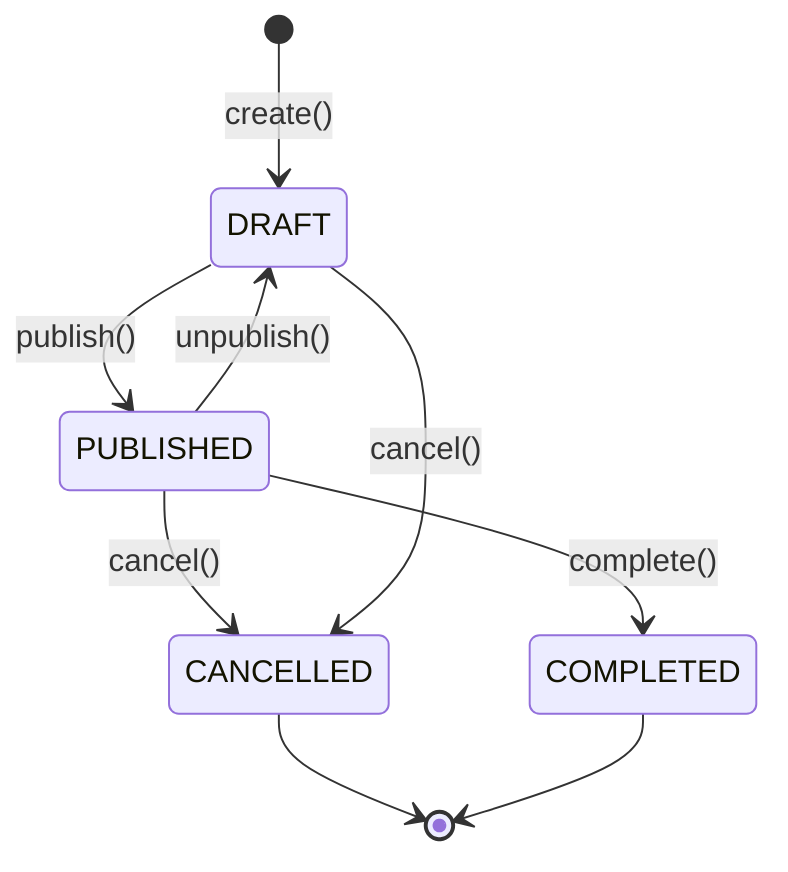

# Event Service

Event Service отвечает за события, билеты и регистрации.

## Обзор

| Параметр | Значение |
|----------|----------|
| Порт | 8082 |
| База данных | postgres-shared |
| Схема | event_service |

## Ответственности

- CRUD событий
- Управление жизненным циклом события
- Видимость участников (CLOSED / OPEN)
- Приватные события (привязка к группе)
- Типы билетов и лимиты
- Бронирование билетов (с таймером)
- Регистрации участников
- Check-in
- Листы ожидания

## ERD

## Видимость участников

| Значение | Описание |
|----------|----------|
| `CLOSED` | Участник видит только свою регистрацию (по умолчанию) |
| `OPEN` | Участники видят список зарегистрированных с распределением по типам билетов (для турниров) |

## Статусы регистрации

| Статус | Описание |
|--------|----------|
| `RESERVED` | Забронировано, ожидает оплаты (с таймером) |
| `PENDING` | Ожидает оплаты (без таймера) |
| `CONFIRMED` | Подтверждена |
| `CANCELLED` | Отменена |
| `CHECKED_IN` | Участник пришёл |
| `EXPIRED` | Бронь истекла |

## API Endpoints

### Events

| Method | Endpoint | Description |
|--------|----------|-------------|
| GET | `/api/v1/events` | Список событий |
| POST | `/api/v1/events` | Создание события |
| GET | `/api/v1/events/{id}` | Детали события |
| PUT | `/api/v1/events/{id}` | Обновление события |
| DELETE | `/api/v1/events/{id}` | Удаление события |
| POST | `/api/v1/events/{id}/publish` | Публикация |
| POST | `/api/v1/events/{id}/cancel` | Отмена |

### Ticket Types

| Method | Endpoint | Description |
|--------|----------|-------------|
| GET | `/api/v1/events/{id}/ticket-types` | Список типов билетов |
| POST | `/api/v1/events/{id}/ticket-types` | Создание типа |
| PUT | `/api/v1/events/{id}/ticket-types/{typeId}` | Обновление типа |
| DELETE | `/api/v1/events/{id}/ticket-types/{typeId}` | Удаление типа |

### Registrations

| Method | Endpoint | Description |
|--------|----------|-------------|
| GET | `/api/v1/events/{id}/registrations` | Список регистраций |
| POST | `/api/v1/events/{id}/registrations` | Создание регистрации |
| GET | `/api/v1/registrations/{id}` | Детали регистрации |
| DELETE | `/api/v1/registrations/{id}` | Отмена регистрации |
| POST | `/api/v1/registrations/{id}/check-in` | Check-in |

### Waitlist

| Method | Endpoint | Description |
|--------|----------|-------------|
| POST | `/api/v1/events/{id}/waitlist` | Встать в очередь |
| DELETE | `/api/v1/events/{id}/waitlist` | Покинуть очередь |

## Жизненный цикл события

**Правила переходов:**
- Публикация возможна только из статуса `DRAFT`
- Дата начала должна быть в будущем при публикации
- При публикации отправляется событие `event.published`

## Регистрация

**Процесс создания регистрации:**
1. Проверка что событие принимает регистрации
2. Проверка доступности билетов выбранного типа
3. Проверка что пользователь ещё не зарегистрирован
4. Создание регистрации с уникальным confirmation code
5. Обновление счётчика проданных билетов
6. Отправка события `registration.created`

**Confirmation code:** 8 символов, alphanumeric, uppercase (например: `A1B2C3D4`)

## Check-in

**Процесс check-in:**
1. Проверка что регистрация подтверждена (`CONFIRMED`)
2. Проверка на повторный check-in
3. Создание записи CHECK_IN с методом и timestamp
4. Обновление статуса регистрации на `CHECKED_IN`
5. Отправка события `checkin.completed`

**Методы check-in:**
- `QR_CODE` — сканирование QR-кода
- `MANUAL` — ручной ввод кода

## Лист ожидания

**Статусы waitlist:**

| Статус | Описание |
|--------|----------|
| `WAITING` | Ожидает места |
| `NOTIFIED` | Уведомлён о свободном месте |
| `CONVERTED` | Зарегистрировался |
| `EXPIRED` | Истекло время на регистрацию |

**Логика обработки:**
- При освобождении места первый в очереди получает уведомление
- Даётся 24 часа на регистрацию
- При истечении времени уведомляется следующий

## События (RabbitMQ)

### Публикуемые

| Event | Описание |
|-------|----------|
| `event.created` | Событие создано |
| `event.published` | Событие опубликовано |
| `event.cancelled` | Событие отменено |
| `event.completed` | Событие завершено |
| `registration.created` | Регистрация создана |
| `registration.cancelled` | Регистрация отменена |
| `reservation.expired` | Бронь истекла |
| `checkin.completed` | Check-in выполнен |

### Потребляемые

| Event | Действие |
|-------|----------|
| `payment.completed` | Подтверждение регистрации |
| `payment.failed` | Отмена регистрации |
| `payment.refunded` | Отмена регистрации |
| `group.member.added` | Доступ к приватным событиям группы |

## Дальнейшее чтение

- [Domain Model](../../../data/domain-model.md)
- [Service Topology](../../../architecture/service-topology.md)
