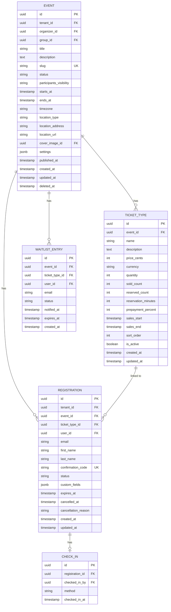
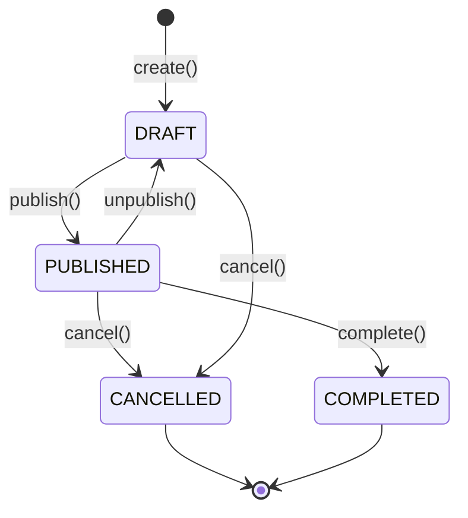

# Event Service

Event Service отвечает за события, билеты и регистрации.

## Обзор

| Параметр | Значение |
|----------|----------|
| Порт | 8082 |
| База данных | postgres-shared |
| Схема | event_service |

## Ответственности

- CRUD событий
- Управление жизненным циклом события
- Видимость участников (CLOSED / OPEN)
- Приватные события (привязка к группе)
- Типы билетов и лимиты
- Бронирование билетов (с таймером)
- Регистрации участников
- Check-in
- Листы ожидания

## ERD



**Видимость участников (participants_visibility):**
- **CLOSED** — участник видит только свою регистрацию (по умолчанию)
- **OPEN** — участники видят список зарегистрированных с распределением по типам билетов (для турниров)

**Статусы регистрации:**
- `RESERVED` — забронировано, ожидает оплаты (с таймером)
- `PENDING` — ожидает оплаты (без таймера)
- `CONFIRMED` — подтверждена
- `CANCELLED` — отменена
- `CHECKED_IN` — участник пришёл
- `EXPIRED` — бронь истекла

## API Endpoints

### Events

| Method | Endpoint | Description |
|--------|----------|-------------|
| GET | `/api/v1/events` | Список событий |
| POST | `/api/v1/events` | Создание события |
| GET | `/api/v1/events/{id}` | Детали события |
| PUT | `/api/v1/events/{id}` | Обновление события |
| DELETE | `/api/v1/events/{id}` | Удаление события |
| POST | `/api/v1/events/{id}/publish` | Публикация |
| POST | `/api/v1/events/{id}/cancel` | Отмена |

### Ticket Types

| Method | Endpoint | Description |
|--------|----------|-------------|
| GET | `/api/v1/events/{id}/ticket-types` | Список типов билетов |
| POST | `/api/v1/events/{id}/ticket-types` | Создание типа |
| PUT | `/api/v1/events/{id}/ticket-types/{typeId}` | Обновление типа |
| DELETE | `/api/v1/events/{id}/ticket-types/{typeId}` | Удаление типа |

### Registrations

| Method | Endpoint | Description |
|--------|----------|-------------|
| GET | `/api/v1/events/{id}/registrations` | Список регистраций |
| POST | `/api/v1/events/{id}/registrations` | Создание регистрации |
| GET | `/api/v1/registrations/{id}` | Детали регистрации |
| DELETE | `/api/v1/registrations/{id}` | Отмена регистрации |
| POST | `/api/v1/registrations/{id}/check-in` | Check-in |

### Waitlist

| Method | Endpoint | Description |
|--------|----------|-------------|
| POST | `/api/v1/events/{id}/waitlist` | Встать в очередь |
| DELETE | `/api/v1/events/{id}/waitlist` | Покинуть очередь |

## Жизненный цикл события



```java
@Service
@RequiredArgsConstructor
public class EventService {

    @Transactional
    public EventDto publish(UUID eventId) {
        Event event = findByIdOrThrow(eventId);
        
        if (event.getStatus() != EventStatus.DRAFT) {
            throw new InvalidEventStateException("Только черновик можно опубликовать");
        }
        
        if (event.getStartsAt().isBefore(Instant.now())) {
            throw new ValidationException("Дата начала должна быть в будущем");
        }
        
        event.setStatus(EventStatus.PUBLISHED);
        event.setPublishedAt(Instant.now());
        
        Event saved = eventRepository.save(event);
        eventPublisher.publish(new EventPublishedEvent(saved.getId(), saved.getTenantId()));
        
        return eventMapper.toDto(saved);
    }
}
```

## Регистрация

```java
@Service
@RequiredArgsConstructor
public class RegistrationService {

    @Transactional
    public RegistrationDto create(UUID eventId, CreateRegistrationRequest request) {
        Event event = eventService.findByIdOrThrow(eventId);
        
        // Проверки
        validateEventAcceptsRegistrations(event);
        
        TicketType ticketType = ticketTypeRepository.findById(request.ticketTypeId())
            .orElseThrow(() -> new TicketTypeNotFoundException(request.ticketTypeId()));
        
        validateTicketAvailability(ticketType);
        validateNotAlreadyRegistered(eventId, request.email());
        
        // Создание регистрации
        Registration registration = new Registration();
        registration.setEvent(event);
        registration.setTicketType(ticketType);
        registration.setEmail(request.email());
        registration.setFirstName(request.firstName());
        registration.setLastName(request.lastName());
        registration.setConfirmationCode(generateConfirmationCode());
        registration.setStatus(RegistrationStatus.CONFIRMED); // Для бесплатных
        registration.setTenantId(event.getTenantId());
        
        Registration saved = registrationRepository.save(registration);
        
        // Обновляем счётчик
        ticketType.setSoldCount(ticketType.getSoldCount() + 1);
        ticketTypeRepository.save(ticketType);
        
        eventPublisher.publish(new RegistrationCreatedEvent(
            saved.getId(),
            saved.getEvent().getId(),
            saved.getEmail()
        ));
        
        return registrationMapper.toDto(saved);
    }
    
    private String generateConfirmationCode() {
        return RandomStringUtils.randomAlphanumeric(8).toUpperCase();
    }
}
```

## Check-in

```java
@Transactional
public CheckInDto checkIn(UUID registrationId, CheckInRequest request) {
    Registration registration = findByIdOrThrow(registrationId);
    
    if (registration.getStatus() != RegistrationStatus.CONFIRMED) {
        throw new InvalidRegistrationStateException("Регистрация не подтверждена");
    }
    
    // Проверка на повторный check-in
    if (checkInRepository.existsByRegistrationId(registrationId)) {
        throw new AlreadyCheckedInException(registrationId);
    }
    
    CheckIn checkIn = new CheckIn();
    checkIn.setRegistration(registration);
    checkIn.setCheckedInBy(SecurityContext.getUserId());
    checkIn.setMethod(request.method());
    checkIn.setCheckedInAt(Instant.now());
    
    CheckIn saved = checkInRepository.save(checkIn);
    
    registration.setStatus(RegistrationStatus.CHECKED_IN);
    registrationRepository.save(registration);
    
    eventPublisher.publish(new CheckInCompletedEvent(
        registration.getEvent().getId(),
        registrationId
    ));
    
    return checkInMapper.toDto(saved);
}
```

## События (RabbitMQ)

### Публикуемые

| Event | Описание |
|-------|----------|
| `event.created` | Событие создано |
| `event.published` | Событие опубликовано |
| `event.cancelled` | Событие отменено |
| `event.completed` | Событие завершено |
| `registration.created` | Регистрация создана |
| `registration.cancelled` | Регистрация отменена |
| `reservation.expired` | Бронь истекла |
| `checkin.completed` | Check-in выполнен |

### Потребляемые

| Event | Действие |
|-------|----------|
| `payment.completed` | Подтверждение регистрации |
| `payment.failed` | Отмена регистрации |
| `payment.refunded` | Отмена регистрации |
| `group.member.added` | Доступ к приватным событиям группы |

## Лист ожидания

```java
@Service
public class WaitlistService {

    @Transactional
    public void processAvailableSpot(UUID eventId, UUID ticketTypeId) {
        // Находим первого в очереди
        Optional<WaitlistEntry> first = waitlistRepository
            .findFirstByEventIdAndTicketTypeIdAndStatusOrderByCreatedAt(
                eventId, ticketTypeId, WaitlistStatus.WAITING
            );
        
        if (first.isEmpty()) return;
        
        WaitlistEntry entry = first.get();
        entry.setStatus(WaitlistStatus.NOTIFIED);
        entry.setNotifiedAt(Instant.now());
        entry.setExpiresAt(Instant.now().plus(24, ChronoUnit.HOURS));
        
        waitlistRepository.save(entry);
        
        eventPublisher.publish(new WaitlistSpotAvailableEvent(
            entry.getId(),
            entry.getEmail(),
            eventId
        ));
    }
}
```

## Дальнейшее чтение

- [Domain Model](../../../data/domain-model.md)
- [Service Topology](../../../architecture/service-topology.md)
