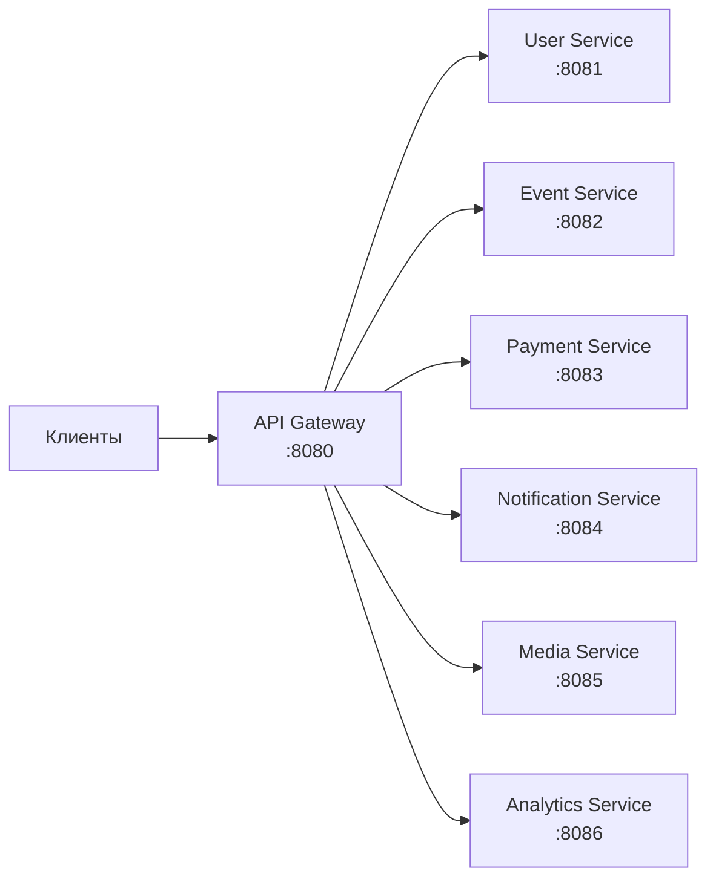

# API Gateway

API Gateway — единая точка входа для всех клиентских запросов.

## Обзор



## Технологии

| Компонент | Технология |
|-----------|-----------|
| Framework | Spring Cloud Gateway |
| Runtime | WebFlux (реактивный) |
| Rate Limiting | Redis |
| Auth | JWT validation |

**Важно:** Gateway — единственный сервис на WebFlux. Это обусловлено природой proxy-сервиса.

## Ответственности

### Authentication

- Валидация JWT токенов
- Извлечение claims (userId, tenantId, roles)
- Прокидывание контекста в downstream сервисы

### Rate Limiting

- Per-IP rate limiting
- Per-user rate limiting
- Configurable limits per endpoint

### Request Routing

- Path-based routing
- Load balancing (при наличии реплик)
- Circuit breaker (Resilience4j)

### Cross-Cutting Concerns

- CORS handling
- Request/Response logging
- Correlation ID generation
- Metrics collection

## Маршруты

```yaml
spring:
  cloud:
    gateway:
      routes:
        - id: user-service
          uri: lb://user-service
          predicates:
            - Path=/api/v1/auth/**,/api/v1/users/**,/api/v1/organizations/**,/api/v1/organization-requests/**,/api/v1/groups/**
          filters:
            - StripPrefix=0

        - id: event-service
          uri: lb://event-service
          predicates:
            - Path=/api/v1/events/**,/api/v1/registrations/**
          filters:
            - StripPrefix=0
            
        - id: payment-service
          uri: lb://payment-service
          predicates:
            - Path=/api/v1/payments/**,/api/v1/webhooks/**
          filters:
            - StripPrefix=0
            
        - id: notification-service
          uri: lb://notification-service
          predicates:
            - Path=/api/v1/notifications/**
          filters:
            - StripPrefix=0
            
        - id: media-service
          uri: lb://media-service
          predicates:
            - Path=/api/v1/media/**
          filters:
            - StripPrefix=0
            
        - id: analytics-service
          uri: lb://analytics-service
          predicates:
            - Path=/api/v1/analytics/**
          filters:
            - StripPrefix=0
```

## Rate Limiting

### Конфигурация

```yaml
spring:
  cloud:
    gateway:
      default-filters:
        - name: RequestRateLimiter
          args:
            redis-rate-limiter:
              replenishRate: 100
              burstCapacity: 200
              requestedTokens: 1
            key-resolver: "#{@userKeyResolver}"
```

### Лимиты

| Тип | Лимит | Scope |
|-----|-------|-------|
| Anonymous | 100 req/min | Per IP |
| Authenticated | 1000 req/min | Per User |
| File upload | 10 req/min | Per User |

### Key Resolver

```java
@Configuration
public class RateLimitConfig {

    @Bean
    public KeyResolver userKeyResolver() {
        return exchange -> {
            String userId = exchange.getRequest()
                .getHeaders()
                .getFirst("X-User-Id");
            
            if (userId != null) {
                return Mono.just(userId);
            }
            
            // Fallback to IP
            return Mono.just(
                exchange.getRequest()
                    .getRemoteAddress()
                    .getAddress()
                    .getHostAddress()
            );
        };
    }
}
```

## Authentication Filter

```java
@Component
public class JwtAuthenticationFilter implements GlobalFilter, Ordered {

    private final JwtTokenProvider tokenProvider;
    private final List<String> publicPaths = List.of(
        "/api/v1/auth/telegram",
        "/api/v1/auth/login",
        "/api/v1/auth/register",
        "/api/v1/events/public",
        "/api/v1/webhooks"
    );

    @Override
    public Mono<Void> filter(ServerWebExchange exchange, GatewayFilterChain chain) {
        String path = exchange.getRequest().getPath().value();
        
        // Пропускаем публичные endpoints
        if (isPublicPath(path)) {
            return chain.filter(exchange);
        }
        
        String token = extractToken(exchange.getRequest());
        if (token == null) {
            return unauthorized(exchange);
        }
        
        try {
            Claims claims = tokenProvider.validateAndGetClaims(token);
            
            // Добавляем headers для downstream сервисов
            ServerHttpRequest request = exchange.getRequest().mutate()
                .header("X-User-Id", claims.getSubject())
                .header("X-Tenant-Id", claims.get("tenantId", String.class))
                .header("X-User-Roles", String.join(",", claims.get("roles", List.class)))
                .build();
            
            return chain.filter(exchange.mutate().request(request).build());
            
        } catch (JwtException e) {
            return unauthorized(exchange);
        }
    }

    @Override
    public int getOrder() {
        return -100; // Высокий приоритет
    }
}
```

## Correlation ID

```java
@Component
public class CorrelationIdFilter implements GlobalFilter, Ordered {

    private static final String CORRELATION_ID_HEADER = "X-Correlation-Id";

    @Override
    public Mono<Void> filter(ServerWebExchange exchange, GatewayFilterChain chain) {
        String correlationId = exchange.getRequest()
            .getHeaders()
            .getFirst(CORRELATION_ID_HEADER);
        
        if (correlationId == null) {
            correlationId = UUID.randomUUID().toString();
        }
        
        ServerHttpRequest request = exchange.getRequest().mutate()
            .header(CORRELATION_ID_HEADER, correlationId)
            .build();
        
        String finalCorrelationId = correlationId;
        return chain.filter(exchange.mutate().request(request).build())
            .then(Mono.fromRunnable(() -> {
                exchange.getResponse()
                    .getHeaders()
                    .add(CORRELATION_ID_HEADER, finalCorrelationId);
            }));
    }

    @Override
    public int getOrder() {
        return -200; // Перед auth filter
    }
}
```

## Error Handling

```java
@Component
public class GlobalErrorHandler implements ErrorWebExceptionHandler {

    @Override
    public Mono<Void> handle(ServerWebExchange exchange, Throwable ex) {
        HttpStatus status = determineStatus(ex);
        
        ErrorResponse error = new ErrorResponse(
            determineCode(ex),
            determineMessage(ex),
            Map.of()
        );
        
        exchange.getResponse().setStatusCode(status);
        exchange.getResponse().getHeaders().setContentType(MediaType.APPLICATION_JSON);
        
        byte[] bytes = objectMapper.writeValueAsBytes(error);
        DataBuffer buffer = exchange.getResponse().bufferFactory().wrap(bytes);
        
        return exchange.getResponse().writeWith(Mono.just(buffer));
    }
    
    private HttpStatus determineStatus(Throwable ex) {
        if (ex instanceof ResponseStatusException rse) {
            return HttpStatus.valueOf(rse.getStatusCode().value());
        }
        if (ex instanceof JwtException) {
            return HttpStatus.UNAUTHORIZED;
        }
        return HttpStatus.INTERNAL_SERVER_ERROR;
    }
}
```

## Health Check

```yaml
management:
  endpoints:
    web:
      exposure:
        include: health,info,prometheus
  endpoint:
    health:
      show-details: always
      probes:
        enabled: true
  health:
    redis:
      enabled: true
```

## Docker

```yaml
# docker-compose.yml
gateway:
  build: ./services/gateway
  ports:
    - "8080:8080"
  environment:
    - SPRING_PROFILES_ACTIVE=docker
    - REDIS_HOST=redis
    - JWT_SECRET=${JWT_SECRET}
  depends_on:
    - redis
    - user-service
    - event-service
```

## Мониторинг

### Метрики

- `gateway.requests.total` — общее количество запросов
- `gateway.requests.duration` — время обработки
- `gateway.rate_limit.exceeded` — превышения rate limit
- `gateway.auth.failures` — неудачные аутентификации

### Логирование

```yaml
logging:
  level:
    org.springframework.cloud.gateway: INFO
    reactor.netty: INFO
```

## Дальнейшее чтение

- [Service Topology](../../../architecture/service-topology.md) — все сервисы
- [API Guidelines](../api-guidelines.md) — правила API
