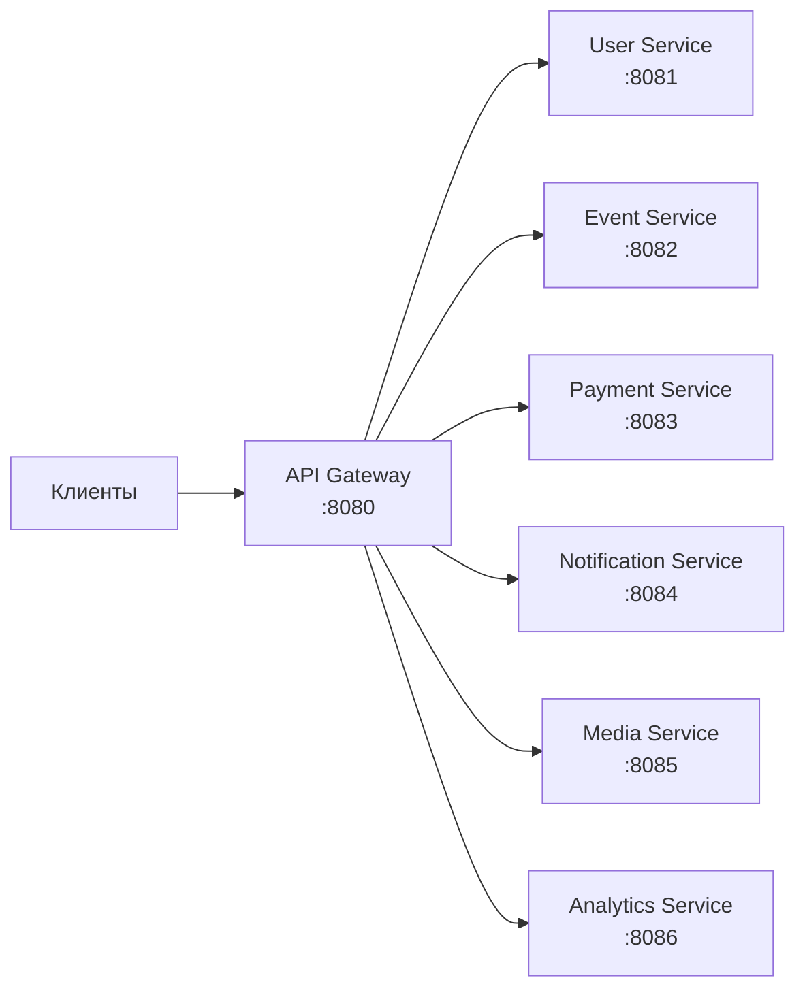

# API Gateway

API Gateway — единая точка входа для всех клиентских запросов.

## Обзор



## Технологии

| Компонент | Технология |
|-----------|-----------|
| Framework | Spring Cloud Gateway |
| Runtime | WebFlux (реактивный) |
| Rate Limiting | Redis |
| Auth | JWT validation |

**Важно:** Gateway — единственный сервис на WebFlux. Это обусловлено природой proxy-сервиса.

## Ответственности

### Authentication

- Валидация JWT токенов
- Извлечение claims (userId, tenantId, roles)
- Прокидывание контекста в downstream сервисы через headers

### Rate Limiting

- Per-IP rate limiting
- Per-user rate limiting
- Configurable limits per endpoint

### Request Routing

- Path-based routing
- Load balancing (при наличии реплик)
- Circuit breaker (Resilience4j)

### Cross-Cutting Concerns

- CORS handling
- Request/Response logging
- Correlation ID generation
- Metrics collection

## Маршруты

| Сервис | Пути |
|--------|------|
| User Service | `/api/v1/auth/**`, `/api/v1/users/**`, `/api/v1/organizations/**`, `/api/v1/organization-requests/**`, `/api/v1/groups/**` |
| Event Service | `/api/v1/events/**`, `/api/v1/registrations/**` |
| Payment Service | `/api/v1/payments/**`, `/api/v1/webhooks/**` |
| Notification Service | `/api/v1/notifications/**` |
| Media Service | `/api/v1/media/**` |
| Analytics Service | `/api/v1/analytics/**` |

## Rate Limiting

### Лимиты

| Тип | Лимит | Scope |
|-----|-------|-------|
| Anonymous | 100 req/min | Per IP |
| Authenticated | 1000 req/min | Per User |
| File upload | 10 req/min | Per User |

### Key Resolution

**Приоритет:**
1. `X-User-Id` header (для аутентифицированных)
2. IP адрес (fallback для анонимных)

## Authentication Filter

**Публичные endpoints (без аутентификации):**
- `/api/v1/auth/telegram`
- `/api/v1/auth/login`
- `/api/v1/auth/register`
- `/api/v1/events/public`
- `/api/v1/webhooks`

**Процесс для защищённых endpoints:**
1. Извлечение токена из `Authorization: Bearer <token>`
2. Валидация JWT
3. Извлечение claims
4. Добавление headers для downstream сервисов:
   - `X-User-Id` — UUID пользователя
   - `X-Tenant-Id` — UUID текущей организации
   - `X-User-Roles` — роли через запятую

## Correlation ID

**Процесс:**
1. Проверка наличия `X-Correlation-Id` в запросе
2. Если отсутствует — генерация нового UUID
3. Прокидывание в downstream сервисы
4. Добавление в response headers

**Использование:** Сквозной трейсинг запросов через все сервисы.

## Error Handling

**Маппинг ошибок:**

| Exception | HTTP Status |
|-----------|-------------|
| `JwtException` | 401 Unauthorized |
| `ResponseStatusException` | Соответствующий статус |
| Остальные | 500 Internal Server Error |

**Формат ответа:**

```json
{
  "code": "error_code",
  "message": "Описание ошибки",
  "details": {}
}
```

## Health Check

| Endpoint | Описание |
|----------|----------|
| `/actuator/health` | Общий статус |
| `/actuator/health/liveness` | Приложение живо |
| `/actuator/health/readiness` | Готово принимать трафик |

**Проверяемые зависимости:**
- Redis (rate limiting store)

## Мониторинг

### Метрики

| Метрика | Описание |
|---------|----------|
| `gateway.requests.total` | Общее количество запросов |
| `gateway.requests.duration` | Время обработки |
| `gateway.rate_limit.exceeded` | Превышения rate limit |
| `gateway.auth.failures` | Неудачные аутентификации |

### Логирование

| Logger | Level |
|--------|-------|
| `org.springframework.cloud.gateway` | INFO |
| `reactor.netty` | INFO |

## Конфигурация

| Переменная | Описание |
|------------|----------|
| `REDIS_HOST` | Хост Redis |
| `JWT_SECRET` | Секрет для валидации JWT |

## Дальнейшее чтение

- [Service Topology](../../../architecture/service-topology.md) — все сервисы
- [API Guidelines](../api-guidelines.md) — правила API
