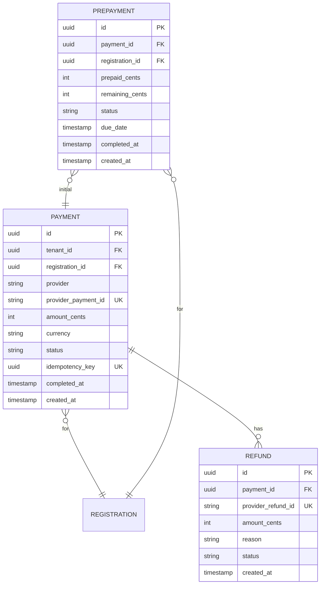

# Payment Service

Payment Service отвечает за платежи и интеграцию с платёжными провайдерами.

## Обзор

| Параметр | Значение |
|----------|----------|
| Порт | 8083 |
| База данных | postgres-payment (dedicated) |
| Схема | payment_service |

## Ответственности

- Интеграция с платёжными провайдерами
- Создание и обработка платежей (полная оплата)
- Предоплата (частичная оплата при регистрации)
- Доплата остатка
- Возвраты (полные и частичные)
- Обработка webhooks

## ERD

## Статусы платежей

| Статус | Описание |
|--------|----------|
| `PENDING` | Ожидает оплаты |
| `COMPLETED` | Успешно оплачен |
| `FAILED` | Ошибка оплаты |
| `REFUNDED` | Полностью возвращён |
| `PARTIALLY_REFUNDED` | Частично возвращён |

## Статусы предоплаты

| Статус | Описание |
|--------|----------|
| `PARTIAL` | Предоплата внесена, ожидает доплаты |
| `COMPLETED` | Полностью оплачено |

**Бизнес-правила:**
- Создаётся когда билет имеет `prepayment_percent > 0`
- Остаток можно оплатить в личном кабинете
- Если не оплачено до `due_date` — регистрация может быть отменена

## API Endpoints

### Payments

| Method | Endpoint | Description |
|--------|----------|-------------|
| POST | `/api/v1/payments` | Создание платежа |
| GET | `/api/v1/payments/{id}` | Статус платежа |
| POST | `/api/v1/payments/{id}/refund` | Возврат |

### Webhooks

| Method | Endpoint | Description |
|--------|----------|-------------|
| POST | `/api/v1/webhooks/{provider}` | Webhook от провайдера |

## Платёжные провайдеры

**Архитектура:** Провайдеры реализуют общий интерфейс `PaymentProvider` и подключаются через `@ConditionalOnProperty`.

**Методы интерфейса:**

| Метод | Описание |
|-------|----------|
| `createSession()` | Создание платёжной сессии |
| `getStatus()` | Получение статуса платежа |
| `refund()` | Выполнение возврата |
| `verifyWebhook()` | Верификация подписи webhook |

## Создание платежа

**Процесс:**
1. Проверка идемпотентности по `idempotency_key`
2. Создание сессии у платёжного провайдера
3. Сохранение платежа со статусом `PENDING`
4. Возврат URL для перенаправления на оплату

**Идемпотентность:** Header `X-Idempotency-Key` обязателен.
При повторном запросе с тем же ключом возвращается существующий платёж.

## Обработка Webhook

**Процесс:**
1. Верификация подписи запроса
2. Парсинг события от провайдера
3. Обновление статуса платежа
4. Публикация события в RabbitMQ

**Типы событий от провайдера:**

| Тип | Действие |
|-----|----------|
| `PAYMENT_SUCCEEDED` | Установить статус `COMPLETED`, опубликовать `payment.completed` |
| `PAYMENT_FAILED` | Установить статус `FAILED`, опубликовать `payment.failed` |
| `REFUNDED` | Создать запись Refund, опубликовать `payment.refunded` |

## Возвраты

**Процесс:**
1. Проверка что платёж в статусе `COMPLETED`
2. Проверка что сумма возврата не превышает оплаченную
3. Выполнение возврата через провайдера
4. Сохранение записи Refund
5. Обновление статуса платежа (`REFUNDED` или `PARTIALLY_REFUNDED`)
6. Публикация события `payment.refunded`

**Типы возвратов:**
- Полный возврат — вся сумма платежа
- Частичный возврат — указанная сумма

## События (RabbitMQ)

### Публикуемые

| Event | Описание |
|-------|----------|
| `payment.created` | Платёж создан |
| `payment.completed` | Платёж успешен |
| `payment.failed` | Платёж не удался |
| `payment.refunded` | Возврат выполнен |

### Потребляемые

| Event | Действие |
|-------|----------|
| `registration.created` | Создание платежа (для платных билетов) |
| `event.cancelled` | Массовый возврат |

## Конфигурация

| Переменная | Описание |
|------------|----------|
| `PAYMENT_PROVIDER` | Активный провайдер |
| `PAYMENT_API_KEY` | API ключ провайдера |
| `PAYMENT_WEBHOOK_SECRET` | Секрет для верификации webhook |

## Дальнейшее чтение

- [Domain Model](../../../data/domain-model.md)
- [Service Topology](../../../architecture/service-topology.md)
