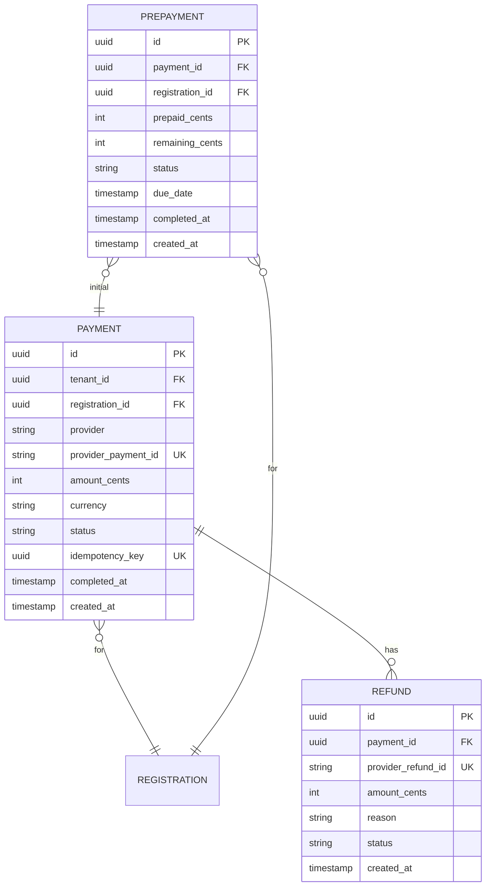

# Payment Service

Payment Service отвечает за платежи и интеграцию с платёжными провайдерами.

## Обзор

| Параметр | Значение |
|----------|----------|
| Порт | 8083 |
| База данных | postgres-payment (dedicated) |
| Схема | payment_service |

## Ответственности

- Интеграция с платёжными провайдерами
- Создание и обработка платежей (полная оплата)
- Предоплата (частичная оплата при регистрации)
- Доплата остатка
- Возвраты (полные и частичные)
- Обработка webhooks

## ERD



**Статусы Prepayment:**
- `PARTIAL` — предоплата внесена, ожидает доплаты
- `COMPLETED` — полностью оплачено

**Бизнес-правила:**
- Создаётся когда билет имеет `prepayment_percent > 0`
- Остаток можно оплатить в личном кабинете
- Если не оплачено до `due_date` — регистрация может быть отменена

## API Endpoints

### Payments

| Method | Endpoint | Description |
|--------|----------|-------------|
| POST | `/api/v1/payments` | Создание платежа |
| GET | `/api/v1/payments/{id}` | Статус платежа |
| POST | `/api/v1/payments/{id}/refund` | Возврат |

### Webhooks

| Method | Endpoint | Description |
|--------|----------|-------------|
| POST | `/api/v1/webhooks/{provider}` | Webhook от провайдера |

## Платёжные провайдеры

```java
public interface PaymentProvider {
    String getName();
    PaymentSession createSession(CreatePaymentRequest request);
    PaymentStatus getStatus(String providerPaymentId);
    RefundResult refund(String providerPaymentId, int amountCents);
    boolean verifyWebhook(String payload, String signature);
}

// Реализации провайдеров подключаются через @ConditionalOnProperty
@Service
@ConditionalOnProperty(name = "payment.provider", havingValue = "...")
public class ConcretePaymentProvider implements PaymentProvider {
    // Implementation
}
```

## Создание платежа

```java
@Service
@RequiredArgsConstructor
public class PaymentService {

    private final PaymentProvider paymentProvider;
    private final PaymentRepository paymentRepository;

    @Transactional
    public PaymentDto create(CreatePaymentRequest request, UUID idempotencyKey) {
        // Проверка идемпотентности
        Optional<Payment> existing = paymentRepository.findByIdempotencyKey(idempotencyKey);
        if (existing.isPresent()) {
            return paymentMapper.toDto(existing.get());
        }
        
        // Создание сессии у провайдера
        PaymentSession session = paymentProvider.createSession(request);
        
        // Сохранение платежа
        Payment payment = new Payment();
        payment.setRegistrationId(request.registrationId());
        payment.setTenantId(request.tenantId());
        payment.setProvider(paymentProvider.getName());
        payment.setProviderPaymentId(session.getId());
        payment.setAmountCents(request.amountCents());
        payment.setCurrency(request.currency());
        payment.setStatus(PaymentStatus.PENDING);
        payment.setIdempotencyKey(idempotencyKey);
        
        Payment saved = paymentRepository.save(payment);
        
        return paymentMapper.toDto(saved, session.getCheckoutUrl());
    }
}
```

## Webhook Processing

```java
@RestController
@RequestMapping("/api/v1/webhooks")
@RequiredArgsConstructor
public class WebhookController {

    private final WebhookService webhookService;

    @PostMapping("/{provider}")
    public ResponseEntity<Void> handleWebhook(
        @PathVariable String provider,
        @RequestBody String payload,
        @RequestHeader(value = "X-Signature", required = false) String signature
    ) {
        webhookService.handle(provider, payload, signature);
        return ResponseEntity.ok().build();
    }
}
```

```java
@Service
@RequiredArgsConstructor
public class WebhookService {

    private final PaymentProvider paymentProvider;
    private final PaymentRepository paymentRepository;
    private final EventPublisher eventPublisher;

    @Transactional
    public void handle(String provider, String payload, String signature) {
        // Верификация подписи
        if (!paymentProvider.verifyWebhook(payload, signature)) {
            throw new InvalidWebhookException("Неверная подпись webhook");
        }

        // Обработка события
        WebhookEvent event = paymentProvider.parseWebhook(payload);

        switch (event.getType()) {
            case PAYMENT_SUCCEEDED -> handlePaymentSucceeded(event);
            case PAYMENT_FAILED -> handlePaymentFailed(event);
            case REFUNDED -> handleRefunded(event);
        }
    }

    private void handlePaymentSucceeded(WebhookEvent event) {
        Payment payment = paymentRepository
            .findByProviderPaymentId(event.getPaymentId())
            .orElseThrow();

        payment.setStatus(PaymentStatus.COMPLETED);
        payment.setCompletedAt(Instant.now());
        paymentRepository.save(payment);

        eventPublisher.publish(new PaymentCompletedEvent(
            payment.getId(),
            payment.getRegistrationId()
        ));
    }
}
```

## Возвраты

```java
@Transactional
public RefundDto refund(UUID paymentId, RefundRequest request) {
    Payment payment = findByIdOrThrow(paymentId);
    
    if (payment.getStatus() != PaymentStatus.COMPLETED) {
        throw new InvalidPaymentStateException("Можно вернуть только завершённый платёж");
    }
    
    int refundAmount = request.amountCents() != null 
        ? request.amountCents() 
        : payment.getAmountCents();
    
    // Проверка суммы
    int alreadyRefunded = refundRepository.sumByPaymentId(paymentId);
    if (alreadyRefunded + refundAmount > payment.getAmountCents()) {
        throw new RefundAmountExceededException();
    }
    
    // Возврат через провайдера
    RefundResult result = paymentProvider.refund(
        payment.getProviderPaymentId(), 
        refundAmount
    );
    
    // Сохранение
    Refund refund = new Refund();
    refund.setPayment(payment);
    refund.setAmountCents(refundAmount);
    refund.setReason(request.reason());
    refund.setProviderRefundId(result.getId());
    refund.setStatus(RefundStatus.COMPLETED);
    
    Refund saved = refundRepository.save(refund);
    
    // Обновляем статус платежа
    if (alreadyRefunded + refundAmount == payment.getAmountCents()) {
        payment.setStatus(PaymentStatus.REFUNDED);
    } else {
        payment.setStatus(PaymentStatus.PARTIALLY_REFUNDED);
    }
    paymentRepository.save(payment);
    
    eventPublisher.publish(new PaymentRefundedEvent(
        payment.getId(),
        payment.getRegistrationId(),
        refundAmount
    ));
    
    return refundMapper.toDto(saved);
}
```

## События (RabbitMQ)

### Публикуемые

| Event | Описание |
|-------|----------|
| `payment.created` | Платёж создан |
| `payment.completed` | Платёж успешен |
| `payment.failed` | Платёж не удался |
| `payment.refunded` | Возврат выполнен |

### Потребляемые

| Event | Действие |
|-------|----------|
| `registration.created` | Создание платежа (для платных билетов) |
| `event.cancelled` | Массовый возврат |

## Конфигурация

```yaml
payment:
  provider: ${PAYMENT_PROVIDER}
  api-key: ${PAYMENT_API_KEY}
  webhook-secret: ${PAYMENT_WEBHOOK_SECRET}
```

## Дальнейшее чтение

- [Domain Model](../../../data/domain-model.md)
- [Service Topology](../../../architecture/service-topology.md)
