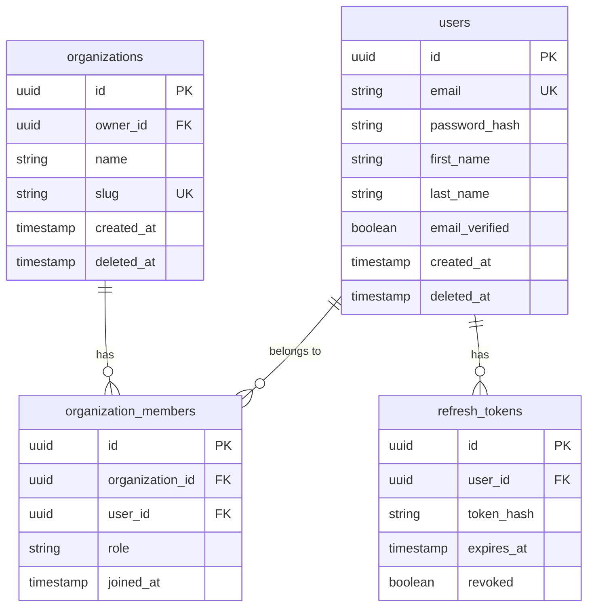

# User Service

User Service отвечает за пользователей, организации и аутентификацию.

## Обзор

| Параметр | Значение |
|----------|----------|
| Порт | 8081 |
| База данных | postgres-user (dedicated) |
| Схема | user_service |

## Ответственности

- Регистрация и аутентификация пользователей
- Управление профилями
- Создание и управление организациями
- Членство в организациях и роли
- JWT token generation

## API Endpoints

### Authentication

| Method | Endpoint | Description |
|--------|----------|-------------|
| POST | `/api/v1/auth/register` | Регистрация |
| POST | `/api/v1/auth/login` | Вход |
| POST | `/api/v1/auth/refresh` | Обновление токена |
| POST | `/api/v1/auth/logout` | Выход |
| POST | `/api/v1/auth/forgot-password` | Запрос сброса пароля |
| POST | `/api/v1/auth/reset-password` | Сброс пароля |
| POST | `/api/v1/auth/verify-email` | Подтверждение email |

### Users

| Method | Endpoint | Description |
|--------|----------|-------------|
| GET | `/api/v1/users/me` | Текущий пользователь |
| PUT | `/api/v1/users/me` | Обновление профиля |
| PUT | `/api/v1/users/me/password` | Смена пароля |
| DELETE | `/api/v1/users/me` | Удаление аккаунта |

### Organizations

| Method | Endpoint | Description |
|--------|----------|-------------|
| GET | `/api/v1/organizations` | Список организаций пользователя |
| POST | `/api/v1/organizations` | Создание организации |
| GET | `/api/v1/organizations/{id}` | Детали организации |
| PUT | `/api/v1/organizations/{id}` | Обновление организации |
| DELETE | `/api/v1/organizations/{id}` | Удаление организации |

### Organization Members

| Method | Endpoint | Description |
|--------|----------|-------------|
| GET | `/api/v1/organizations/{id}/members` | Список членов |
| POST | `/api/v1/organizations/{id}/members/invite` | Приглашение |
| PUT | `/api/v1/organizations/{id}/members/{userId}` | Изменение роли |
| DELETE | `/api/v1/organizations/{id}/members/{userId}` | Удаление члена |
| POST | `/api/v1/invitations/{token}/accept` | Принятие приглашения |

## Модель данных



## Роли и права

| Роль | Описание |
|------|----------|
| OWNER | Владелец организации, полный доступ |
| ADMIN | Администратор, управление членами и событиями |
| MANAGER | Менеджер, управление событиями |
| VIEWER | Только просмотр |

```java
public enum OrganizationRole {
    OWNER,
    ADMIN,
    MANAGER,
    VIEWER
}
```

## JWT Tokens

### Access Token

```java
// Payload
{
  "sub": "user-uuid",
  "email": "user@example.com",
  "tenantId": "org-uuid",  // Текущая организация
  "roles": ["ADMIN"],
  "iat": 1623456789,
  "exp": 1623457689  // 15 минут
}
```

### Refresh Token

- Хранится в БД (hashed)
- Срок жизни: 7 дней
- One-time use (rotation)

```java
@Service
@RequiredArgsConstructor
public class AuthService {

    private final JwtTokenProvider tokenProvider;
    private final RefreshTokenRepository refreshTokenRepository;

    @Transactional
    public AuthResponse refresh(String refreshToken) {
        RefreshToken token = refreshTokenRepository
            .findByTokenHashAndRevokedFalse(hash(refreshToken))
            .orElseThrow(() -> new InvalidTokenException());
        
        if (token.getExpiresAt().isBefore(Instant.now())) {
            throw new TokenExpiredException();
        }
        
        // Revoke old token
        token.setRevoked(true);
        refreshTokenRepository.save(token);
        
        // Issue new tokens
        User user = token.getUser();
        String newAccessToken = tokenProvider.generateAccessToken(user);
        String newRefreshToken = generateRefreshToken(user);
        
        return new AuthResponse(newAccessToken, newRefreshToken);
    }
}
```

## Регистрация

```java
@Service
@RequiredArgsConstructor
public class RegistrationService {

    private final UserRepository userRepository;
    private final PasswordEncoder passwordEncoder;
    private final EventPublisher eventPublisher;

    @Transactional
    public UserDto register(RegisterRequest request) {
        // Проверка уникальности email
        if (userRepository.existsByEmail(request.email())) {
            throw new EmailAlreadyExistsException(request.email());
        }
        
        // Создание пользователя
        User user = new User();
        user.setEmail(request.email());
        user.setPasswordHash(passwordEncoder.encode(request.password()));
        user.setFirstName(request.firstName());
        user.setLastName(request.lastName());
        user.setEmailVerified(false);
        
        User saved = userRepository.save(user);
        
        // Публикуем событие для отправки verification email
        eventPublisher.publish(new UserRegisteredEvent(
            saved.getId(),
            saved.getEmail()
        ));
        
        return userMapper.toDto(saved);
    }
}
```

## Организации

```java
@Service
@RequiredArgsConstructor
public class OrganizationService {

    @Transactional
    public OrganizationDto create(CreateOrganizationRequest request) {
        UUID userId = SecurityContext.getUserId();
        
        // Проверка уникальности slug
        if (organizationRepository.existsBySlug(request.slug())) {
            throw new SlugAlreadyExistsException(request.slug());
        }
        
        // Создание организации
        Organization org = new Organization();
        org.setName(request.name());
        org.setSlug(request.slug());
        org.setOwnerId(userId);
        
        Organization saved = organizationRepository.save(org);
        
        // Добавляем создателя как OWNER
        OrganizationMember member = new OrganizationMember();
        member.setOrganization(saved);
        member.setUserId(userId);
        member.setRole(OrganizationRole.OWNER);
        member.setJoinedAt(Instant.now());
        
        memberRepository.save(member);
        
        eventPublisher.publish(new OrganizationCreatedEvent(saved.getId()));
        
        return organizationMapper.toDto(saved);
    }
}
```

## События (RabbitMQ)

### Публикуемые

| Event | Описание |
|-------|----------|
| `user.registered` | Пользователь зарегистрировался |
| `user.email.verified` | Email подтверждён |
| `user.password.reset` | Пароль сброшен |
| `organization.created` | Организация создана |
| `organization.member.invited` | Приглашение отправлено |
| `organization.member.joined` | Член присоединился |

### Потребляемые

Нет — User Service не подписывается на события других сервисов.

## Конфигурация

```yaml
# application.yml
spring:
  datasource:
    url: jdbc:postgresql://${DATABASE_HOST:localhost}:${DATABASE_PORT:5433}/${DATABASE_NAME:user_service}
    username: ${DATABASE_USERNAME:aqstream}
    password: ${DATABASE_PASSWORD:aqstream}

jwt:
  secret: ${JWT_SECRET}
  access-token-expiration: 15m
  refresh-token-expiration: 7d

password:
  min-length: 8
  require-uppercase: true
  require-lowercase: true
  require-digit: true
```

## Тестирование

```java
@SpringBootTest
@Testcontainers
class AuthServiceTest {

    @Container
    static PostgreSQLContainer<?> postgres = new PostgreSQLContainer<>("postgres:15");

    @Autowired
    private AuthService authService;

    @Test
    void login_ValidCredentials_ReturnsTokens() {
        // Given
        RegisterRequest registerRequest = new RegisterRequest(
            "test@example.com",
            "Password123",
            "Test",
            "User"
        );
        authService.register(registerRequest);
        
        LoginRequest loginRequest = new LoginRequest(
            "test@example.com",
            "Password123"
        );
        
        // When
        AuthResponse response = authService.login(loginRequest);
        
        // Then
        assertThat(response.accessToken()).isNotBlank();
        assertThat(response.refreshToken()).isNotBlank();
    }
}
```

## Дальнейшее чтение

- [Service Topology](../../../architecture/service-topology.md)
- [Domain Model](../../../data/domain-model.md)
