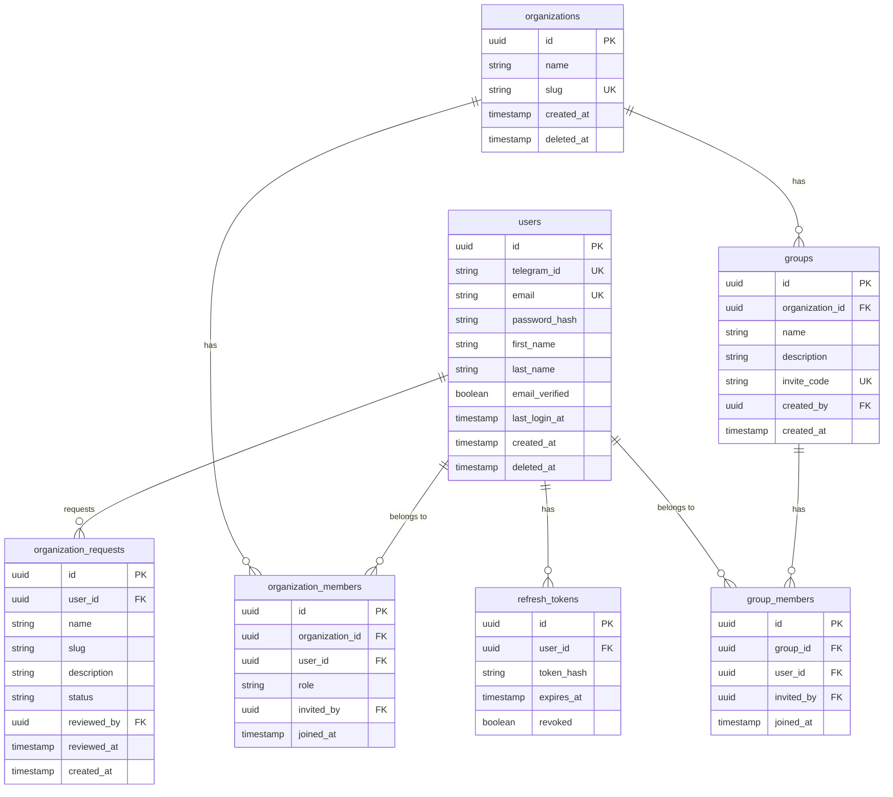

# User Service

User Service отвечает за пользователей, организации, группы и аутентификацию.

## Обзор

| Параметр | Значение |
|----------|----------|
| Порт | 8081 |
| База данных | postgres-user (dedicated) |
| Схема | user_service |

## Ответственности

- Регистрация и аутентификация пользователей
  - **Telegram** — основной способ
  - **Email/password** — альтернативный способ
- Управление профилями
- Запросы на создание организаций (одобрение админом)
- Создание и управление организациями
- Роли: Владелец (OWNER), Модератор (MODERATOR)
- Группы для приватных событий
- JWT token generation

## API Endpoints

### Authentication

| Method | Endpoint | Description |
|--------|----------|-------------|
| POST | `/api/v1/auth/telegram` | Вход/регистрация через Telegram (основной) |
| POST | `/api/v1/auth/register` | Регистрация по email (альтернативный) |
| POST | `/api/v1/auth/login` | Вход по email/password (альтернативный) |
| POST | `/api/v1/auth/refresh` | Обновление токена |
| POST | `/api/v1/auth/logout` | Выход |
| POST | `/api/v1/auth/forgot-password` | Запрос сброса пароля |
| POST | `/api/v1/auth/reset-password` | Сброс пароля |
| POST | `/api/v1/auth/verify-email` | Подтверждение email |

### Users

| Method | Endpoint | Description |
|--------|----------|-------------|
| GET | `/api/v1/users/me` | Текущий пользователь |
| PUT | `/api/v1/users/me` | Обновление профиля |
| PUT | `/api/v1/users/me/password` | Смена пароля |
| DELETE | `/api/v1/users/me` | Удаление аккаунта |

### Organization Requests

| Method | Endpoint | Description |
|--------|----------|-------------|
| POST | `/api/v1/organization-requests` | Подать запрос на создание |
| GET | `/api/v1/organization-requests` | Список запросов (админ) |
| POST | `/api/v1/organization-requests/{id}/approve` | Одобрить (админ) |
| POST | `/api/v1/organization-requests/{id}/reject` | Отклонить (админ) |

### Organizations

| Method | Endpoint | Description |
|--------|----------|-------------|
| GET | `/api/v1/organizations` | Список организаций пользователя |
| POST | `/api/v1/organizations` | Создание организации (после одобрения) |
| GET | `/api/v1/organizations/{id}` | Детали организации |
| PUT | `/api/v1/organizations/{id}` | Обновление организации |
| DELETE | `/api/v1/organizations/{id}` | Удаление организации |

### Organization Members

| Method | Endpoint | Description |
|--------|----------|-------------|
| GET | `/api/v1/organizations/{id}/members` | Список членов |
| POST | `/api/v1/organizations/{id}/invite` | Приглашение (через Telegram) |
| PUT | `/api/v1/organizations/{id}/members/{userId}` | Изменение роли |
| DELETE | `/api/v1/organizations/{id}/members/{userId}` | Удаление члена |

### Groups

| Method | Endpoint | Description |
|--------|----------|-------------|
| GET | `/api/v1/organizations/{id}/groups` | Список групп организации |
| POST | `/api/v1/organizations/{id}/groups` | Создание группы |
| GET | `/api/v1/groups/{id}` | Детали группы |
| PUT | `/api/v1/groups/{id}` | Обновление группы |
| DELETE | `/api/v1/groups/{id}` | Удаление группы |
| POST | `/api/v1/groups/{id}/invite` | Инвайт в группу |
| GET | `/api/v1/groups/{id}/members` | Члены группы |
| POST | `/api/v1/groups/join/{inviteCode}` | Вступить по инвайт-коду |

## Модель данных

## Роли и права

| Роль | Описание |
|------|----------|
| OWNER | Владелец организации — полный контроль, удаление |
| MODERATOR | Модератор — управление событиями, check-in, аналитика |

**Бизнес-правила:**
- OWNER может быть только один
- OWNER не может изменить свою роль
- Только OWNER может назначать/снимать роли

## JWT Tokens

### Access Token

| Поле | Описание |
|------|----------|
| sub | UUID пользователя |
| email | Email пользователя |
| tenantId | UUID текущей организации |
| roles | Роли в текущей организации |
| exp | Срок действия (15 минут) |

### Refresh Token

- Хранится в БД (hashed)
- Срок жизни: 7 дней
- One-time use (rotation)

## События (RabbitMQ)

### Публикуемые

| Event | Описание |
|-------|----------|
| `user.registered` | Пользователь зарегистрировался |
| `user.updated` | Профиль обновлён |
| `organization.request.created` | Запрос на создание организации |
| `organization.created` | Организация создана |
| `organization.member.added` | Член добавлен в организацию |
| `group.created` | Группа создана |
| `group.member.added` | Член добавлен в группу |

### Потребляемые

Нет — User Service не подписывается на события других сервисов.

## Дальнейшее чтение

- [Service Topology](../../../architecture/service-topology.md)
- [Domain Model](../../../data/domain-model.md)
