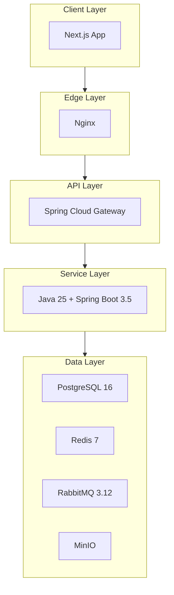

# Tech Stack Overview

Обзор технологического стека платформы AqStream.

## Архитектура



## Backend

### Core

| Технология | Версия | Назначение |
|------------|--------|------------|
| Java | 25 LTS | Язык программирования |
| Spring Boot | 3.5.x | Application framework |
| Spring MVC | — | Web framework (servlet-based) |
| Spring Security | 6.5.x | Security framework |
| Spring Data JPA | 2025.0.x | Data access |

**Важно:** Используем классический **Spring MVC** (servlet-based, blocking I/O), не WebFlux. Исключение — API Gateway.

### Database

| Технология | Версия | Назначение |
|------------|--------|------------|
| PostgreSQL | 16+ | Основная СУБД |
| Liquibase | 4.31.x | Миграции схемы |
| HikariCP | 6.x | Connection pooling |

### Messaging

| Технология | Версия | Назначение |
|------------|--------|------------|
| RabbitMQ | 3.12+ | Message broker |
| Spring AMQP | 3.x | RabbitMQ client |

### Caching

| Технология | Версия | Назначение |
|------------|--------|------------|
| Redis | 7.x | Cache, sessions |
| Spring Data Redis | 3.x | Redis client |

### Documentation

| Технология | Версия | Назначение |
|------------|--------|------------|
| SpringDoc OpenAPI | 2.x | API documentation |
| Swagger UI | — | Interactive API explorer |

### Build & Tools

| Технология | Версия | Назначение |
|------------|--------|------------|
| Gradle | 8.x | Build tool |
| MapStruct | 1.5.x | DTO mapping |
| Lombok | — | Boilerplate reduction |

## Frontend

### Core

| Технология | Версия | Назначение |
|------------|--------|------------|
| Next.js | 14.x | React framework |
| React | 18.x | UI library |
| TypeScript | 5.x | Type safety |

### UI

| Технология | Версия | Назначение |
|------------|--------|------------|
| Tailwind CSS | 3.x | Styling |
| shadcn/ui | — | UI components |

**Важно:** Используем **только shadcn/ui** для UI компонентов. Другие UI библиотеки (MUI, Chakra, Ant Design) не используются.

### State Management

| Технология | Версия | Назначение |
|------------|--------|------------|
| TanStack Query | 5.x | Server state |
| Zustand | 4.x | Client state |
| React Hook Form | 7.x | Form handling |
| Zod | 3.x | Validation |

### Build & Tools

| Технология | Версия | Назначение |
|------------|--------|------------|
| pnpm | 8.x | Package manager |
| ESLint | 8.x | Linting |
| Prettier | 3.x | Formatting |

## Infrastructure

### Containerization

| Технология | Версия | Назначение |
|------------|--------|------------|
| Docker | 24+ | Containerization |
| Docker Compose | 2.x | Local orchestration |

### Reverse Proxy

| Технология | Версия | Назначение |
|------------|--------|------------|
| Nginx | 1.25+ | Reverse proxy, TLS |

### Storage

| Технология | Версия | Назначение |
|------------|--------|------------|
| MinIO | — | S3-compatible storage |

### Observability

| Технология | Назначение |
|------------|------------|
| Prometheus | Metrics collection |
| Grafana | Visualization |
| Loki | Log aggregation |

### CI/CD

| Технология | Назначение |
|------------|------------|
| GitHub Actions | CI/CD pipelines |

## Версии зависимостей

### Backend (build.gradle.kts)

```kotlin
// Root build.gradle.kts
extra["springBootVersion"] = "3.3.0"
extra["springCloudVersion"] = "2023.0.0"

// Dependencies
implementation("org.springframework.boot:spring-boot-starter-web")
implementation("org.springframework.boot:spring-boot-starter-data-jpa")
implementation("org.springframework.boot:spring-boot-starter-security")
implementation("org.springframework.boot:spring-boot-starter-validation")
implementation("org.springframework.boot:spring-boot-starter-amqp")
implementation("org.springframework.boot:spring-boot-starter-data-redis")
implementation("org.springdoc:springdoc-openapi-starter-webmvc-ui:2.3.0")
implementation("org.liquibase:liquibase-core")
implementation("org.mapstruct:mapstruct:1.5.5.Final")
implementation("io.jsonwebtoken:jjwt-api:0.12.3")

runtimeOnly("org.postgresql:postgresql")

compileOnly("org.projectlombok:lombok")
annotationProcessor("org.projectlombok:lombok")
annotationProcessor("org.mapstruct:mapstruct-processor:1.5.5.Final")

testImplementation("org.springframework.boot:spring-boot-starter-test")
testImplementation("org.testcontainers:postgresql")
testImplementation("io.rest-assured:rest-assured")
```

### Frontend (package.json)

```json
{
  "dependencies": {
    "next": "14.x",
    "react": "18.x",
    "react-dom": "18.x",
    "@tanstack/react-query": "5.x",
    "zustand": "4.x",
    "react-hook-form": "7.x",
    "@hookform/resolvers": "3.x",
    "zod": "3.x",
    "axios": "1.x",
    "date-fns": "3.x",
    "lucide-react": "latest",
    "tailwind-merge": "2.x",
    "clsx": "2.x"
  },
  "devDependencies": {
    "typescript": "5.x",
    "tailwindcss": "3.x",
    "postcss": "8.x",
    "autoprefixer": "10.x",
    "@types/react": "18.x",
    "@types/node": "20.x",
    "eslint": "8.x",
    "eslint-config-next": "14.x",
    "prettier": "3.x",
    "vitest": "1.x",
    "@playwright/test": "1.x"
  }
}
```

## Принципы выбора технологий

### Стабильность

Выбираем проверенные технологии с активным сообществом и долгосрочной поддержкой.

### Простота

Предпочитаем простые решения сложным. Spring MVC вместо WebFlux, потому что проще отлаживать.

### Консистентность

Один подход для всех сервисов. shadcn/ui везде на frontend, Spring Boot везде на backend.

### Поддержка

LTS версии где возможно (Java 25 LTS). Версии с активной поддержкой.

## Дальнейшее чтение

- [Backend Architecture](./backend/architecture.md)
- [Frontend Architecture](./frontend/architecture.md)
- [Tooling](./tooling.md)
